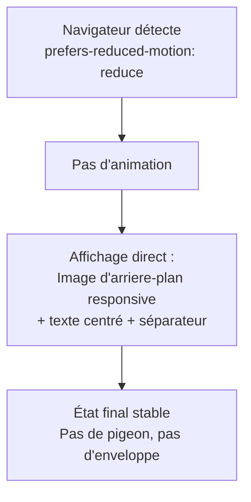
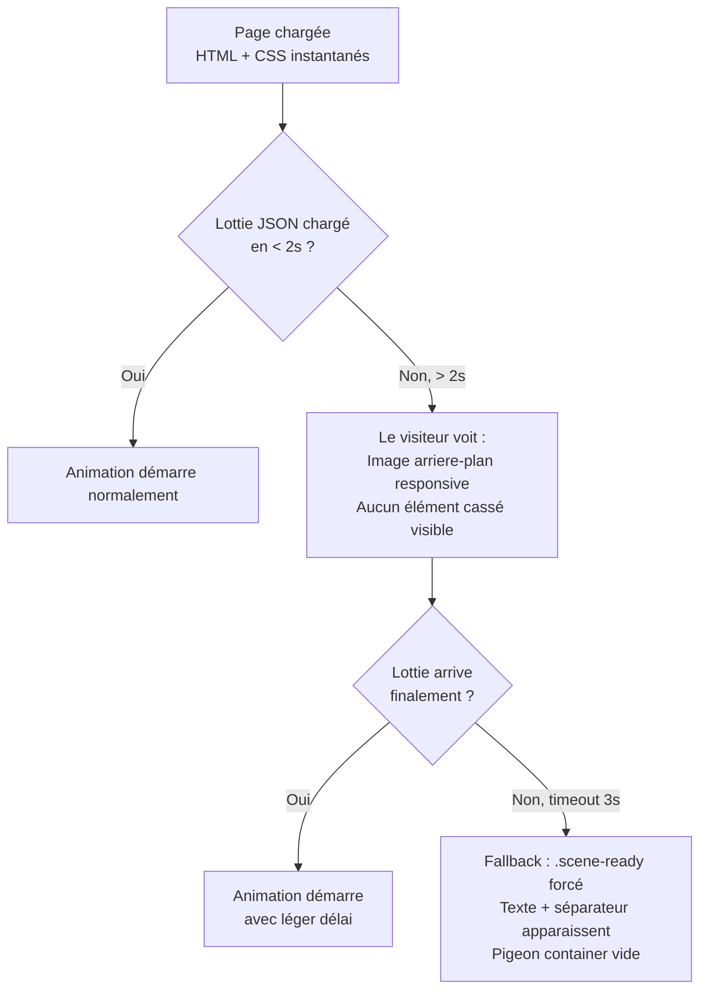
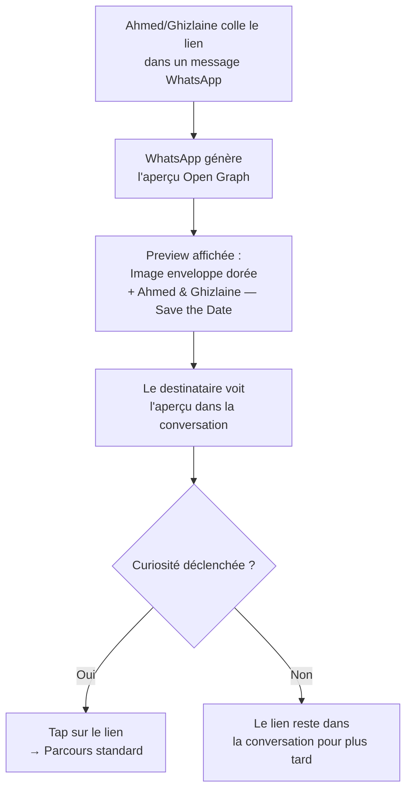

# UX Design Specification — Save the Date Animé (Pigeon Voyageur)

**Auteur :** Mister Azami
**Date :** 2026-02-19 (mise à jour)

---

## Executive Summary

### Vision Projet

Animation "Save the Date" sur la landing page publique (`/`) du site de mariage. Un pigeon voyageur Lottie (animation frame-by-frame, palette aquarelle florale) survole la scène et dépose une enveloppe cachetée A&G qui s'ouvre pour révéler la date, le lieu et un message poétique. La page utilise des images d'arrière-plan responsives (aquarelle florale mobile, botanique desktop). Page autonome, accessible à tous, sans lien avec le parcours RSVP des invités.

### Utilisateurs Cibles

| Persona | Contexte Save the Date | Besoin UX |
|---------|----------------------|-----------|
| Tante Fatima (58 ans) | Reçoit le lien `/` via WhatsApp avant l'invitation | Animation compréhensible immédiatement, message clair |
| Karim (28 ans) | Voit le lien partagé, juge la qualité | Animation premium, "c'est trop propre", envie de screenshoter |
| Visiteur quelconque | Tombe sur `/` par hasard ou partage | Comprend qu'il s'agit d'un mariage, expérience mémorable |

### Architecture de Pages

| Route | Contenu | Audience |
|-------|---------|----------|
| `/` | Save the Date animé (pigeon → enveloppe → révélation) | Publique — tout le monde |
| `/invite/[slug]` | Site d'invitation complet (hero, histoire, RSVP) | Invités uniquement |
| `/admin` | Gestion invités | Ahmed & Ghizlaine |

### Défis UX Clés

1. **Clarté immédiate de l'animation** — Le pigeon et l'enveloppe doivent être identifiables instantanément. Aucune ambiguïté visuelle tolérée, même pour un utilisateur peu tech-savvy.

2. **Cohabitation de deux styles visuels** — Le pigeon flat/illustré (Save the Date) et les alliances réalistes (invitation) vivent sur des pages différentes, ce qui atténue la dissonance, mais l'identité visuelle globale (palette dorée, crème, Cormorant) doit unifier les deux.

3. **Preload des assets** — L'animation se joue au chargement. Deux fichiers JSON Lottie sont utilisés selon la résolution : `/design/oiseau.json` (mobile) et `/design/pigeon.json` (desktop >= 1024px), sélectionnés via `window.matchMedia('(min-width: 1024px)')` dans un `useEffect`. Tous les éléments animés (pigeon, enveloppe, textes) démarrent à `opacity: 0` pour éviter tout flash. Les animations ne démarrent qu'après le chargement du Lottie via la classe `.scene-ready`.

### Opportunités Design

1. **Bouche-à-oreille visuel** — Les invités partagent `/` avec leurs proches. Une animation réussie génère des "regarde ça" spontanés sur WhatsApp.

2. **Open Graph dédié** — L'aperçu WhatsApp de `/` montre le Save the Date (image enveloppe dorée + "Ahmed & Ghizlaine — Save the Date"), distinct de l'aperçu de l'invitation.

3. **Page autonome ultra-performante** — Client Components pour l'orchestration (`SaveTheDateScene`, `PigeonVoyageur`), zéro API, zéro base de données. Performance maximale garantie. Dépendance unique : `lottie-react`.

## Core User Experience

### Expérience Définissante

L'action fondamentale du Save the Date est **contemplative, pas interactive**. L'utilisateur est spectateur d'une micro-narration animée en 3 actes. Il n'y a aucun tap, aucun scroll, aucun choix à faire — juste regarder et absorber. C'est un court-métrage de 4-5 secondes, pas une interface.

L'utilisateur décrirait l'expérience : *"J'ai ouvert le lien et un truc magnifique s'est joué devant moi — un pigeon qui livre une lettre avec la date du mariage. C'était classe."*

### Stratégie Plateforme

| Aspect | Décision |
|--------|----------|
| Page | Landing publique `/` — accessible à tous, sans authentification |
| Type | Page autonome, Server Component racine + Client Component `SaveTheDateScene` pour l'orchestration (chargement Lottie, gating `.scene-ready`, verrouillage pigeon post-animation) |
| Input | Aucun — expérience 100% passive, zéro JS interactif |
| Durée | 4-5 secondes d'animation, puis contenu statique permanent |
| Post-animation | Contenu reste affiché, pas de scroll, pas de CTA sur la page |
| Replay | L'animation se rejoue à chaque rechargement — pas de mécanisme "déjà vu". Le replay EST la valeur de partage |
| CTA implicite | L'Open Graph WhatsApp (image enveloppe dorée + "Ahmed & Ghizlaine — Save the Date") est le vrai déclencheur de visite, pas un bouton sur la page |
| Dépendances | Zéro API, zéro base de données, zéro état client persistant. Package `lottie-react` pour le rendu du pigeon |

### Interactions Sans Friction

Le mot "interaction" est presque un abus de langage ici — l'expérience est conçue pour **zéro friction par absence totale d'interaction** :

| Moment | Principe |
|--------|----------|
| Chargement de la page | Fond crème immédiat (pas de blanc), animation démarre dès que les assets sont prêts |
| Pendant l'animation | L'utilisateur ne fait rien — il regarde. Pas de bouton "skip", pas de contrôles |
| Fin de l'animation | Le contenu final (date, lieu, message) reste visible indéfiniment |
| Revisites | L'animation se rejoue intégralement — chaque visite est une nouvelle projection du court-métrage |
| Partage | Le lien `/` est partageable tel quel — le destinataire vit la même expérience complète |
| `prefers-reduced-motion` | Contenu final affiché immédiatement, sans animation |

### Moments de Succès Critiques

1. **L'entrée du pigeon (Acte 1)** — C'est LE moment make-or-break. Le pigeon doit entrer avec grâce et capter l'attention instantanément. Si l'animation est saccadée, si le pigeon est visuellement confus, ou si le chargement est lent, l'effet "waouh" est perdu irrémédiablement.

2. **La micro-pause (transition Acte 2 → 3)** — Le pigeon s'envole, l'enveloppe reste seule au centre, immobile pendant 300-500ms. Ce silence visuel crée l'anticipation avant la révélation. Sans cette pause, l'ouverture de l'enveloppe arrive trop vite et l'émotion n'a pas le temps de monter.

3. **L'ouverture de l'enveloppe (Acte 3)** — Le rabat qui se soulève et le contenu qui émerge doivent être fluides et élégants. Si cette transition est bâclée, la narration se brise juste avant la révélation — le pire moment possible pour perdre la magie.

4. **La lisibilité du contenu final** — Après l'émotion de l'animation, l'information doit être immédiatement lisible : date, lieu, message. Si l'utilisateur doit plisser les yeux ou chercher l'info, l'impact émotionnel se dissipe.

### Principes d'Expérience

1. **Spectacle, pas interface** — L'utilisateur est spectateur, jamais acteur. Aucun élément interactif ne doit briser l'immersion narrative.

2. **Deux moments, zéro compromis** — L'entrée du pigeon et l'ouverture de l'enveloppe portent toute la charge émotionnelle. Ces deux animations doivent être irréprochables, quitte à simplifier le reste.

3. **L'émotion de sortie est double** — "C'était beau, j'ai hâte" (émotion personnelle) + "il faut que je montre ça" (envie de partager). Le replay à chaque visite et l'Open Graph soigné nourrissent directement cette envie de partage.

4. **Rejouable par design** — L'animation se joue à chaque chargement. Pas de "déjà vu", pas d'état sauvegardé. Chaque ouverture du lien est une nouvelle projection. C'est ce qui rend le partage WhatsApp efficace.

5. **Le CTA est invisible** — Aucun bouton sur la page. Le déclencheur de visite est l'aperçu Open Graph dans WhatsApp. Le déclencheur de partage est la beauté de l'animation elle-même.

## Desired Emotional Response

### Objectifs Émotionnels Primaires

**Émotion dominante :** Émerveillement admiratif — "waouh, c'est très bien fait". Pas de tendresse ni de mièvrerie. L'utilisateur est impressionné par la qualité d'exécution et le caractère fantaisiste/poétique de l'animation. C'est de l'admiration visuelle, pas de l'attendrissement.

**Émotion secondaire :** Excitation impatiente — "j'ai hâte, ça arrive bientôt". La date révélée déclenche une projection vers le futur, pas un constat solennel.

**Registre du pigeon :** Poétique et élégant avant tout. Le pigeon n'est pas un personnage cartoon mignon — c'est un messager de conte, gracieux et raffiné. Le charme vient de la poésie du geste (livrer une lettre en volant), pas d'un design "kawaii".

### Cartographie Émotionnelle du Parcours

| Étape | Émotion visée | Intensité |
|-------|---------------|-----------|
| Aperçu WhatsApp (Open Graph) | Curiosité intriguée — "c'est quoi ça ?" | Douce — envie d'ouvrir |
| Fond crème au chargement | Neutre — attente calme | Minimale — pas d'impatience |
| Acte 1 — Entrée du pigeon (enveloppe visible dans le bec) | **"Waouh"** — admiration immédiate, surprise positive | **Forte** — pic émotionnel d'entrée |
| Acte 2 — Dépôt de l'enveloppe | Fascination — "c'est beau, c'est bien fait" | Soutenue — l'admiration se confirme |
| Sceau A&G visible sur l'enveloppe | Reconnaissance personnalisée — "c'est sur mesure, c'est LEUR mariage" | Précise — détail qui élève |
| Micro-pause (enveloppe seule) | Anticipation — "qu'est-ce qui va se passer ?" | Montante — tension narrative |
| Acte 3 — Ouverture et révélation | **Excitation** — "17 Octobre ! J'ai hâte !" | **Forte** — deuxième pic émotionnel |
| Contenu statique final | Satisfaction + projection — "ça va être bien" | Calme — l'émotion se pose |
| Après fermeture de la page | "Il faut que je montre ça à quelqu'un" | Résiduelle — envie de partager |

**Note — Visiteurs non-invités :** Pour ceux qui ne connaissent pas le couple, l'émotion à la révélation est différente mais tout aussi positive : "c'est class" / "j'aimerais avoir ça pour mon mariage". Le design doit porter cette émotion par la beauté seule de la typographie et de l'animation, sans nécessiter de lien personnel avec Ahmed & Ghizlaine.

### Micro-Émotions

| État positif visé | État négatif à éviter | Contexte |
|-------------------|----------------------|----------|
| Admiration ("waouh") | Indifférence ("bof", "naze") | Qualité visuelle de l'animation — jamais cheap |
| Fluidité ("c'est smooth") | Lenteur ("c'est long") | Rythme de l'animation — jamais traînant |
| Compréhension instantanée | Confusion ("je comprends pas") | Lisibilité du pigeon, de l'enveloppe, du texte final |
| Excitation ("j'ai hâte") | Ennui ("ok et ?") | Révélation de la date — doit créer l'impatience |
| Émerveillement poétique | Niaiserie ("c'est niais") | Le pigeon est élégant, pas mignon |
| Sur mesure ("c'est pas un template") | Générique ("c'est vu et revu") | Sceau A&G calligraphié, qualité des assets |

### Implications Design

| Émotion | Traduction UX |
|---------|---------------|
| "Waouh" / admiration | Animation du pigeon irréprochable : trajectoire fluide, easing naturel, détails soignés. La qualité d'exécution EST le waouh — pas besoin d'effets spéciaux, juste de la perfection dans le mouvement |
| Poésie / élégance | Pigeon stylisé avec grâce, pas cartoon. Mouvement de vol réaliste dans sa fluidité, fantaisiste dans son contexte. Palette dorée/blanche cohérente |
| Excitation / impatience | La date apparaît avec impact — typographie display, animation de révélation nette. Le mot "Casablanca" et la date sont les deux éléments qui doivent frapper |
| Anti-lenteur | Rythme total 4-5s, JAMAIS plus. Chaque acte ~1.5s. Aucun temps mort perceptible sauf la micro-pause intentionnelle (300-500ms). Si l'utilisateur pense "c'est long", c'est raté |
| Anti-confusion | Le pigeon doit être identifiable en < 0.5s. **L'enveloppe est visible dans le bec du pigeon dès la première frame de l'animation** — c'est le lien narratif entre l'oiseau et la lettre. Le texte final doit être lisible sans effort. Zéro ambiguïté visuelle |
| Anti-naze | Pas de template, pas de clip-art, pas d'animation générique. La qualité des assets SVG et du timing d'animation est ce qui sépare "waouh" de "naze" |
| Beauté autonome | Le contenu révélé doit fonctionner émotionnellement même pour quelqu'un qui ne connaît pas le couple — la typographie, la composition et le message poétique portent l'émotion par eux-mêmes |

### Principes de Design Émotionnel

1. **Le waouh vient de l'exécution, pas du concept** — L'idée d'un pigeon qui livre une lettre est simple. Ce qui crée l'admiration, c'est la fluidité du vol, la grâce du dépôt, l'élégance de l'ouverture. Chaque milliseconde d'animation doit être polie.

2. **Les assets sont un prérequis bloquant** — La qualité artistique des illustrations SVG est un bloqueur absolu. L'animation la plus fluide du monde ne sauve pas un pigeon clip-art. Tant que les assets ne sont pas au niveau, l'animation ne doit pas être développée.

3. **Poétique, jamais niais** — Le pigeon est un messager de conte, pas une mascotte. L'enveloppe est un objet précieux, pas un accessoire. Le ton est "il était une fois", pas "c'est trop chou".

4. **Le rythme crée l'émotion** — 4-5 secondes, pas une de plus. Le tempo doit donner l'impression que tout va vite et bien, jamais que ça traîne. La micro-pause avant l'ouverture est le seul ralentissement autorisé — et il sert l'anticipation.

5. **La clarté est non-négociable** — Si un seul utilisateur dit "je comprends pas ce que c'est", c'est un échec. L'enveloppe est visible dans le bec dès la frame 1. Le pigeon = oiseau qui vole avec une lettre. Le texte = date et lieu. Zéro abstraction.

6. **L'excitation se construit en crescendo** — Acte 1 = waouh visuel. Acte 2 = fascination + détail du sceau. Pause = anticipation. Acte 3 = excitation. Le parcours émotionnel monte, il ne descend jamais avant la fin.

## UX Pattern Analysis & Inspiration

### Analyse des Produits Inspirants

**Apple.com (pages produits)**
- Transitions maîtrisées entre sections, micro-interactions élégantes
- Animations au scroll ultra-premium : révélation progressive, parallax subtil
- Timing parfait : jamais trop rapide, jamais trop lent
- Pertinence Save the Date : la référence absolue pour le timing et l'easing des animations

**Stripe (animations vectorielles)**
- Animations SVG propres, modernes, pédagogiques
- Mouvement au service de la compréhension, pas de la décoration
- Simplicité + sophistication : peu d'éléments, beaucoup de polish
- Pertinence Save the Date : modèle pour l'animation du pigeon — vectoriel, fluide, narratif

**Airbnb (micro-animations)**
- Animations chaleureuses et organiques dans l'app
- Sens du détail : ombres, easing naturel, micro-rebonds subtils
- L'animation renforce le sentiment humain, pas la technicité
- Pertinence Save the Date : le registre émotionnel chaleureux sans tomber dans le niais

**Intros d'apps bancaires premium**
- Logo qui se "trace" en ligne fine dorée — raffinement extrême
- Apparition progressive, lumière, reflets métalliques subtils
- Le doré comme accent, pas comme dominante
- Pertinence Save the Date : référence directe pour le traitement doré du pigeon et du sceau

**Sites Awwwards**
- Standard de fluidité cinématique et d'immersion visuelle
- Animations comme élément narratif, pas décoratif
- Pertinence Save the Date : le niveau de qualité visé — "primable sur Awwwards"

### Analyse des Références Visuelles

**Style d'illustration — Pigeon :**

| Inspiration | Ce qu'on retient | Ce qu'on évite |
|-------------|-----------------|----------------|
| Illustrations éditoriales minimalistes | Formes pleines, ombres très légères, élégance épurée | Surcharge de détails, hyper-réalisme |
| Logos animés en ligne fine dorée | Un seul accent doré métallique sur fond blanc cassé | Dégradés brillants "bling bling" |
| Identité visuelle de marque de parfum | Minimalisme haut de gamme, raffinement absolu | Style corporate générique |
| Animation de battement d'aile | Slow motion gracieux, léger reflet doré animé | Cartoon enfantin, mouvement saccadé |

**Style d'enveloppe & sceau — Direction retenue : Papeterie de luxe :**

| Élément | Style | Référence |
|---------|-------|-----------|
| Enveloppe | Crème texturée, élégance intemporelle | Papeterie de mariage haut de gamme, univers Hermès |
| Sceau | Doré gaufré, calligraphie fine A&G | Wax seal avec texture cire réaliste |
| Ouverture | Rabat qui se soulève avec grâce, léger bruit visuel | Animation solennel mais pas lente |
| Ton général | Invitation privée, magazine luxe, exclusivité | Faire-part traditionnel revisité en digital |

### Patterns Transférables

**Patterns d'Animation :**

| Pattern | Source | Application Save the Date |
|---------|--------|--------------------------|
| Easing naturel avec micro-rebonds | Airbnb | Le pigeon se pose avec un très léger rebond — vivant, pas mécanique |
| Traçage en ligne fine dorée | Intros apps bancaires | Le sceau A&G pourrait se "tracer" en animation avant l'ouverture |
| Révélation progressive | Apple | Le texte du Save the Date émerge mot par mot ou ligne par ligne, pas en bloc |
| Animation vectorielle narrative | Stripe | Le vol du pigeon raconte une histoire — trajectoire avec intention, pas déplacement linéaire |

**Patterns Visuels :**

| Pattern | Source | Application Save the Date |
|---------|--------|--------------------------|
| Accent doré unique sur fond neutre | Apps bancaires premium | Fond crème + seul le pigeon/sceau/enveloppe portent le doré |
| Formes pleines + ombres légères | Illustrations éditoriales | Pigeon en aplats avec ombre portée subtile — profondeur sans complexité |
| Espace blanc généreux | Apple / Hermès | Le pigeon vole dans un espace vide — le vide est élégance |
| Texture subtile sur l'enveloppe | Papeterie luxe | Grain de papier léger sur le SVG de l'enveloppe — touche physique dans le digital |

### Anti-Patterns à Éviter

| Anti-pattern | Pourquoi l'éviter | Risque si ignoré |
|--------------|-------------------|------------------|
| Pigeon cartoon / kawaii | Tue le registre poétique, tombe dans le niais | "C'est mignon" au lieu de "c'est waouh" |
| Dégradés dorés brillants excessifs | Effet "bling bling" cheap | "C'est kitsch" au lieu de "c'est élégant" |
| Animation trop rapide (< 3s) | L'utilisateur ne comprend pas ce qui s'est passé | Confusion, pas d'émotion |
| Animation trop lente (> 6s) | L'utilisateur décroche | "C'est long" — émotion anti-waouh |
| Trop d'éléments animés simultanément | Surcharge cognitive, perte de focus | L'œil ne sait pas où regarder |
| Style corporate / template | Aucune personnalité | "C'est générique" — zéro mémorabilité |
| Effets sonores | Intrusif sur mobile, amateurish | Fatima panique, Karim ferme |
| Particules / confettis / paillettes | Cliché de mariage digital | "C'est un template" |

### Stratégie d'Inspiration Design

**Adopter tel quel :**
- Easing naturel et timing maîtrisé (Apple) — chaque keyframe est calibrée
- Animation vectorielle narrative (Stripe) — le mouvement raconte, pas décore
- Espace blanc comme élément de design (Apple / Hermès) — le vide est du luxe

**Adapter au contexte Save the Date :**
- Micro-rebonds Airbnb → version ultra-subtile pour le dépôt de l'enveloppe (touche vivante sans cartoon)
- Traçage doré des intros bancaires → animation du sceau A&G qui se révèle en tracé fin avant l'ouverture
- Révélation progressive Apple → texte du Save the Date qui émerge ligne par ligne (prénoms → date → lieu → message)
- Texture papier luxe → grain SVG subtil sur l'enveloppe pour ancrage physique

**Éviter absolument :**
- Tout ce qui dit "template de mariage digital" (particules, confettis, cœurs, polices cursives)
- Tout ce qui est cartoon, enfantin ou "mignon"
- Tout excès doré — le doré est un accent chirurgical, pas une dominante
- Tout effet sonore

## Design System Foundation

### Choix du Système

**Héritage du design system principal** — Le Save the Date réutilise intégralement la fondation visuelle du site de mariage existant (Tailwind CSS 4 + tokens `@theme inline`).

### Raisons du Choix

| Critère | Décision |
|---------|----------|
| Cohérence visuelle | Même palette, mêmes polices, mêmes tokens → le Save the Date "appartient" au même univers que l'invitation |
| Zéro configuration | Les tokens Tailwind sont déjà définis, les polices déjà chargées via `next/font/google` |
| Maintenance | Un seul design system à maintenir pour tout le projet |
| Performance | Pas de CSS additionnel — tout est déjà dans le bundle Tailwind existant |

### Fondation Visuelle Héritée

**Palette :**

| Rôle | Hex | Token `@theme inline` | Usage Save the Date |
|------|-----|-----------------------|---------------------|
| Fond | `#FAF7F2` (Crème Chaud) | — | Background fallback de la page — visible dès le chargement |
| Accent | `#B8860B` (Doré Marocain) | — | Sceau A&G, accents dorés de l'enveloppe, "&" |
| Accent clair | `#D4A54A` (Doré Lumineux) | — | Reflets subtils, détails de l'enveloppe |
| Accent très clair | `#E8D5A8` (Voile Doré) | — | Ombre douce, fond du sceau |
| Texte prénoms | `#2C2418` (Brun Profond) | — | Prénoms "Ghizlaine" et "Ahmed" |
| Texte date | `#6B3A4E` (Mauve Profond) | `--color-mauve-deep` | "17 Octobre 2026" — inspiré des fleurs fuchsia/dahlia. Contraste 8.4:1 sur crème (AAA) |
| Texte lieu | `#4A5E3A` (Olive Profond) | `--color-olive-deep` | "Casablanca" — inspiré du feuillage/fougères. Contraste 6.7:1 sur crème (AA) |
| Texte message | `#7A5A6A` (Mauve Doux) | `--color-mauve-soft` | Message poétique en italique — inspiré de la lavande. Contraste 5.7:1 sur crème (AA) |
| Fond enveloppe | `#FFFDF9` (Blanc Cassé) | — | Intérieur de l'enveloppe ouverte |

**Typographie :**

| Usage | Police | Taille (clamp fluid) | Poids |
|-------|--------|---------------------|-------|
| "Ghizlaine" (ligne 1) | Cormorant Garamond | `clamp(2.25rem, 6vw+0.25rem, 3.5rem)` → 36px mobile / 56px desktop | 300 (Light) |
| "&" (ligne 2) | Cormorant Garamond | `clamp(1.5rem, 3vw+0.25rem, 2.25rem)` → 24px mobile / 36px desktop | 300 (Light), couleur Doré Marocain |
| "Ahmed" (ligne 3) | Cormorant Garamond | `clamp(2.25rem, 6vw+0.25rem, 3.5rem)` → 36px mobile / 56px desktop | 300 (Light) |
| "17 Octobre 2026" | Cormorant Garamond | `clamp(1.75rem, 4vw+0.25rem, 2.75rem)` → 28px mobile / 44px desktop | 400 (Regular), couleur Mauve Profond `#6B3A4E` |
| "Casablanca" | Cormorant Garamond | `clamp(1.5rem, 3vw+0.25rem, 2.25rem)` → 24px mobile / 36px desktop | 400 (Regular), couleur Olive Profond `#4A5E3A` |
| Message poétique | Geist Sans | `clamp(1rem, 1.5vw+0.5rem, 1.25rem)` → 16px mobile / 20px desktop | 400 (Regular), italique, couleur Mauve Doux `#7A5A6A` |

**Note :** Les prénoms sont affichés sur 3 lignes séparées (Ghizlaine / & / Ahmed) pour un impact visuel plus fort.

### Technologie d'Animation

**Approche hybride : Lottie (`lottie-react`) pour le pigeon + CSS Animations pour l'orchestration.**

| Aspect | Technologie | Raison |
|--------|-------------|--------|
| Pigeon (animation de vol) | **Lottie** via `lottie-react` | Animation frame-by-frame complexe (9 poses, 1084 formes) impossible à reproduire en CSS/SVG pur |
| Trajectoire du pigeon | **CSS keyframes** (`pigeon-lifecycle-*`) | Trajectoire en arc + dépôt + départ gérés par `transform: translate()` |
| Enveloppe, texte, séquencement | **CSS Animations** + `animation-delay` | GPU-accelerated, séquencement précis, zéro JS |
| Orchestration générale | **Client Component** `SaveTheDateScene` | Gating `.scene-ready` après chargement Lottie, fallback 3s, verrouillage pigeon post-animation |
| `prefers-reduced-motion` | **CSS** `@media` | Pigeon et enveloppe masqués, texte affiché à `opacity: 1` directement |

**Détails Lottie :**
- Fichiers : deux fichiers Lottie selon la résolution, sélectionnés via `window.matchMedia('(min-width: 1024px)')` dans un `useEffect` :
  - Mobile : `/design/oiseau.json` (bird)
  - Desktop (>= 1024px) : `/design/pigeon.json` (pigeon), recolorisé du greyscale vers une palette aquarelle florale (mauves, blush, crème) assortie aux arrière-plans
- Format : 9 poses frame-by-frame, 141x110 canvas, 60fps
- Chargement : `fetch()` au runtime dans un `useEffect`, animation CSS démarre après `onReady`
- Package : `lottie-react` (~28Ko gzippé) — dépendance npm ajoutée au projet
- Effet aquarelle CSS : `filter: saturate(0.85) contrast(0.92) blur(0.3px); mix-blend-mode: multiply;`

**Pourquoi pas CSS pur pour le pigeon :**
Le pigeon Lottie contient 1084 formes et 21 122 vertices — impossible à reproduire ou à animer en SVG/CSS pur. L'approche hybride (Lottie pour le rendu du pigeon, CSS pour sa trajectoire et le séquencement) combine la richesse visuelle du Lottie avec la précision du timing CSS.

### Stratégie de Personnalisation

**Composants shadcn/ui :** Aucun nécessaire pour le Save the Date. La page est une animation pure sans interaction — pas de `Dialog`, pas de `Button`, pas de `Input`. Si un besoin émerge, shadcn/ui est disponible dans le projet mais non requis a priori.

**Tokens custom Save the Date (dans `@theme inline`) :**

| Token | Valeur | Usage |
|-------|--------|-------|
| `--animation-act1` | `1500ms` | Durée Acte 1 (entrée pigeon) |
| `--animation-act2` | `1500ms` | Durée Acte 2 (dépôt + envol) |
| `--animation-pause` | `400ms` | Micro-pause (enveloppe seule) |
| `--animation-act3` | `1500ms` | Durée Acte 3 (ouverture + révélation) |
| `--easing-flight` | `cubic-bezier(0.25, 0.1, 0.25, 1.0)` | Trajectoire naturelle du pigeon |
| `--easing-land` | `cubic-bezier(0.34, 1.56, 0.64, 1)` | Micro-rebond au dépôt |
| `--easing-reveal` | `cubic-bezier(0.0, 0.0, 0.2, 1)` | Ouverture fluide de l'enveloppe |

## Expérience Définissante — Détail

### Interaction Fondamentale

**"Ouvrir un lien → regarder un pigeon livrer une lettre → découvrir la date du mariage"**

L'utilisateur décrirait cette expérience à un ami : *"Tu ouvres le lien et y'a un pigeon qui arrive avec une lettre, elle s'ouvre et tu vois la date du mariage. C'est super bien fait."* C'est un spectacle de 5 secondes, pas une interface.

### Modèle Mental des Utilisateurs

| Aspect | Attente de l'utilisateur | Réalité du site |
|--------|--------------------------|-----------------|
| Format | Un visuel statique "Save the Date" classique | Une micro-narration animée en 3 actes |
| Interactivité | Un bouton à cliquer, un formulaire | Rien — on regarde, c'est tout |
| Durée | Instantané (image) ou long (vidéo) | 5 secondes — ni trop court ni trop long |
| Qualité | Template standard de mariage | Animation premium niveau Awwwards |

**Patterns établis (zéro éducation nécessaire) :**
- Un oiseau qui vole et porte quelque chose dans son bec — universellement compris
- Une enveloppe qui s'ouvre — geste familier, même pour Fatima
- Du texte qui apparaît progressivement — vu partout (Apple, pubs TV, génériques)

**Innovation contextuelle :**
- Le pigeon voyageur comme métaphore de l'invitation — poétique et inattendu dans un contexte digital
- L'animation remplace le visuel statique — "c'est pas un Save the Date classique"

### Critères de Succès

| Indicateur | Cible | Mesure |
|-----------|-------|--------|
| Compréhension immédiate | 100% des utilisateurs identifient le pigeon + l'enveloppe en < 1s | Test qualitatif sur 5 personnes |
| Réaction "waouh" | > 50% des premiers spectateurs verbalisent une réaction positive | Observation lors du partage |
| Lisibilité du contenu final | Date + lieu lus en < 2s après la fin de l'animation | Test qualitatif |
| Envie de partager | > 30% des spectateurs partagent le lien spontanément | Observation WhatsApp |
| Fluidité | 60fps constant, zéro saccade perceptible | Lighthouse + test appareils réels |
| Durée perçue | Personne ne dit "c'est long" | Test qualitatif |

### Mécanique Détaillée de l'Animation

**Budget total : 5 secondes (5000ms)**

#### Acte 1 — L'Arrivée (~1500ms)

| Phase | Durée | Description | Technique CSS |
|-------|-------|-------------|---------------|
| Entrée | 0-1200ms | Le pigeon entre depuis la gauche, légèrement en hauteur. Trajectoire en arc gracieux descendant vers le centre. Battements d'ailes fluides, rythme lent. | Keyframes CSS `translate` + `rotate` (pas de `offset-path` — jamais utilisé) |
| Ralentissement | 1200-1500ms | À l'approche du centre : ralentissement progressif, transition vers un léger plané. Micro-mouvement de stabilisation. | Easing décélérant, keyframes d'ailes qui se stabilisent |

#### Acte 2 — La Livraison (~1200ms)

| Phase | Durée | Description | Technique CSS |
|-------|-------|-------------|---------------|
| Dépôt | 1500-1800ms | Le pigeon dépose l'enveloppe au centre. Micro-rebond ultra-subtil au contact. **Dépôt cadré à 300ms max** — geste vif et précis. | `var(--easing-land)` avec rebond, `translate` |
| Envol | 1800-2700ms | Le pigeon s'envole vers le haut, ascension douce (~900ms). Fade-out progressif pendant la montée. Mission accomplie — il disparaît dans la lumière. L'envol porte plus de charge visuelle que le dépôt. | `translateY` négatif + `opacity: 0`, easing ease-out |

**L'enveloppe est maintenant seule au centre. Le sceau A&G en calligraphie dorée est visible.**

#### Micro-Pause (~300ms)

| Phase | Durée | Description |
|-------|-------|-------------|
| Silence visuel | 2700-3000ms | L'enveloppe est immobile, seule au centre. Ce moment d'immobilité crée l'anticipation. Le sceau A&G attire l'œil. |

#### Acte 3 — La Révélation (~2000ms)

| Phase | Durée | Description | Technique CSS |
|-------|-------|-------------|---------------|
| Ouverture | 3000-3500ms | Le sceau se brise doucement. Le rabat de l'enveloppe se soulève avec grâce. | `transform: rotateX()` sur le rabat, easing `var(--easing-reveal)` |
| Prénoms | 3500-3700ms | "Ahmed & Ghizlaine" apparaît — opacité + léger mouvement vertical (+8px). Cormorant XL. | `animation-delay: 3500ms`, 200ms |
| Date | 3700-3900ms | "17 Octobre 2026" apparaît — même effet. Cormorant L. | `animation-delay: 3700ms`, 200ms |
| Lieu | 3900-4100ms | "Casablanca" apparaît. Cormorant M. | `animation-delay: 3900ms`, 200ms |
| Séparateur | 4100-4200ms | Trait doré horizontal (`w-12`, `#B8860B`) — respiration visuelle, ancrage dans l'univers du site principal. | `animation-delay: 4100ms`, 100ms |
| Message | 4200-4600ms | *« Une date à retenir… »* apparaît. Geist Sans italique. | `animation-delay: 4200ms`, 400ms |
| Stabilisation | 4600-5000ms | Tout est visible. L'enveloppe a déjà disparu (opacity 0 entre 3200-3800ms). Le texte reste net et centré sur l'image d'arrière-plan. | — |

### État Final

| Élément | État | Visibilité |
|---------|------|------------|
| Pigeon | Disparu (fade-out complet + classe `.pigeon-done` verrouillée via JS après 3.6s) | Invisible, immunisé aux changements de breakpoint |
| Enveloppe | Disparue complètement (`opacity: 0`) + classe `.envelope-done` verrouillée via JS après 5.1s | Invisible, immunisé aux changements de breakpoint |
| "Ghizlaine" | Cormorant `clamp(2.25rem…3.5rem)`, Brun Profond `#2C2418`, centré, ligne 1 | Pleine visibilité |
| "&" | Cormorant `clamp(1.5rem…2.25rem)`, Doré Marocain `#B8860B`, centré, ligne 2 | Pleine visibilité |
| "Ahmed" | Cormorant `clamp(2.25rem…3.5rem)`, Brun Profond `#2C2418`, centré, ligne 3 | Pleine visibilité |
| "17 Octobre 2026" | Cormorant `clamp(1.75rem…2.75rem)`, Mauve Profond `#6B3A4E`, centré | Pleine visibilité |
| "Casablanca" | Cormorant `clamp(1.5rem…2.25rem)`, Olive Profond `#4A5E3A`, centré | Pleine visibilité |
| Séparateur doré | Trait horizontal `w-12`, Doré Marocain | Pleine visibilité |
| Message poétique | Geist Sans italique `clamp(1rem…1.25rem)`, Mauve Doux `#7A5A6A`, centré | Pleine visibilité |
| Fond | Images responsives via CSS class `.landing-bg` : mobile `arriere plan 4.jpeg` (aquarelle florale), desktop (>= 1024px) `arriere plan 2.jpg` (botanique). Fallback Crème `#FAF7F2` | Permanent |

### État `prefers-reduced-motion`

Quand l'utilisateur a activé "Réduire les animations" :
- **Pas d'animation** — pigeon et enveloppe masqués (`display: none !important`)
- **Textes visibles immédiatement** — `opacity: 1 !important` sur `.text-line-1` à `.text-line-5` (contrebalance le `opacity: 0` par défaut des éléments animés)
- **Affichage direct** : texte centré + séparateur doré sur image d'arrière-plan responsive
- L'expérience reste élégante et complète, simplement statique

### Diagramme de Timeline

```
0s        1s        2s        3s        3.5s      4s        4.6s      5s
|---------|---------|---------|---------|---------|---------|---------|
[========= Pigeon Lottie + CSS trajectory (3500ms) =========]
  entrée arc    →    dépôt centre    pause    envol ↑ fade → .pigeon-done @3.6s

[============= Enveloppe lifecycle (5000ms) =================........]
  hidden (0-1.5s)    visible (1.5s)    opening (3s)   disparue (3.2-3.8s)

                                        [== Acte 3 — Texte ==============]
                                         seal  flap  Ghiz|&|Ahmed|date|lieu|—|msg
                                         3.0s  3.2s  3.5s      →      4.6s
```

### Notes d'Implémentation

- **Lottie + CSS hybride** : Le pigeon utilise `lottie-react` pour le rendu frame-by-frame, et des keyframes CSS (`pigeon-lifecycle-mobile` / `pigeon-lifecycle-desktop`) pour la trajectoire. Les deux keyframes déposent le pigeon au même point (`translate(0, 0)` = centre du conteneur).
- **Gating `.scene-ready`** : Toutes les animations CSS sont scopées sous `.scene-ready`. La classe est ajoutée par le Client Component `SaveTheDateScene` après : (1) callback `onReady` du Lottie chargé + 2 `requestAnimationFrame`, OU (2) fallback timeout 3s.
- **Anti-flash** : Tous les éléments animés ont `opacity: 0` par défaut en CSS. Ils ne deviennent visibles que via les animations déclenchées par `.scene-ready`.
- **Anti-breakpoint-flash** : Le pigeon reçoit la classe `.pigeon-done` (`opacity: 0 !important; animation: none !important`) 3.6s après `.scene-ready`, et l'enveloppe reçoit `.envelope-done` (même pattern) 5.1s après `.scene-ready`, empêchant tout re-flash lors d'un changement de breakpoint CSS.
- **Validation sur appareils réels** : Tester la trajectoire du pigeon et les tailles typographiques sur iPhone SE, iPhone 14 Pro Max, Galaxy A52 — pas en simulateur.

## Visual Design Foundation

### Système de Couleurs

**Palette héritée du site principal + palette florale dédiée.** Le Save the Date utilise la palette dorée/crème existante et ajoute trois couleurs inspirées des fleurs et du feuillage, assorties aux arrière-plans aquarelle.

**Application spécifique au Save the Date :**

| Élément | Couleur(s) | Détail |
|---------|-----------|--------|
| Fond de page | Images responsives via CSS class `.landing-bg` avec `@media (min-width: 1024px)` dans `globals.css`. Mobile : `arriere plan 4.jpeg` (aquarelle florale sur blanc). Desktop (>= 1024px) : `arriere plan 2.jpg` (botanique sur crème). Fallback `#FAF7F2` Crème Chaud. Images dans `/public/images/rings/` | Images visibles dès le chargement, permanentes |
| Pigeon (Lottie) | Palette aquarelle florale (mauves, blush, crème) | Mobile : `/design/oiseau.json` (bird). Desktop : `/design/pigeon.json` (pigeon), recolorisé du greyscale vers palette aquarelle assortie aux arrière-plans. Effet CSS : `filter: saturate(0.85) contrast(0.92) blur(0.3px); mix-blend-mode: multiply;` |
| Enveloppe — surface | `#FFFDF9` Blanc Cassé | Aplat principal, coins arrondis (`rx="8" ry="8"`) |
| Enveloppe — plis/bords | `#E8D5A8` Voile Doré | Ombres de pli très discrètes, `strokeLinecap="round"` sur les lignes de pli |
| Enveloppe — bordure | `#D4A54A` Doré Lumineux | Liseré fin doré sur les bords + rect intérieur pour la profondeur |
| Enveloppe — ombre | `feDropShadow` doré subtil | Ombre portée dorée légère pour l'élévation |
| Sceau A&G | `#B8860B` Doré Marocain | Monogramme en relief doré |
| Texte — prénoms | `#2C2418` Brun Profond | Lisibilité maximale (~14:1 sur crème) |
| Texte — "&" | `#B8860B` Doré Marocain | Accent doré |
| Texte — date | `#6B3A4E` Mauve Profond (`--color-mauve-deep`) | Inspiré des fleurs fuchsia/dahlia. Contraste 8.4:1 sur crème (AAA) |
| Texte — lieu | `#4A5E3A` Olive Profond (`--color-olive-deep`) | Inspiré du feuillage/fougères. Contraste 6.7:1 sur crème (AA) |
| Texte — message poétique | `#7A5A6A` Mauve Doux (`--color-mauve-soft`) | Inspiré de la lavande. Contraste 5.7:1 sur crème (AA) |
| Séparateur doré | `#B8860B` Doré Marocain | Trait horizontal `w-12` |

### Pigeon — Spécifications Visuelles

**Principe : Animation Lottie frame-by-frame via `lottie-react`, palette aquarelle florale, fichiers différents par résolution**

| Propriété | Spécification |
|-----------|---------------|
| Format | Lottie JSON via `lottie-react` package. Deux fichiers selon la résolution, sélectionnés via `window.matchMedia('(min-width: 1024px)')` dans un `useEffect` |
| Fichier mobile | `/design/oiseau.json` (bird) — utilisé pour les écrans < 1024px |
| Fichier desktop | `/design/pigeon.json` (pigeon) — utilisé pour les écrans >= 1024px. Recolorisé du greyscale vers palette aquarelle florale (mauves, blush, crème) assortie aux arrière-plans |
| Style | Animation frame-by-frame (9 poses distinctes), rendu vectoriel détaillé (1084 formes, 21 122 vertices) |
| Palette | Palette aquarelle florale (mauves, blush, crème) assortie aux arrière-plans. Effet CSS : `filter: saturate(0.85) contrast(0.92) blur(0.3px); mix-blend-mode: multiply;` |
| Canvas | 141x110 pixels natif, 60fps |
| Silhouette | Reconnaissable en < 0.5s : pigeon en vol avec battements d'ailes fluides |
| Taille rendue | `h-56 w-60` mobile, `sm:h-80 sm:w-96`, `lg:h-48 lg:w-[13rem]` |
| Composant | `PigeonVoyageur` est un **Client Component** (`'use client'`) |
| Positionnement | Centré dans le cadre via wrapper `absolute inset-0 flex items-center justify-center`. La trajectoire CSS déplace le pigeon par rapport au centre |
| Trajectoire | Keyframes CSS `pigeon-lifecycle-mobile` / `pigeon-lifecycle-desktop` — arc depuis le haut-gauche, dépôt au centre (`translate(0,0)`), départ vers le haut-droite. Approche `translate` + `rotate` uniquement (pas de `offset-path`) |
| Poids | ~40Ko gzippé (optimisé : nombres arrondis à 2 décimales, métadonnées supprimées) |
| Boucle | Animation Lottie en `loop`, la trajectoire CSS gère l'apparition/disparition |

### Enveloppe — Spécifications Visuelles

**Principe : aplat avec réalisme discret, coins arrondis, ombre dorée**

| Propriété | Spécification |
|-----------|---------------|
| Style | Aplat Blanc Cassé avec touches de réalisme très discrètes |
| Surface | Coins arrondis `rx="8" ry="8"` (plus doux que l'original `rx="2"`) |
| Plis | Ombres de pli très discrètes en Voile Doré, `strokeLinecap="round"` sur les lignes de pli — profondeur subtile |
| Bordure | Liseré fin doré sur les contours + rect intérieur ajouté pour profondeur — élégance papeterie de luxe |
| Ombre | `feDropShadow` SVG pour une ombre dorée subtile |
| Rabat | `<path>` avec coins supérieurs courbes (remplace l'ancien `<polygon>` triangulaire). S'ouvre en `rotateX()` à l'Acte 3 |
| Proportions | Ratio ~3:2 (format enveloppe classique). ~120px de large mobile, ~200px desktop |
| Trajectoire | L'enveloppe suit le pigeon à `scale(0.12)`, se dépose au centre, grandit en taille réelle, puis disparait. Keyframes : `envelope-lifecycle-mobile` et `envelope-lifecycle-desktop` |
| Disparition | L'enveloppe disparait complètement (`opacity: 0`) — PAS de fantome 20-25% comme originellement planifié |
| Protection breakpoint | Classe `.envelope-done` (`opacity: 0 !important; animation: none !important`) ajoutée via JS après 5100ms, comme `.pigeon-done` |
| À éviter | Texture papier lourde, ombres portées dramatiques, aspect 3D poussé |

### Sceau A&G — Spécifications Visuelles

**Principe : monogramme latin élégant avec touche arabesque géométrique**

| Propriété | Spécification |
|-----------|---------------|
| Style | Monogramme "A&G" en typographie latine élégante (serif fine), entouré d'entrelacs géométriques inspirés de l'art islamique (zellige, arabesques) |
| Forme | Cercle doré — forme du cachet de cire traditionnel |
| Couleur | Doré Marocain `#B8860B` principal, Doré Lumineux `#D4A54A` pour les détails d'entrelacs |
| Lettres | "A" et "G" en serif élégante (proche Cormorant), "&" plus petit entre les deux |
| Entrelacs | Motifs géométriques fins autour du monogramme — étoiles à 8 branches, lignes entrecroisées. Subtils, pas dominants — le monogramme reste le centre d'attention |
| Taille | ~30-40px de diamètre mobile, ~50-60px desktop — proportionnel à l'enveloppe |
| Animation | Option : le sceau se "trace" en ligne fine dorée avant l'ouverture (adapté des intros bancaires premium) |
| À éviter | Calligraphie arabe littérale (problème de lisibilité universelle), motifs trop chargés, effet cire 3D trop réaliste |

### Système Typographique (État Final)

**Héritage du site principal — appliqué au contenu révélé. Tailles fluides via `clamp()` :**

| Ligne | Police | clamp(min, fluid, max) | ~Mobile (375px) | ~Desktop (1440px) | Poids | Couleur |
|-------|--------|----------------------|-----------------|-------------------|-------|---------|
| "Ghizlaine" (l.1) | Cormorant | `clamp(2.25rem, 6vw+0.25rem, 3.5rem)` | 36px | 56px | 300 (Light) | `#2C2418` Brun Profond |
| "&" (l.2) | Cormorant | `clamp(1.5rem, 3vw+0.25rem, 2.25rem)` | 24px | 36px | 300 (Light) | `#B8860B` Doré Marocain |
| "Ahmed" (l.3) | Cormorant | `clamp(2.25rem, 6vw+0.25rem, 3.5rem)` | 36px | 56px | 300 (Light) | `#2C2418` Brun Profond |
| "17 Octobre 2026" | Cormorant | `clamp(1.75rem, 4vw+0.25rem, 2.75rem)` | 28px | 44px | 400 (Regular) | `#6B3A4E` Mauve Profond |
| "Casablanca" | Cormorant | `clamp(1.5rem, 3vw+0.25rem, 2.25rem)` | 24px | 36px | 400 (Regular) | `#4A5E3A` Olive Profond |
| Séparateur doré | — | `w-12` (48px) | 48px | 48px | — | `#B8860B` |
| Message poétique | Geist Sans | `clamp(1rem, 1.5vw+0.5rem, 1.25rem)` | 16px | 20px | 400 (Regular), italique | `#7A5A6A` Mauve Doux |

### Système d'Espacement & Layout

**Layout — État final centré, ~60% de la hauteur écran :**

| Propriété | Valeur | Justification |
|-----------|--------|---------------|
| Centrage vertical | `flex` + `justify-center` + `items-center` sur `min-h-dvh` | Centrage parfait sur tous les écrans |
| Hauteur du bloc texte | ~60% de la hauteur visible | Texte étalé, respiration entre les lignes, pas compressé |
| Espacement entre lignes | `space-lg` (32px) entre prénoms ↔ date, `space-md` (16px) entre date ↔ lieu, `space-md` (16px) entre lieu ↔ séparateur, `space-md` (16px) entre séparateur ↔ message | Hiérarchie par l'espacement : les prénoms "respirent" le plus |
| Marges latérales | `px-6` mobile, `px-8` desktop | Cohérent avec le site principal |
| Enveloppe | `absolute inset-0 flex items-center justify-center` (z-0), disparait complètement après ouverture (`opacity: 0` + `.envelope-done` à 5.1s) | Animation narrative, ne reste pas en fond |

**Layout — Pendant l'animation :**

| Phase | Zone d'animation | Centrage |
|-------|-----------------|----------|
| Acte 1 (pigeon en vol) | Plein écran — le pigeon traverse de gauche au centre | Le mouvement utilise tout l'espace horizontal |
| Acte 2 (dépôt + envol) | Centre de l'écran | L'enveloppe est déposée au centre exact |
| Acte 3 (révélation) | Centre vertical, ~60% hauteur | Le texte prend sa position finale directement |

### Considérations d'Accessibilité

| Aspect | Spécification |
|--------|---------------|
| Contraste texte prénoms | Brun Profond `#2C2418` sur Crème `#FAF7F2` → ~14:1 (AAA) ✅ |
| Contraste texte date | Mauve Profond `#6B3A4E` sur Crème → 8.4:1 (AAA) ✅ |
| Contraste texte lieu | Olive Profond `#4A5E3A` sur Crème → 6.7:1 (AA) ✅ |
| Contraste message poétique | Mauve Doux `#7A5A6A` sur Crème → 5.7:1 (AA) ✅ |
| Taille minimale | 18px pour le message poétique — au-dessus du minimum 14px |
| `prefers-reduced-motion` | État final statique sans enveloppe, texte + séparateur sur fond crème |
| Sémantique HTML | `h1` pour "Ahmed & Ghizlaine", `time` pour la date, `address` pour le lieu, `blockquote` pour le message |
| Screen reader | Le pigeon et l'enveloppe sont `aria-hidden="true"` (décoratifs). Le contenu textuel est accessible nativement |
| Métadonnées | `noindex, nofollow` — cohérent avec la page publique non-référencée |

## Design Direction

### Directions Explorées

Trois variations de composition explorées dans l'esthétique établie (pigeon flat premium, enveloppe papeterie luxe, palette dorée/crème) :

| Direction | Concept | Intensité décorative |
|-----------|---------|---------------------|
| A — Épure Totale | Fond crème nu, le vide est le luxe | Minimale — rien que l'animation et le texte |
| **B — Cadre Doré** | Cadre décoratif fin doré avec coins arabesques, évoque le faire-part encadré | Mesurée — un élément décoratif structurant |
| C — Atmosphère Lumineuse | Halo doré central en gradient radial, le pigeon vole "vers la lumière" | Subtile — ambiance sans élément tangible |

### Direction Retenue : Épure + Image d'Arrière-Plan

La direction initiale (cadre doré avec bordure et arabesques) a été simplifiée après itération. Le cadre est désormais un **conteneur de layout invisible** (pas de bordure, pas de décoration). L'élégance vient des images d'arrière-plan responsives et de la typographie avec palette florale.

- **Images d'arrière-plan responsives** — CSS class `.landing-bg` avec `@media (min-width: 1024px)` dans `globals.css`. Mobile : `arriere plan 4.jpeg` (aquarelle florale sur blanc). Desktop (>= 1024px) : `arriere plan 2.jpg` (botanique sur crème). Les deux images sont dans `/public/images/rings/`. Fallback `bg-cream-warm`
- **Espace comme luxe** — Pas de bordure visible, le contenu flotte sur l'image d'arrière-plan
- **Cadre invisible** — `GoldenFrame` est un conteneur `relative` pour le positionnement des éléments animés (pigeon, enveloppe, texte), sans rendu visuel propre

### Spécifications du Layout

| Propriété | Spécification |
|-----------|---------------|
| Arrière-plan | Images responsives via CSS class `.landing-bg` dans `globals.css`. Mobile : `/public/images/rings/arriere plan 4.jpeg` (aquarelle florale). Desktop (>= 1024px via `@media`) : `/public/images/rings/arriere plan 2.jpg` (botanique). `bg-cover bg-center bg-no-repeat` |
| Fallback | `bg-cream-warm` (`#FAF7F2`) affiché pendant le chargement de l'image |
| Conteneur d'animation | `GoldenFrame` : `relative mx-auto flex min-h-[80dvh] w-[85%] lg:w-[70%] flex-col justify-center` |
| Bordure | Aucune — supprimée au profit de l'épure |
| Coins arabesques | Supprimés |
| Padding page | `px-6` mobile, `sm:px-8` desktop |

### Composition Globale

**Pendant l'animation :**
```
┌─────────────────────────────────┐
│  .landing-bg (responsive img)   │
│                                 │
│       🕊️ ──→  ✉️               │  Pigeon Lottie vole vers le centre
│                                 │  (oiseau.json mobile / pigeon.json desktop)
│                                 │
│                                 │
└─────────────────────────────────┘
   bg-cover bg-center bg-no-repeat
```

**État final :**
```
┌─────────────────────────────────┐
│  .landing-bg (responsive img)   │
│                                 │
│          Ghizlaine              │  Cormorant clamp(2.25rem…3.5rem) #2C2418
│              &                  │  Doré Marocain #B8860B
│            Ahmed                │  Cormorant clamp(2.25rem…3.5rem) #2C2418
│                                 │
│       17 Octobre 2026           │  Cormorant clamp(1.75rem…2.75rem) #6B3A4E Mauve
│         Casablanca              │  Cormorant clamp(1.5rem…2.25rem) #4A5E3A Olive
│           ────                  │  Séparateur doré
│    « Une date à retenir… »      │  Geist Sans italic #7A5A6A Mauve Doux
│                                 │
│    (enveloppe disparue)         │  Enveloppe opacity: 0 + .envelope-done
└─────────────────────────────────┘
```

### Principes de Composition

1. **L'image d'arrière-plan est permanente** — Elle couvre tout le viewport dès le chargement (`bg-cover bg-center`), créant l'atmosphère avant même que l'animation ne démarre.

2. **Le contenu flotte sur l'image** — Pas de cadre visible, pas de bordure. La typographie et le séparateur doré suffisent à structurer visuellement.

3. **L'enveloppe disparaît** — Après ouverture, l'enveloppe s'efface complètement (`opacity: 0`) entre 3200ms et 3800ms. Le texte prend toute la place.

4. **Responsive** — Le conteneur invisible (`GoldenFrame`) occupe `w-[85%]` sur mobile et `w-[70%]` sur desktop. Le padding page (`px-6` / `sm:px-8`) crée les marges.

## User Journey Flows

### Parcours Standard (Tous Visiteurs)

```mermaid
flowchart TD
    A[Reçoit le lien / via WhatsApp<br>ou tape l'URL directement] --> B[Tap sur le lien]
    B --> C[Navigateur s'ouvre]
    C --> D[Image arriere-plan responsive<br>+ fond crème #FAF7F2 immédiat]
    D --> E{Assets Lottie chargés ?}
    E -->|Oui| F[Animation démarre]
    E -->|Non, chargement en cours| G[Image arriere-plan<br>visible en attendant<br>Pas de loader, pas de spinner]
    G --> F
    F --> H[Acte 1 — Pigeon entre<br>depuis la gauche, arc gracieux<br>~1500ms]
    H --> I[Acte 2 — Dépôt enveloppe<br>+ envol vers le haut<br>~1200ms]
    I --> J[Micro-pause<br>Enveloppe seule, sceau A&G visible<br>~300ms]
    J --> K[Acte 3 — Sceau se brise<br>Enveloppe s'ouvre<br>~500ms]
    K --> L[Texte émerge ligne par ligne<br>Prénoms → Date → Lieu → Séparateur → Message<br>~1500ms]
    L --> M[Stabilisation<br>Enveloppe disparait complètement (opacity 0)<br>~400ms]
    M --> N[État final stable<br>Texte + fond responsive + enveloppe disparue]
    N --> O[Le visiteur peut :<br>- Fermer la page<br>- Screenshoter<br>- Partager le lien]
```

**Points clés :**
- Aucune interaction requise — le visiteur regarde, c'est tout
- L'image d'arriere-plan responsive et le fond crème sont visibles immédiatement (pas de blanc)
- Si les assets mettent du temps à charger, le visiteur voit un écran élégant avec l'image d'arriere-plan — pas de spinner
- L'animation se rejoue identiquement à chaque visite

### Parcours `prefers-reduced-motion`



**Points clés :**
- Détection CSS pure : `@media (prefers-reduced-motion: reduce)`
- Pas d'enveloppe en arriere-plan (confuse sans contexte narratif)
- L'image d'arriere-plan responsive est affichée (élément statique, pas d'animation)
- L'expérience reste élégante et complète

### Cas d'Erreur : Chargement Lent des Assets



**Points clés :**
- Le HTML + CSS sont instantanés (Server Component, image d'arriere-plan en CSS)
- L'attente est invisible : image d'arriere-plan + fond crème = écran élégant, pas un écran vide
- Si le Lottie n'arrive jamais (réseau cassé), le fallback 3s force `.scene-ready` et le contenu textuel s'affiche quand même
- Le visiteur voit toujours la date du mariage, animation ou pas

### Parcours Open Graph (WhatsApp Preview)



### Patterns Transversaux

| Pattern | Application | Justification |
|---------|-------------|---------------|
| Fond crème + image immédiate | Le fond `#FAF7F2` est en CSS (0ms), les images d'arriere-plan responsives chargent rapidement apres | Jamais de flash blanc, même sur connexion lente |
| Pas de loader / spinner | Aucun indicateur de chargement visible | Le chargement est invisible — l'écran "attend" avec grâce |
| Fallback textuel garanti | Le texte est dans le HTML, pas généré par JS | Même si tout casse, la date du mariage est lisible |
| Replay = valeur de partage | L'animation se rejoue à chaque visite | Le destinataire d'un partage WhatsApp vit la même expérience |

### Principes d'Optimisation des Flux

1. **Zéro étape active** — Le visiteur ne fait rien. Ouvrir le lien est la seule action, tout le reste est automatique.

2. **Dégradation gracieuse invisible** — Si les assets sont lents ou absents, le visiteur ne voit jamais un état "cassé". Il voit un écran élégant (crème + cadre), puis soit l'animation, soit le texte directement.

3. **Le contenu textuel est le dernier filet** — Quoi qu'il arrive (pas d'animation, pas d'assets, navigateur ancien), la date "17 Octobre 2026" et "Casablanca" sont toujours affichées. L'information ne dépend jamais de l'animation.

## Component Strategy

### Composants shadcn/ui Utilisés

Aucun. Le Save the Date est une page d'animation sans interaction — pas de `Dialog`, `Button`, `Input` ni aucun composant interactif.

### Composants Custom — Save the Date

**`SaveTheDatePage`** (page.tsx racine `/`)
- Conteneur principal : layout + images d'arriere-plan responsives + metadata
- Technique : Server Component, metadata `noindex, nofollow`, `metadataBase: new URL("https://ag-wedding.com")`
- Responsabilité : layout `min-h-dvh flex flex-col justify-center`, images d'arriere-plan responsives via CSS class `.landing-bg` (mobile : `arriere plan 4.jpeg`, desktop : `arriere plan 2.jpg`), fallback `bg-cream-warm`, padding `px-6 sm:px-8`
- Délègue l'orchestration d'animation à `SaveTheDateScene` (Client Component)

**`GoldenFrame`**
- **Conteneur de layout invisible** — NO golden border, NO arabesque corners
- Technique : simple `div` avec `relative` pour le positionnement des enfants
- Rôle : positionnement des éléments absolus (pigeon, enveloppe) et centrage du contenu texte
- Props : `children: ReactNode`
- Note : la bordure et les coins arabesques ont été supprimés apres itération — c'est juste un conteneur de layout

**`SaveTheDateScene`** _(Client Component)_
- Orchestrateur principal de toutes les animations
- Technique : `'use client'`, gère le chargement Lottie, la classe `.scene-ready`, le verrouillage pigeon et enveloppe
- Responsabilités :
  - Attend le callback `onReady` du pigeon (Lottie chargé) puis ajoute `.scene-ready` après 2 `requestAnimationFrame`
  - Fallback : ajoute `.scene-ready` après 3s même si le Lottie ne charge pas
  - Après 3.6s, ajoute `.pigeon-done` sur le pigeon pour empêcher le re-flash au changement de breakpoint
  - Après 5.1s, ajoute `.envelope-done` sur l'enveloppe pour la même protection breakpoint
  - Force le restart des animations CSS lors du HMR (dev) via `classList.remove`
  - Contient le wrapper d'orchestration avec `ref`

**`PigeonVoyageur`** _(Client Component)_
- Animation Lottie du pigeon chargée dynamiquement via `lottie-react`
- Technique : `'use client'`. Détection du breakpoint via `window.matchMedia('(min-width: 1024px)')` dans un `useEffect`. Charge `/design/oiseau.json` (mobile) ou `/design/pigeon.json` (desktop >= 1024px). Classe CSS `pigeon-container` pour la trajectoire
- Effet aquarelle CSS : `filter: saturate(0.85) contrast(0.92) blur(0.3px); mix-blend-mode: multiply;`
- Tailles : `h-56 w-60` mobile, `sm:h-80 sm:w-96`, `lg:h-48 lg:w-[13rem]`
- Positionnement : dans un wrapper centré (`absolute inset-0 flex items-center justify-center`), les keyframes CSS déplacent le pigeon par rapport au centre du cadre
- Keyframes : `pigeon-lifecycle-mobile` / `pigeon-lifecycle-desktop`, durée 3500ms. Le point de dépot est `translate(0, 0)` = centre du cadre = position de l'enveloppe. Approche `translate` + `rotate` uniquement (pas de `offset-path`)
- Props : `className`, `onReady` (callback quand le Lottie est chargé)
- Accessibilité : `aria-hidden="true"`, `pointer-events: none`
- `prefers-reduced-motion` : masqué (`display: none !important`)

**`Envelope`**
- SVG de l'enveloppe avec animation d'ouverture et trajectoire de suivi du pigeon
- Technique : SVG inline (corps avec `rx="8" ry="8"`, rabat en `<path>` avec coins courbes, plis avec `strokeLinecap="round"`, `feDropShadow` doré, rect intérieur pour profondeur), `transform: rotateX()` sur le rabat avec `var(--easing-reveal)`, opacité finale 0%
- Animation trajectoire : l'enveloppe suit le pigeon a `scale(0.12)`, se dépose au centre, grandit en taille réelle, puis disparait. Keyframes : `envelope-lifecycle-mobile` et `envelope-lifecycle-desktop`
- États : `hidden` (opacity 0, suit le pigeon a petite échelle) → `deposée` (grandit au centre) → `opening` (rabat se soulève) → `disparue` (opacity 0, état final)
- Protection breakpoint : classe `.envelope-done` (`opacity: 0 !important; animation: none !important`) ajoutée via JS après 5100ms
- Positionnement : centré via wrapper `absolute inset-0 flex items-center justify-center`
- Taille : `h-28 w-[168px]` mobile, `sm:h-44 sm:w-[264px]`, `lg:h-[200px] lg:w-[300px]`
- Props : `className`
- Accessibilité : `aria-hidden="true"` (décoratif)
- `prefers-reduced-motion` : masqué (`display: none !important`)

**`SealAG`**
- SVG du sceau monogramme A&G avec entrelacs arabesques géométriques
- Technique : SVG inline, cercle doré, lettres "A&G" en serif, motifs géométriques fins autour
- États : `visible` (sur l'enveloppe cachetée) → `breaking` (animation de brisure avant ouverture)
- Props : aucune — synchronisé avec `Envelope`
- Accessibilité : `aria-hidden="true"` (décoratif)
- Réutilisable : peut être exporté pour l'image Open Graph statique

**`SaveTheDateContent`** _(Server Component)_
- Bloc de texte révélé : prénoms sur 3 lignes (Ghizlaine / & / Ahmed), date, lieu, séparateur doré, message poétique
- Technique : éléments HTML sémantiques (`h1` avec 3 `span.block`, `time`, `address`, `blockquote`), classes `.text-line-1` à `.text-line-5`, animation CSS `text-reveal` (`opacity` + `translateY`) avec `animation-delay` séquentiels (3500-4600ms)
- Tailles fluides : toutes en `clamp()` pour adaptation mobile-desktop sans breakpoint
- États : `hidden` (`opacity: 0` par défaut CSS) → `revealing` (apparition ligne par ligne, 200ms entre chaque, déclenché par `.scene-ready`) → `visible` (état final permanent)
- Props : aucune — contenu via `lib/constants.ts` (convention FR29). Champs `bride`, `groom`, `date`, `city`, `message`
- Accessibilité : sémantique HTML native, contenu lisible par screen reader sans dépendre de l'animation
- `prefers-reduced-motion` : `opacity: 1 !important` — affiché directement sans animation

**`GoldenSeparator`**
- Trait doré horizontal décoratif (hérité du site principal)
- Technique : `div` avec `w-12 h-px bg-gold mx-auto`
- Accessibilité : `aria-hidden="true"` (décoratif)
- Réutilisable : déjà utilisé dans le site principal

### Architecture des Composants

```
SaveTheDatePage (Server Component — page.tsx /)
│   background: .landing-bg (mobile: arriere plan 4.jpeg, desktop: arriere plan 2.jpg)
│   metadataBase: https://ag-wedding.com
│
└── SaveTheDateScene (Client Component — orchestrateur)
    │   Gère: .scene-ready, chargement Lottie, .pigeon-done (3.6s), .envelope-done (5.1s)
    │
    └── GoldenFrame (conteneur layout invisible — just a relative div)
        ├── [wrapper centré] → Envelope (SVG — trajectory + animé puis invisible)
        │                       └── SealAG (SVG — visible puis brisé)
        ├── [wrapper centré] → PigeonVoyageur (Client — Lottie lottie-react + CSS trajectory)
        │                       mobile: oiseau.json / desktop: pigeon.json
        └── SaveTheDateContent (Server Component — texte révélé puis permanent)
            ├── h1: span "Ghizlaine" #2C2418 / span "&" #B8860B / span "Ahmed" #2C2418
            ├── time "17 Octobre 2026" #6B3A4E (mauve-deep)
            ├── address "Casablanca" #4A5E3A (olive-deep)
            ├── GoldenSeparator
            └── blockquote "Une date à retenir..." #7A5A6A (mauve-soft)
```

### Stratégie d'Implémentation

| Priorité | Composant | Raison |
|----------|-----------|--------|
| P0 — Bloquant | `SealAG` | Asset SVG nécessaire en premier — sert de référence stylistique pour les entrelacs du cadre |
| P0 — Bloquant | `PigeonVoyageur` | Asset Lottie principal (deux fichiers JSON) — la qualité artistique est un prérequis bloquant (principe émotionnel #2) |
| P0 — Bloquant | `Envelope` | Asset SVG — doit être cohérent visuellement avec le sceau et le pigeon |
| P1 — Structure | `GoldenFrame` | Cadre CSS/SVG — peut être développé en parallèle des assets |
| P1 — Structure | `SaveTheDateContent` | HTML sémantique + animations CSS — indépendant des assets SVG |
| P1 — Structure | `GoldenSeparator` | Déjà existant dans le projet — réutilisation directe |
| P2 — Assemblage | `SaveTheDatePage` | Orchestration finale — assemble tout une fois les composants prêts |

### Conventions de Développement

| Convention | Règle |
|-----------|-------|
| Emplacement | `components/save-the-date/` — dossier dédié |
| Nommage | PascalCase : `PigeonVoyageur.tsx`, `GoldenFrame.tsx`, etc. |
| Server/Client | Server Components par défaut. `SaveTheDateScene` et `PigeonVoyageur` sont Client Components (`'use client'`) pour l'orchestration et le chargement Lottie via `lottie-react` |
| Props | Minimales — la plupart des composants sont auto-suffisants (pas de props) |
| Styles | Tailwind CSS classes + CSS custom properties pour les tokens d'animation |
| Assets SVG | Inline dans les composants (enveloppe, sceau). Exception : le pigeon utilise deux fichiers Lottie JSON — `/design/oiseau.json` (mobile) et `/design/pigeon.json` (desktop >= 1024px), chargés via `fetch()` |
| Assets images | `/public/images/rings/arriere plan 4.jpeg` (mobile) et `/public/images/rings/arriere plan 2.jpg` (desktop) — images d'arrière-plan responsives via `.landing-bg` |
| Dépendance npm | `lottie-react` — seul package ajouté pour le Save the Date |
| Strings | Hardcodées ou via `lib/constants.ts` (convention FR29 du projet) |

## UX Consistency Patterns

### Patterns d'Animation

| Pattern | Règle | Application |
|---------|-------|-------------|
| Séquencement par `animation-delay` | Toutes les animations sont calculées depuis `t=0` (ajout de `.scene-ready`). Le Client Component `SaveTheDateScene` ajoute la classe après chargement du Lottie. | Pigeon `0ms`, enveloppe visible `~1500ms` (30% de 5000ms), ouverture `3000ms`, texte `3500-4600ms` |
| Easing naturel | Chaque type de mouvement a son easing dédié. Jamais de `linear` sur un élément vivant, jamais de `ease` générique. | Vol = `--easing-flight`, dépôt = `--easing-land` (rebond), ouverture = `--easing-reveal` |
| Un seul élément en mouvement à la fois | À chaque instant, l'œil suit UN élément. Pas de mouvements simultanés concurrents. | Le pigeon vole seul → l'enveloppe s'ouvre seule → le texte apparaît séquentiellement |
| `animation-fill-mode: both` | Tous les éléments conservent leur état final après l'animation (`forwards`) et appliquent l'état initial pendant le délai (`backwards`). Le pigeon est verrouillé via `.pigeon-done` (JS, 3.6s) et l'enveloppe via `.envelope-done` (JS, 5.1s) pour éviter les re-flash au changement de breakpoint. | Le pigeon reste invisible, l'enveloppe disparue, le texte reste visible |
| Durée totale stricte | ~5000ms pour l'ensemble de l'animation. Pigeon 3500ms, texte 3500-4600ms, stabilisation jusqu'à 5000ms. | Budget vérifié |
| Gating `.scene-ready` | Toutes les animations CSS sont scopées sous `.scene-ready .element`. La classe est ajoutée par JS après chargement Lottie (+ 2 rAF) ou fallback 3s. | Empêche le flash SSR → animation |
| Éléments cachés par défaut | `.pigeon-container`, `.envelope-container`, `.text-line-1` à `.text-line-5` ont `opacity: 0` en CSS de base. Les animations les rendent visibles. | Empêche le flash au rechargement |
| Lottie loading gating | Le Lottie est chargé via `fetch()` dans un `useEffect`. L'animation CSS ne démarre qu'après le callback `onReady` du composant `lottie-react` + 2 `requestAnimationFrame`. Fallback timeout 3s si le Lottie ne charge pas. | Assure la synchronisation Lottie/CSS |
| Breakpoint protection `.envelope-done` | Classe `.envelope-done` (`opacity: 0 !important; animation: none !important`) ajoutée via JS après 5100ms (comme `.pigeon-done` à 3600ms). | Empêche le re-flash de l'enveloppe lors d'un changement de breakpoint après l'animation |

**Easing Reference :**

| Token | Valeur | Usage | Caractère |
|-------|--------|-------|-----------|
| `--easing-flight` | `cubic-bezier(0.25, 0.1, 0.25, 1.0)` | Trajectoire du pigeon | Fluide, naturel |
| `--easing-land` | `cubic-bezier(0.34, 1.56, 0.64, 1)` | Micro-rebond au dépôt | Vivant, subtil |
| `--easing-reveal` | `cubic-bezier(0.0, 0.0, 0.2, 1)` | Ouverture enveloppe + apparition texte | Doux, progressif |
| `ease-out` | natif | Envol du pigeon, fade-out | Décélération naturelle |

### Patterns de Chargement

| Situation | Ce que voit l'utilisateur | Ce qui se passe techniquement |
|-----------|--------------------------|-------------------------------|
| Chargement instantané (< 500ms) | Image arrière-plan + fond crème → Lottie chargé → animation démarre | HTML + CSS + image responsive chargés, Lottie fetch rapide |
| Chargement normal (500ms-2s) | Image arrière-plan visible, éléments animés cachés (opacity 0) → animation | L'image d'arrière-plan est le "loading state" élégant |
| Chargement lent (2s-3s) | Image arrière-plan, attente invisible | L'écran est statique mais beau — pas de spinner |
| Timeout (> 3s) | Fallback JS déclenche `.scene-ready` même sans Lottie. Animation CSS démarre, pigeon sans Lottie (container vide), enveloppe + texte apparaissent normalement | L'information est toujours accessible |

**Règles :**
- **Jamais de spinner, jamais de loader, jamais de barre de progression** — l'attente doit être invisible
- **L'image d'arrière-plan + fond crème sont le loading state** — un écran élégant, pas un écran vide
- **Le contenu HTML est toujours dans le DOM** — masqué par CSS (`opacity: 0`) jusqu'à l'animation via `.scene-ready`, mais présent pour les screen readers et le fallback

### Patterns de Dégradation

| Condition | Comportement | Justification |
|-----------|-------------|---------------|
| `prefers-reduced-motion: reduce` | Pas d'animation. Texte + séparateur affichés directement sur image d'arriere-plan. Pas d'enveloppe en fond. | L'enveloppe est confuse sans le contexte narratif de l'animation |
| Lottie non chargé (timeout 3s) | `.scene-ready` forcé. Texte + séparateur affichés. Pigeon container vide. Enveloppe CSS s'anime normalement. | Le contenu informatif ne dépend jamais du Lottie |
| JavaScript désactivé | Identique au reduced-motion — texte statique + cadre | Les animations CSS fonctionnent sans JS, mais si JS est requis pour un orchestrateur minimal, le fallback est le contenu statique |
| Écran très petit (< 320px) | Même layout, tailles typographiques réduites proportionnellement | `clamp()` ou media queries pour les tailles extrêmes |

**Règle d'or :** La date "17 Octobre 2026" et "Casablanca" sont **toujours lisibles**, quelles que soient les conditions. C'est le contenu non-négociable.

### Pattern Open Graph

| Propriété | Valeur | Justification |
|-----------|--------|---------------|
| `og:title` | "Ahmed & Ghizlaine — Save the Date" | Clair, personnel, intrigue |
| `og:description` | "17 Octobre 2026 · Casablanca" | L'info essentielle en une ligne |
| `og:image` | Image statique : enveloppe dorée fermée avec sceau A&G sur fond crème | L'enveloppe fermée crée la curiosité — "qu'est-ce qu'il y a dedans ?" |
| `og:image` dimensions | 1200x630px (ratio WhatsApp/Facebook) | Standard Open Graph |
| `og:type` | `website` | Standard |
| `og:url` | `https://ag-wedding.com/` (`metadataBase` défini dans `app/layout.tsx`) | Lien canonique |

**Règles :**
- L'image OG est **statique** — générée via Satori avec `runtime = 'nodejs'` (static prerender, NOT `force-dynamic`)
- Utilise une police locale TTF via `readFileSync` : `/public/fonts/cormorant-garamond-light.ttf` (PAS Google Fonts URL)
- Le texte dans l'OG ne révèle pas tout — la curiosité pousse à ouvrir le lien

**Favicon :**
- Fichier : `app/icon.tsx` — favicon Satori-rendered (48x48) avec sceau simplifié A&G

### Intégration Design System

| Pattern Save the Date | Pattern équivalent site principal | Cohérence |
|----------------------|----------------------------------|-----------|
| Fond crème `#FAF7F2` (fallback) + images responsives | Même fond crème sur toutes les pages | ✅ Identique (fallback) |
| Séparateur doré `w-12` | Séparateur doré `w-12` du site principal | ✅ Composant réutilisé tel quel |
| Typographie Cormorant XL/L/M | Mêmes niveaux sur le site invité | ✅ Identique |
| Séparateur doré | `GoldenSeparator` existant | ✅ Composant réutilisé |
| `prefers-reduced-motion` | Même pattern sur le site invité (animations désactivées) | ✅ Comportement cohérent |
| `noindex, nofollow` | Même metadata que la landing non-invités actuelle | ✅ Remplace la page existante |

## Responsive Design & Accessibilité

### Stratégie Responsive

**Approche : Mobile-First absolue** — 90%+ des visiteurs via WhatsApp mobile. La page est identique sur tous les devices, seules les tailles s'adaptent.

| Device | Priorité | Adaptation |
|--------|----------|------------|
| Mobile portrait (360-428px) | Primaire | Expérience de référence |
| Mobile paysage | Secondaire | Même zone d'animation centrée, marges latérales plus grandes |
| Tablette (768-1024px) | Tertiaire | Tailles agrandies, marges généreuses |
| Desktop (1024px+) | Supporté | Zone d'animation centrée, effet "tableau encadré" |

**Principe clé : la zone d'animation est centrée et fixe.** Le pigeon parcourt toujours la même distance relative (du bord gauche de la zone au centre). En paysage ou sur grand écran, l'espace supplémentaire est du fond crème — pas de la distance de vol en plus.

### Breakpoints

| Breakpoint | Valeur | Adaptation Save the Date |
|-----------|--------|--------------------------|
| Base (mobile) | < 640px | Tailles typographiques de référence, cadre marge 24px |
| `sm` | 640px | Textes légèrement plus grands |
| `md` | 768px | Cadre marge 36px, pigeon et enveloppe agrandis |
| `lg` | 1024px | Cadre marge 48px, tailles display desktop, effet "tableau" |

Breakpoints Tailwind CSS 4 par défaut — pas de custom.

### Adaptations par Composant

| Composant | Mobile (< 640px) | Desktop (1024px+) |
|-----------|------------------|-------------------|
| `GoldenFrame` | `w-[85%]`, `min-h-[80dvh]` | `lg:w-[70%]`, `min-h-[80dvh]` |
| `PigeonVoyageur` | `h-56 w-60`, `sm:h-80 sm:w-96`. Lottie : `oiseau.json` | `lg:h-48 lg:w-[13rem]`. Lottie : `pigeon.json` (palette aquarelle) |
| `Envelope` | `h-28 w-[168px]` | `lg:h-[200px] lg:w-[300px]` |
| `SealAG` | `h-8 w-8` (32px) | `lg:h-14 lg:w-14` (56px) |
| Prénoms (clamp) | 36px | 56px |
| Date (clamp) | 28px | 44px |
| Lieu (clamp) | 24px | 36px |
| Message (clamp) | 16px | 20px |
| Pigeon trajectoire | `pigeon-lifecycle-mobile` — arc compact (offset ±120-250px) | `pigeon-lifecycle-desktop` — arc large (offset ±180-350px) |
| Zone d'animation | Centrée dans le conteneur — pigeon et enveloppe en `absolute inset-0 flex items-center justify-center` | Identique — même positionnement centré |

### Gestion de l'Orientation

| Orientation | Comportement |
|-------------|-------------|
| Portrait (défaut) | Expérience de référence — cadre vertical, pigeon vole dans le cadre |
| Paysage | Même zone d'animation centrée. Le cadre s'adapte aux proportions (plus large, moins haut). Les marges latérales augmentent naturellement. Le pigeon vole la même distance. |

### Stratégie d'Accessibilité — WCAG 2.1 AA

| Exigence | Implémentation Save the Date |
|----------|------------------------------|
| Contrastes | Brun Profond `#2C2418` sur Crème = ~14:1 (AAA) ✅ / Mauve Profond `#6B3A4E` = 8.4:1 (AAA) ✅ / Olive Profond `#4A5E3A` = 6.7:1 (AA) ✅ / Mauve Doux `#7A5A6A` = 5.7:1 (AA) ✅ |
| Taille minimale | 18px (message poétique) — au-dessus du seuil 14px |
| `prefers-reduced-motion` | Animation désactivée, contenu statique direct (texte + cadre + séparateur, pas d'enveloppe) |
| Sémantique HTML | `h1` prénoms, `time` date, `address` lieu, `blockquote` message |
| Screen reader | Pigeon, enveloppe, sceau, cadre = `aria-hidden="true"`. Contenu textuel accessible nativement |
| Focus | Aucun élément interactif → pas de gestion de focus nécessaire |
| Images | Tous les SVG sont décoratifs → `aria-hidden="true"`, pas de `alt` |
| Metadata | `noindex, nofollow` |
| Langue | `lang="fr"` sur le HTML |

### Stratégie de Test

**Devices cibles :**
- iPhone SE (375px), iPhone 14/15 (393px), Galaxy A52 (412px), iPad (768px), Desktop 1440px

**Tests d'animation :**
- 60fps constant sur iPhone 11 et Galaxy A52
- Keyframes CSS `translate` + `rotate` fonctionnels sur Safari iOS + Chrome Android (pas de `offset-path`)
- Lottie `lottie-react` rendu correct sur tous les navigateurs cibles
- Deux fichiers Lottie testés : `oiseau.json` (mobile) et `pigeon.json` (desktop >= 1024px)
- `.pigeon-done` (3.6s) et `.envelope-done` (5.1s) testés lors de changements de breakpoint
- `prefers-reduced-motion` : contenu statique affiché correctement

**Tests d'accessibilité :**
- Lighthouse Accessibility ≥ 95 (page simple, devrait être quasi-parfait)
- VoiceOver iOS : le contenu textuel est lu dans l'ordre correct (prénoms → date → lieu → message)
- Contrastes validés sur écrans réels (pas seulement en valeur hex)

**Tests de performance :**
- Lighthouse Performance ≥ 90 (mobile 4G)
- FCP < 1s (Server Component, pas de JS bloquant)
- Poids total des assets SVG < 150 Ko (budget PRD)
- Animation à 60fps sans jank

### Guidelines d'Implémentation

| Règle | Détail |
|-------|--------|
| Unités typographiques | `rem` — scaling responsive naturel |
| Unités layout | `%`, `vw`, `dvh` — adaptatif aux viewports |
| Media queries | Mobile-first (`min-width`), classes Tailwind (`sm:`, `md:`, `lg:`) |
| Tailles typographiques responsive | `clamp()` recommandé pour les Display XL/L/M — transition fluide mobile→desktop |
| Zone d'animation | Taille max contrainte par le conteneur `GoldenFrame`, pas par le viewport — centrée dans le cadre |
| SVG responsive | `viewBox` préservé, taille contrôlée par CSS (`width`/`height` en %, `max-width`) |
| Polices | `next/font/google` Cormorant Garamond + Geist Sans, `font-display: swap` |
