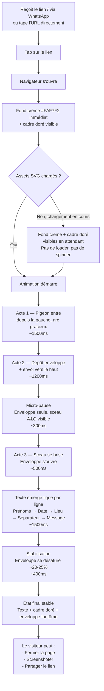
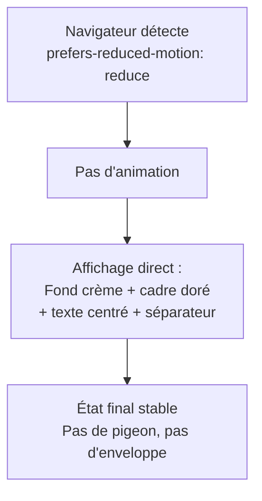
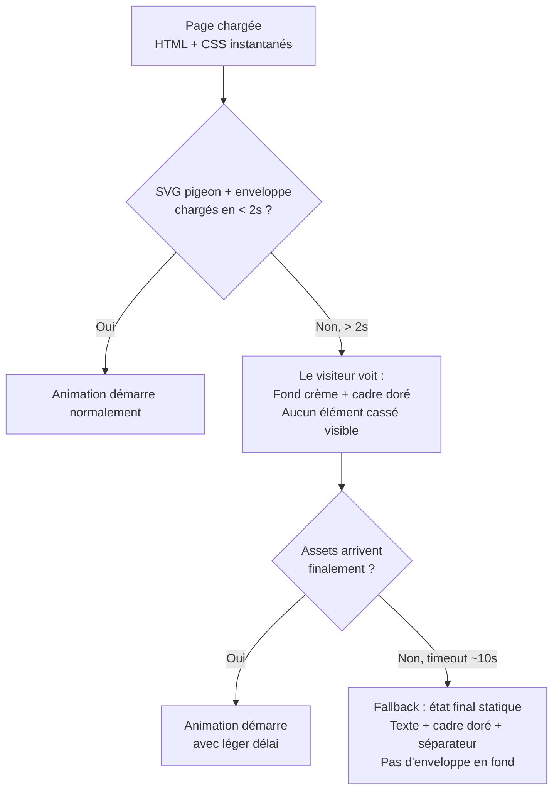
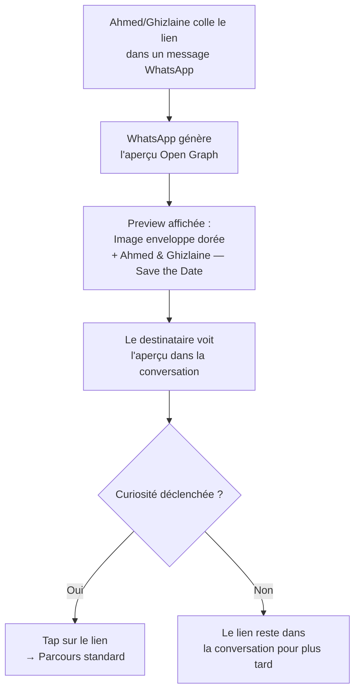

# UX Design Specification — Save the Date Animé (Pigeon Voyageur)

**Auteur :** Mister Azami
**Date :** 2026-02-18

---

## Executive Summary

### Vision Projet

Animation "Save the Date" sur la landing page publique (`/`) du site de mariage. Un pigeon voyageur stylisé livre une enveloppe cachetée A&G qui s'ouvre pour révéler la date, le lieu et un message poétique. Page autonome, accessible à tous, sans lien avec le parcours RSVP des invités.

### Utilisateurs Cibles

| Persona | Contexte Save the Date | Besoin UX |
|---------|----------------------|-----------|
| Tante Fatima (58 ans) | Reçoit le lien `/` via WhatsApp avant l'invitation | Animation compréhensible immédiatement, message clair |
| Karim (28 ans) | Voit le lien partagé, juge la qualité | Animation premium, "c'est trop propre", envie de screenshoter |
| Visiteur quelconque | Tombe sur `/` par hasard ou partage | Comprend qu'il s'agit d'un mariage, expérience mémorable |

### Architecture de Pages

| Route | Contenu | Audience |
|-------|---------|----------|
| `/` | Save the Date animé (pigeon → enveloppe → révélation) | Publique — tout le monde |
| `/invite/[slug]` | Site d'invitation complet (hero, histoire, RSVP) | Invités uniquement |
| `/admin` | Gestion invités | Ahmed & Ghizlaine |

### Défis UX Clés

1. **Clarté immédiate de l'animation** — Le pigeon et l'enveloppe doivent être identifiables instantanément. Aucune ambiguïté visuelle tolérée, même pour un utilisateur peu tech-savvy.

2. **Cohabitation de deux styles visuels** — Le pigeon flat/illustré (Save the Date) et les alliances réalistes (invitation) vivent sur des pages différentes, ce qui atténue la dissonance, mais l'identité visuelle globale (palette dorée, crème, Cormorant) doit unifier les deux.

3. **Preload des assets** — L'animation se joue au chargement. Les SVG du pigeon et de l'enveloppe doivent être chargés avant le premier frame, sinon flash blanc. Stratégie de preload ou fond crème de transition nécessaire.

### Opportunités Design

1. **Bouche-à-oreille visuel** — Les invités partagent `/` avec leurs proches. Une animation réussie génère des "regarde ça" spontanés sur WhatsApp.

2. **Open Graph dédié** — L'aperçu WhatsApp de `/` montre le Save the Date (image enveloppe dorée + "Ahmed & Ghizlaine — Save the Date"), distinct de l'aperçu de l'invitation.

3. **Page autonome ultra-performante** — Server Component pur, zéro API, zéro base de données. Performance maximale garantie.

## Core User Experience

### Expérience Définissante

L'action fondamentale du Save the Date est **contemplative, pas interactive**. L'utilisateur est spectateur d'une micro-narration animée en 3 actes. Il n'y a aucun tap, aucun scroll, aucun choix à faire — juste regarder et absorber. C'est un court-métrage de 4-5 secondes, pas une interface.

L'utilisateur décrirait l'expérience : *"J'ai ouvert le lien et un truc magnifique s'est joué devant moi — un pigeon qui livre une lettre avec la date du mariage. C'était classe."*

### Stratégie Plateforme

| Aspect | Décision |
|--------|----------|
| Page | Landing publique `/` — accessible à tous, sans authentification |
| Type | Page autonome, Server Component avec Client Component minimal pour l'orchestration d'animation |
| Input | Aucun — expérience 100% passive, zéro JS interactif |
| Durée | 4-5 secondes d'animation, puis contenu statique permanent |
| Post-animation | Contenu reste affiché, pas de scroll, pas de CTA sur la page |
| Replay | L'animation se rejoue à chaque visite — pas de mécanisme "déjà vu". Le replay EST la valeur de partage |
| CTA implicite | L'Open Graph WhatsApp (image enveloppe dorée + "Ahmed & Ghizlaine — Save the Date") est le vrai déclencheur de visite, pas un bouton sur la page |
| Dépendances | Zéro API, zéro base de données, zéro état client persistant |

### Interactions Sans Friction

Le mot "interaction" est presque un abus de langage ici — l'expérience est conçue pour **zéro friction par absence totale d'interaction** :

| Moment | Principe |
|--------|----------|
| Chargement de la page | Fond crème immédiat (pas de blanc), animation démarre dès que les assets sont prêts |
| Pendant l'animation | L'utilisateur ne fait rien — il regarde. Pas de bouton "skip", pas de contrôles |
| Fin de l'animation | Le contenu final (date, lieu, message) reste visible indéfiniment |
| Revisites | L'animation se rejoue intégralement — chaque visite est une nouvelle projection du court-métrage |
| Partage | Le lien `/` est partageable tel quel — le destinataire vit la même expérience complète |
| `prefers-reduced-motion` | Contenu final affiché immédiatement, sans animation |

### Moments de Succès Critiques

1. **L'entrée du pigeon (Acte 1)** — C'est LE moment make-or-break. Le pigeon doit entrer avec grâce et capter l'attention instantanément. Si l'animation est saccadée, si le pigeon est visuellement confus, ou si le chargement est lent, l'effet "waouh" est perdu irrémédiablement.

2. **La micro-pause (transition Acte 2 → 3)** — Le pigeon s'envole, l'enveloppe reste seule au centre, immobile pendant 300-500ms. Ce silence visuel crée l'anticipation avant la révélation. Sans cette pause, l'ouverture de l'enveloppe arrive trop vite et l'émotion n'a pas le temps de monter.

3. **L'ouverture de l'enveloppe (Acte 3)** — Le rabat qui se soulève et le contenu qui émerge doivent être fluides et élégants. Si cette transition est bâclée, la narration se brise juste avant la révélation — le pire moment possible pour perdre la magie.

4. **La lisibilité du contenu final** — Après l'émotion de l'animation, l'information doit être immédiatement lisible : date, lieu, message. Si l'utilisateur doit plisser les yeux ou chercher l'info, l'impact émotionnel se dissipe.

### Principes d'Expérience

1. **Spectacle, pas interface** — L'utilisateur est spectateur, jamais acteur. Aucun élément interactif ne doit briser l'immersion narrative.

2. **Deux moments, zéro compromis** — L'entrée du pigeon et l'ouverture de l'enveloppe portent toute la charge émotionnelle. Ces deux animations doivent être irréprochables, quitte à simplifier le reste.

3. **L'émotion de sortie est double** — "C'était beau, j'ai hâte" (émotion personnelle) + "il faut que je montre ça" (envie de partager). Le replay à chaque visite et l'Open Graph soigné nourrissent directement cette envie de partage.

4. **Rejouable par design** — L'animation se joue à chaque chargement. Pas de "déjà vu", pas d'état sauvegardé. Chaque ouverture du lien est une nouvelle projection. C'est ce qui rend le partage WhatsApp efficace.

5. **Le CTA est invisible** — Aucun bouton sur la page. Le déclencheur de visite est l'aperçu Open Graph dans WhatsApp. Le déclencheur de partage est la beauté de l'animation elle-même.

## Desired Emotional Response

### Objectifs Émotionnels Primaires

**Émotion dominante :** Émerveillement admiratif — "waouh, c'est très bien fait". Pas de tendresse ni de mièvrerie. L'utilisateur est impressionné par la qualité d'exécution et le caractère fantaisiste/poétique de l'animation. C'est de l'admiration visuelle, pas de l'attendrissement.

**Émotion secondaire :** Excitation impatiente — "j'ai hâte, ça arrive bientôt". La date révélée déclenche une projection vers le futur, pas un constat solennel.

**Registre du pigeon :** Poétique et élégant avant tout. Le pigeon n'est pas un personnage cartoon mignon — c'est un messager de conte, gracieux et raffiné. Le charme vient de la poésie du geste (livrer une lettre en volant), pas d'un design "kawaii".

### Cartographie Émotionnelle du Parcours

| Étape | Émotion visée | Intensité |
|-------|---------------|-----------|
| Aperçu WhatsApp (Open Graph) | Curiosité intriguée — "c'est quoi ça ?" | Douce — envie d'ouvrir |
| Fond crème au chargement | Neutre — attente calme | Minimale — pas d'impatience |
| Acte 1 — Entrée du pigeon (enveloppe visible dans le bec) | **"Waouh"** — admiration immédiate, surprise positive | **Forte** — pic émotionnel d'entrée |
| Acte 2 — Dépôt de l'enveloppe | Fascination — "c'est beau, c'est bien fait" | Soutenue — l'admiration se confirme |
| Sceau A&G visible sur l'enveloppe | Reconnaissance personnalisée — "c'est sur mesure, c'est LEUR mariage" | Précise — détail qui élève |
| Micro-pause (enveloppe seule) | Anticipation — "qu'est-ce qui va se passer ?" | Montante — tension narrative |
| Acte 3 — Ouverture et révélation | **Excitation** — "17 Octobre ! J'ai hâte !" | **Forte** — deuxième pic émotionnel |
| Contenu statique final | Satisfaction + projection — "ça va être bien" | Calme — l'émotion se pose |
| Après fermeture de la page | "Il faut que je montre ça à quelqu'un" | Résiduelle — envie de partager |

**Note — Visiteurs non-invités :** Pour ceux qui ne connaissent pas le couple, l'émotion à la révélation est différente mais tout aussi positive : "c'est class" / "j'aimerais avoir ça pour mon mariage". Le design doit porter cette émotion par la beauté seule de la typographie et de l'animation, sans nécessiter de lien personnel avec Ahmed & Ghizlaine.

### Micro-Émotions

| État positif visé | État négatif à éviter | Contexte |
|-------------------|----------------------|----------|
| Admiration ("waouh") | Indifférence ("bof", "naze") | Qualité visuelle de l'animation — jamais cheap |
| Fluidité ("c'est smooth") | Lenteur ("c'est long") | Rythme de l'animation — jamais traînant |
| Compréhension instantanée | Confusion ("je comprends pas") | Lisibilité du pigeon, de l'enveloppe, du texte final |
| Excitation ("j'ai hâte") | Ennui ("ok et ?") | Révélation de la date — doit créer l'impatience |
| Émerveillement poétique | Niaiserie ("c'est niais") | Le pigeon est élégant, pas mignon |
| Sur mesure ("c'est pas un template") | Générique ("c'est vu et revu") | Sceau A&G calligraphié, qualité des assets |

### Implications Design

| Émotion | Traduction UX |
|---------|---------------|
| "Waouh" / admiration | Animation du pigeon irréprochable : trajectoire fluide, easing naturel, détails soignés. La qualité d'exécution EST le waouh — pas besoin d'effets spéciaux, juste de la perfection dans le mouvement |
| Poésie / élégance | Pigeon stylisé avec grâce, pas cartoon. Mouvement de vol réaliste dans sa fluidité, fantaisiste dans son contexte. Palette dorée/blanche cohérente |
| Excitation / impatience | La date apparaît avec impact — typographie display, animation de révélation nette. Le mot "Casablanca" et la date sont les deux éléments qui doivent frapper |
| Anti-lenteur | Rythme total 4-5s, JAMAIS plus. Chaque acte ~1.5s. Aucun temps mort perceptible sauf la micro-pause intentionnelle (300-500ms). Si l'utilisateur pense "c'est long", c'est raté |
| Anti-confusion | Le pigeon doit être identifiable en < 0.5s. **L'enveloppe est visible dans le bec du pigeon dès la première frame de l'animation** — c'est le lien narratif entre l'oiseau et la lettre. Le texte final doit être lisible sans effort. Zéro ambiguïté visuelle |
| Anti-naze | Pas de template, pas de clip-art, pas d'animation générique. La qualité des assets SVG et du timing d'animation est ce qui sépare "waouh" de "naze" |
| Beauté autonome | Le contenu révélé doit fonctionner émotionnellement même pour quelqu'un qui ne connaît pas le couple — la typographie, la composition et le message poétique portent l'émotion par eux-mêmes |

### Principes de Design Émotionnel

1. **Le waouh vient de l'exécution, pas du concept** — L'idée d'un pigeon qui livre une lettre est simple. Ce qui crée l'admiration, c'est la fluidité du vol, la grâce du dépôt, l'élégance de l'ouverture. Chaque milliseconde d'animation doit être polie.

2. **Les assets sont un prérequis bloquant** — La qualité artistique des illustrations SVG est un bloqueur absolu. L'animation la plus fluide du monde ne sauve pas un pigeon clip-art. Tant que les assets ne sont pas au niveau, l'animation ne doit pas être développée.

3. **Poétique, jamais niais** — Le pigeon est un messager de conte, pas une mascotte. L'enveloppe est un objet précieux, pas un accessoire. Le ton est "il était une fois", pas "c'est trop chou".

4. **Le rythme crée l'émotion** — 4-5 secondes, pas une de plus. Le tempo doit donner l'impression que tout va vite et bien, jamais que ça traîne. La micro-pause avant l'ouverture est le seul ralentissement autorisé — et il sert l'anticipation.

5. **La clarté est non-négociable** — Si un seul utilisateur dit "je comprends pas ce que c'est", c'est un échec. L'enveloppe est visible dans le bec dès la frame 1. Le pigeon = oiseau qui vole avec une lettre. Le texte = date et lieu. Zéro abstraction.

6. **L'excitation se construit en crescendo** — Acte 1 = waouh visuel. Acte 2 = fascination + détail du sceau. Pause = anticipation. Acte 3 = excitation. Le parcours émotionnel monte, il ne descend jamais avant la fin.

## UX Pattern Analysis & Inspiration

### Analyse des Produits Inspirants

**Apple.com (pages produits)**
- Transitions maîtrisées entre sections, micro-interactions élégantes
- Animations au scroll ultra-premium : révélation progressive, parallax subtil
- Timing parfait : jamais trop rapide, jamais trop lent
- Pertinence Save the Date : la référence absolue pour le timing et l'easing des animations

**Stripe (animations vectorielles)**
- Animations SVG propres, modernes, pédagogiques
- Mouvement au service de la compréhension, pas de la décoration
- Simplicité + sophistication : peu d'éléments, beaucoup de polish
- Pertinence Save the Date : modèle pour l'animation du pigeon — vectoriel, fluide, narratif

**Airbnb (micro-animations)**
- Animations chaleureuses et organiques dans l'app
- Sens du détail : ombres, easing naturel, micro-rebonds subtils
- L'animation renforce le sentiment humain, pas la technicité
- Pertinence Save the Date : le registre émotionnel chaleureux sans tomber dans le niais

**Intros d'apps bancaires premium**
- Logo qui se "trace" en ligne fine dorée — raffinement extrême
- Apparition progressive, lumière, reflets métalliques subtils
- Le doré comme accent, pas comme dominante
- Pertinence Save the Date : référence directe pour le traitement doré du pigeon et du sceau

**Sites Awwwards**
- Standard de fluidité cinématique et d'immersion visuelle
- Animations comme élément narratif, pas décoratif
- Pertinence Save the Date : le niveau de qualité visé — "primable sur Awwwards"

### Analyse des Références Visuelles

**Style d'illustration — Pigeon :**

| Inspiration | Ce qu'on retient | Ce qu'on évite |
|-------------|-----------------|----------------|
| Illustrations éditoriales minimalistes | Formes pleines, ombres très légères, élégance épurée | Surcharge de détails, hyper-réalisme |
| Logos animés en ligne fine dorée | Un seul accent doré métallique sur fond blanc cassé | Dégradés brillants "bling bling" |
| Identité visuelle de marque de parfum | Minimalisme haut de gamme, raffinement absolu | Style corporate générique |
| Animation de battement d'aile | Slow motion gracieux, léger reflet doré animé | Cartoon enfantin, mouvement saccadé |

**Style d'enveloppe & sceau — Direction retenue : Papeterie de luxe :**

| Élément | Style | Référence |
|---------|-------|-----------|
| Enveloppe | Crème texturée, élégance intemporelle | Papeterie de mariage haut de gamme, univers Hermès |
| Sceau | Doré gaufré, calligraphie fine A&G | Wax seal avec texture cire réaliste |
| Ouverture | Rabat qui se soulève avec grâce, léger bruit visuel | Animation solennel mais pas lente |
| Ton général | Invitation privée, magazine luxe, exclusivité | Faire-part traditionnel revisité en digital |

### Patterns Transférables

**Patterns d'Animation :**

| Pattern | Source | Application Save the Date |
|---------|--------|--------------------------|
| Easing naturel avec micro-rebonds | Airbnb | Le pigeon se pose avec un très léger rebond — vivant, pas mécanique |
| Traçage en ligne fine dorée | Intros apps bancaires | Le sceau A&G pourrait se "tracer" en animation avant l'ouverture |
| Révélation progressive | Apple | Le texte du Save the Date émerge mot par mot ou ligne par ligne, pas en bloc |
| Animation vectorielle narrative | Stripe | Le vol du pigeon raconte une histoire — trajectoire avec intention, pas déplacement linéaire |

**Patterns Visuels :**

| Pattern | Source | Application Save the Date |
|---------|--------|--------------------------|
| Accent doré unique sur fond neutre | Apps bancaires premium | Fond crème + seul le pigeon/sceau/enveloppe portent le doré |
| Formes pleines + ombres légères | Illustrations éditoriales | Pigeon en aplats avec ombre portée subtile — profondeur sans complexité |
| Espace blanc généreux | Apple / Hermès | Le pigeon vole dans un espace vide — le vide est élégance |
| Texture subtile sur l'enveloppe | Papeterie luxe | Grain de papier léger sur le SVG de l'enveloppe — touche physique dans le digital |

### Anti-Patterns à Éviter

| Anti-pattern | Pourquoi l'éviter | Risque si ignoré |
|--------------|-------------------|------------------|
| Pigeon cartoon / kawaii | Tue le registre poétique, tombe dans le niais | "C'est mignon" au lieu de "c'est waouh" |
| Dégradés dorés brillants excessifs | Effet "bling bling" cheap | "C'est kitsch" au lieu de "c'est élégant" |
| Animation trop rapide (< 3s) | L'utilisateur ne comprend pas ce qui s'est passé | Confusion, pas d'émotion |
| Animation trop lente (> 6s) | L'utilisateur décroche | "C'est long" — émotion anti-waouh |
| Trop d'éléments animés simultanément | Surcharge cognitive, perte de focus | L'œil ne sait pas où regarder |
| Style corporate / template | Aucune personnalité | "C'est générique" — zéro mémorabilité |
| Effets sonores | Intrusif sur mobile, amateurish | Fatima panique, Karim ferme |
| Particules / confettis / paillettes | Cliché de mariage digital | "C'est un template" |

### Stratégie d'Inspiration Design

**Adopter tel quel :**
- Easing naturel et timing maîtrisé (Apple) — chaque keyframe est calibrée
- Animation vectorielle narrative (Stripe) — le mouvement raconte, pas décore
- Espace blanc comme élément de design (Apple / Hermès) — le vide est du luxe

**Adapter au contexte Save the Date :**
- Micro-rebonds Airbnb → version ultra-subtile pour le dépôt de l'enveloppe (touche vivante sans cartoon)
- Traçage doré des intros bancaires → animation du sceau A&G qui se révèle en tracé fin avant l'ouverture
- Révélation progressive Apple → texte du Save the Date qui émerge ligne par ligne (prénoms → date → lieu → message)
- Texture papier luxe → grain SVG subtil sur l'enveloppe pour ancrage physique

**Éviter absolument :**
- Tout ce qui dit "template de mariage digital" (particules, confettis, cœurs, polices cursives)
- Tout ce qui est cartoon, enfantin ou "mignon"
- Tout excès doré — le doré est un accent chirurgical, pas une dominante
- Tout effet sonore

## Design System Foundation

### Choix du Système

**Héritage du design system principal** — Le Save the Date réutilise intégralement la fondation visuelle du site de mariage existant (Tailwind CSS 4 + tokens `@theme inline`).

### Raisons du Choix

| Critère | Décision |
|---------|----------|
| Cohérence visuelle | Même palette, mêmes polices, mêmes tokens → le Save the Date "appartient" au même univers que l'invitation |
| Zéro configuration | Les tokens Tailwind sont déjà définis, les polices déjà chargées via `next/font/google` |
| Maintenance | Un seul design system à maintenir pour tout le projet |
| Performance | Pas de CSS additionnel — tout est déjà dans le bundle Tailwind existant |

### Fondation Visuelle Héritée

**Palette :**

| Rôle | Hex | Usage Save the Date |
|------|-----|---------------------|
| Fond | `#FAF7F2` (Crème Chaud) | Background de la page — visible dès le chargement |
| Accent | `#B8860B` (Doré Marocain) | Pigeon, sceau A&G, accents dorés de l'enveloppe |
| Accent clair | `#D4A54A` (Doré Lumineux) | Reflets subtils du pigeon, détails de l'enveloppe |
| Accent très clair | `#E8D5A8` (Voile Doré) | Ombre douce du pigeon, fond du sceau |
| Texte | `#2C2418` (Brun Profond) | Date, lieu, message poétique |
| Texte secondaire | `#6B5D4F` (Brun Moyen) | Message poétique en italique |
| Fond enveloppe | `#FFFDF9` (Blanc Cassé) | Intérieur de l'enveloppe ouverte |

**Typographie :**

| Usage | Police | Taille | Poids |
|-------|--------|--------|-------|
| "Ahmed & Ghizlaine" | Cormorant Garamond | Display XL (48px mobile / 80px desktop) | 300 (Light) |
| "17 Octobre 2026" | Cormorant Garamond | Display L (36px mobile / 56px desktop) | 400 (Regular) |
| "Casablanca" | Cormorant Garamond | Display M (28px mobile / 40px desktop) | 400 (Regular) |
| Message poétique | Geist Sans | Body L (18px) | 400 (Regular), italique |

### Technologie d'Animation

**CSS Animations + CSS Motion Path** — Zéro dépendance, performance maximale.

| Critère | CSS Animations | Framer Motion | Lottie |
|---------|---------------|---------------|--------|
| Bundle ajouté | **0 Ko** | ~35 Ko gzippé | ~50 Ko gzippé |
| GPU acceleration | **Native** | Via `transform` | Canvas/SVG renderer |
| Séquencement 3 actes | `animation-delay` | `variants` + `stagger` | Timeline After Effects |
| Trajectoire courbe pigeon | `offset-path` (Motion Path) | `animate` custom | Intégrée au fichier |
| Client Component requis | **Non** (CSS pur) | Oui (hydration React) | Oui (player JS) |
| Compatibilité cible | Safari 15.4+, Chrome ✅ | Tous navigateurs | Tous navigateurs |

**Décision : CSS Animations pures.** Raisons :
1. **0 Ko de bundle additionnel** — performance maximale, rien à charger
2. **GPU-accelerated nativement** — 60fps garanti sur les appareils cibles
3. **Pas de Client Component** — la page reste un Server Component avec CSS pur
4. **CSS Motion Path (`offset-path`)** — permet les trajectoires courbes du pigeon, supporté par tous les navigateurs cibles
5. **`animation-delay`** — séquencement précis des 3 actes sans orchestrateur JS
6. **`prefers-reduced-motion`** — géré en CSS pur via `@media`, zéro JS nécessaire

### Stratégie de Personnalisation

**Composants shadcn/ui :** Aucun nécessaire pour le Save the Date. La page est une animation pure sans interaction — pas de `Dialog`, pas de `Button`, pas de `Input`. Si un besoin émerge, shadcn/ui est disponible dans le projet mais non requis a priori.

**Tokens custom Save the Date (dans `@theme inline`) :**

| Token | Valeur | Usage |
|-------|--------|-------|
| `--animation-act1` | `1500ms` | Durée Acte 1 (entrée pigeon) |
| `--animation-act2` | `1500ms` | Durée Acte 2 (dépôt + envol) |
| `--animation-pause` | `400ms` | Micro-pause (enveloppe seule) |
| `--animation-act3` | `1500ms` | Durée Acte 3 (ouverture + révélation) |
| `--easing-flight` | `cubic-bezier(0.25, 0.1, 0.25, 1.0)` | Trajectoire naturelle du pigeon |
| `--easing-land` | `cubic-bezier(0.34, 1.56, 0.64, 1)` | Micro-rebond au dépôt |
| `--easing-reveal` | `cubic-bezier(0.0, 0.0, 0.2, 1)` | Ouverture fluide de l'enveloppe |

## Expérience Définissante — Détail

### Interaction Fondamentale

**"Ouvrir un lien → regarder un pigeon livrer une lettre → découvrir la date du mariage"**

L'utilisateur décrirait cette expérience à un ami : *"Tu ouvres le lien et y'a un pigeon qui arrive avec une lettre, elle s'ouvre et tu vois la date du mariage. C'est super bien fait."* C'est un spectacle de 5 secondes, pas une interface.

### Modèle Mental des Utilisateurs

| Aspect | Attente de l'utilisateur | Réalité du site |
|--------|--------------------------|-----------------|
| Format | Un visuel statique "Save the Date" classique | Une micro-narration animée en 3 actes |
| Interactivité | Un bouton à cliquer, un formulaire | Rien — on regarde, c'est tout |
| Durée | Instantané (image) ou long (vidéo) | 5 secondes — ni trop court ni trop long |
| Qualité | Template standard de mariage | Animation premium niveau Awwwards |

**Patterns établis (zéro éducation nécessaire) :**
- Un oiseau qui vole et porte quelque chose dans son bec — universellement compris
- Une enveloppe qui s'ouvre — geste familier, même pour Fatima
- Du texte qui apparaît progressivement — vu partout (Apple, pubs TV, génériques)

**Innovation contextuelle :**
- Le pigeon voyageur comme métaphore de l'invitation — poétique et inattendu dans un contexte digital
- L'animation remplace le visuel statique — "c'est pas un Save the Date classique"

### Critères de Succès

| Indicateur | Cible | Mesure |
|-----------|-------|--------|
| Compréhension immédiate | 100% des utilisateurs identifient le pigeon + l'enveloppe en < 1s | Test qualitatif sur 5 personnes |
| Réaction "waouh" | > 50% des premiers spectateurs verbalisent une réaction positive | Observation lors du partage |
| Lisibilité du contenu final | Date + lieu lus en < 2s après la fin de l'animation | Test qualitatif |
| Envie de partager | > 30% des spectateurs partagent le lien spontanément | Observation WhatsApp |
| Fluidité | 60fps constant, zéro saccade perceptible | Lighthouse + test appareils réels |
| Durée perçue | Personne ne dit "c'est long" | Test qualitatif |

### Mécanique Détaillée de l'Animation

**Budget total : 5 secondes (5000ms)**

#### Acte 1 — L'Arrivée (~1500ms)

| Phase | Durée | Description | Technique CSS |
|-------|-------|-------------|---------------|
| Entrée | 0-1200ms | Le pigeon entre depuis la gauche, légèrement en hauteur. Trajectoire en arc gracieux descendant vers le centre. Battements d'ailes fluides, rythme lent. | `offset-path` courbe de Bézier (fallback : keyframes `translate` + `rotate` si Safari pose problème) |
| Ralentissement | 1200-1500ms | À l'approche du centre : ralentissement progressif, transition vers un léger plané. Micro-mouvement de stabilisation. | Easing décélérant, keyframes d'ailes qui se stabilisent |

#### Acte 2 — La Livraison (~1200ms)

| Phase | Durée | Description | Technique CSS |
|-------|-------|-------------|---------------|
| Dépôt | 1500-1800ms | Le pigeon dépose l'enveloppe au centre. Micro-rebond ultra-subtil au contact. **Dépôt cadré à 300ms max** — geste vif et précis. | `var(--easing-land)` avec rebond, `translate` |
| Envol | 1800-2700ms | Le pigeon s'envole vers le haut, ascension douce (~900ms). Fade-out progressif pendant la montée. Mission accomplie — il disparaît dans la lumière. L'envol porte plus de charge visuelle que le dépôt. | `translateY` négatif + `opacity: 0`, easing ease-out |

**L'enveloppe est maintenant seule au centre. Le sceau A&G en calligraphie dorée est visible.**

#### Micro-Pause (~300ms)

| Phase | Durée | Description |
|-------|-------|-------------|
| Silence visuel | 2700-3000ms | L'enveloppe est immobile, seule au centre. Ce moment d'immobilité crée l'anticipation. Le sceau A&G attire l'œil. |

#### Acte 3 — La Révélation (~2000ms)

| Phase | Durée | Description | Technique CSS |
|-------|-------|-------------|---------------|
| Ouverture | 3000-3500ms | Le sceau se brise doucement. Le rabat de l'enveloppe se soulève avec grâce. | `transform: rotateX()` sur le rabat, easing `var(--easing-reveal)` |
| Prénoms | 3500-3700ms | "Ahmed & Ghizlaine" apparaît — opacité + léger mouvement vertical (+8px). Cormorant XL. | `animation-delay: 3500ms`, 200ms |
| Date | 3700-3900ms | "17 Octobre 2026" apparaît — même effet. Cormorant L. | `animation-delay: 3700ms`, 200ms |
| Lieu | 3900-4100ms | "Casablanca" apparaît. Cormorant M. | `animation-delay: 3900ms`, 200ms |
| Séparateur | 4100-4200ms | Trait doré horizontal (`w-12`, `#B8860B`) — respiration visuelle, ancrage dans l'univers du site principal. | `animation-delay: 4100ms`, 100ms |
| Message | 4200-4600ms | *« Une date à retenir… »* apparaît. Geist Sans italique. | `animation-delay: 4200ms`, 400ms |
| Stabilisation | 4600-5000ms | Tout est visible. L'enveloppe en arrière-plan se désature progressivement et s'atténue (opacité ~20-25%, à valider sur appareil réel). Le texte reste net et centré. | `opacity` transition sur l'enveloppe |

### État Final

| Élément | État | Visibilité |
|---------|------|------------|
| Pigeon | Disparu (fade-out complet) | Invisible |
| Enveloppe ouverte | Désaturée, très légère en arrière-plan | ~20-25% opacité (valider sur appareil réel, pas en simulateur) |
| "Ahmed & Ghizlaine" | Cormorant XL, Brun Profond, centré | Pleine visibilité |
| "17 Octobre 2026" | Cormorant L, Brun Profond, centré | Pleine visibilité |
| "Casablanca" | Cormorant M, Brun Profond, centré | Pleine visibilité |
| Séparateur doré | Trait horizontal `w-12`, Doré Marocain | Pleine visibilité |
| Message poétique | Geist Sans italique, Brun Moyen, centré | Pleine visibilité |
| Fond | Crème `#FAF7F2` | Permanent |

### État `prefers-reduced-motion`

Quand l'utilisateur a activé "Réduire les animations" :
- **Pas d'animation** — aucun pigeon, aucune enveloppe animée
- **Pas d'enveloppe en arrière-plan** — sans le contexte narratif de l'animation, l'enveloppe serait confuse
- **Affichage direct** : texte centré + séparateur doré sur fond crème
- L'expérience reste élégante et complète, simplement statique

### Diagramme de Timeline

```
0s        1s        2s        3s        4s        5s
|---------|---------|---------|---------|---------|
[===== Acte 1 =====]
  pigeon: vol arc    ralenti
                    [==== Acte 2 ====]
                     dépôt   envol ↑ fade
                     300ms   900ms
                                    [P]
                                    300ms
                                      [====== Acte 3 ======]
                                       ouverture  texte    stab.
                                                  A&G|date|lieu|—|msg
```

### Notes d'Implémentation

- **`offset-path` + fallback** : Implémenter `offset-path` pour la trajectoire courbe du pigeon. Prévoir un fallback en keyframes `translate` + `rotate` classiques si Safari pose problème avec `offset-rotate: auto`.
- **Séquencement CSS pur** : Toutes les `animation-delay` sont calculées à partir de `t=0` (chargement). Zéro JS orchestrateur.
- **Validation sur appareils réels** : L'opacité de l'enveloppe finale (20-25%) et le micro-rebond du dépôt doivent être testés sur iPhone SE, iPhone 14, Galaxy A52 — pas en simulateur.

## Visual Design Foundation

### Système de Couleurs

**Palette héritée du site principal** — Aucune couleur supplémentaire. Le Save the Date utilise exclusivement la palette existante.

**Application spécifique au Save the Date :**

| Élément | Couleur(s) | Détail |
|---------|-----------|--------|
| Fond de page | `#FAF7F2` Crème Chaud | Visible dès le chargement, permanent |
| Pigeon — corps principal | `#B8860B` Doré Marocain | Silhouette en aplat doré |
| Pigeon — plumage/détails | `#D4A54A` Doré Lumineux | Nuances très subtiles sur les ailes, ventre légèrement plus clair |
| Pigeon — ombre portée | `#E8D5A8` Voile Doré | Ombre douce projetée, légèreté |
| Enveloppe — surface | `#FFFDF9` Blanc Cassé | Aplat principal, léger grain quasi-imperceptible |
| Enveloppe — plis/bords | `#E8D5A8` Voile Doré | Ombres de pli très discrètes, profondeur subtile |
| Enveloppe — bordure | `#D4A54A` Doré Lumineux | Liseré fin doré sur les bords |
| Sceau A&G | `#B8860B` Doré Marocain | Monogramme en relief doré |
| Texte — prénoms, date, lieu | `#2C2418` Brun Profond | Lisibilité maximale |
| Texte — message poétique | `#6B5D4F` Brun Moyen | Hiérarchie visuelle secondaire |
| Séparateur doré | `#B8860B` Doré Marocain | Trait horizontal `w-12` |

### Pigeon — Spécifications Visuelles

**Principe : 2-3 couleurs, flat premium**

| Propriété | Spécification |
|-----------|---------------|
| Style | Flat design premium — formes pleines, pas de contour (outline) |
| Palette | 2-3 couleurs max : Doré Marocain (corps), Doré Lumineux (plumage subtil), Voile Doré (ombre) |
| Plumage | Nuances très subtiles entre les aplats — différence de ton, pas de dégradé visible. Le passage doré foncé → doré clair suffit à suggérer le volume |
| Silhouette | Reconnaissable en < 0.5s : posture de vol, ailes déployées, enveloppe visible dans le bec |
| Ombre portée | Ombre douce en Voile Doré, projetée légèrement en bas — donne de la profondeur sans surcharger |
| Taille | ~80-100px de large sur mobile, ~150-180px sur desktop |
| À éviter | Dégradés brillants, contours noirs, détails hyper-réalistes (plumes individuelles), style cartoon |

### Enveloppe — Spécifications Visuelles

**Principe : aplat avec réalisme discret**

| Propriété | Spécification |
|-----------|---------------|
| Style | Aplat Blanc Cassé avec touches de réalisme très discrètes |
| Surface | Léger grain quasi-imperceptible — pas de texture papier visible, juste une surface qui n'est pas "parfaitement lisse" au zoom |
| Plis | Ombres de pli très discrètes en Voile Doré — suggère les bords repliés de l'enveloppe sans attirer l'attention |
| Bordure | Liseré fin doré sur les contours — élégance papeterie de luxe |
| Rabat | Partie supérieure triangulaire, même traitement que le corps. S'ouvre en `rotateX()` à l'Acte 3 |
| Proportions | Ratio ~3:2 (format enveloppe classique). ~120px de large mobile, ~200px desktop |
| À éviter | Texture papier lourde, ombres portées dramatiques, aspect 3D poussé |

### Sceau A&G — Spécifications Visuelles

**Principe : monogramme latin élégant avec touche arabesque géométrique**

| Propriété | Spécification |
|-----------|---------------|
| Style | Monogramme "A&G" en typographie latine élégante (serif fine), entouré d'entrelacs géométriques inspirés de l'art islamique (zellige, arabesques) |
| Forme | Cercle doré — forme du cachet de cire traditionnel |
| Couleur | Doré Marocain `#B8860B` principal, Doré Lumineux `#D4A54A` pour les détails d'entrelacs |
| Lettres | "A" et "G" en serif élégante (proche Cormorant), "&" plus petit entre les deux |
| Entrelacs | Motifs géométriques fins autour du monogramme — étoiles à 8 branches, lignes entrecroisées. Subtils, pas dominants — le monogramme reste le centre d'attention |
| Taille | ~30-40px de diamètre mobile, ~50-60px desktop — proportionnel à l'enveloppe |
| Animation | Option : le sceau se "trace" en ligne fine dorée avant l'ouverture (adapté des intros bancaires premium) |
| À éviter | Calligraphie arabe littérale (problème de lisibilité universelle), motifs trop chargés, effet cire 3D trop réaliste |

### Système Typographique (État Final)

**Héritage du site principal — appliqué au contenu révélé :**

| Ligne | Police | Taille mobile | Taille desktop | Poids | Couleur |
|-------|--------|--------------|----------------|-------|---------|
| "Ahmed & Ghizlaine" | Cormorant Garamond | 48px / 3rem | 80px / 5rem | 300 (Light) | `#2C2418` |
| "17 Octobre 2026" | Cormorant Garamond | 36px / 2.25rem | 56px / 3.5rem | 400 (Regular) | `#2C2418` |
| "Casablanca" | Cormorant Garamond | 28px / 1.75rem | 40px / 2.5rem | 400 (Regular) | `#2C2418` |
| Séparateur doré | — | `w-12` (48px) | `w-12` (48px) | — | `#B8860B` |
| Message poétique | Geist Sans | 18px / 1.125rem | 18px / 1.125rem | 400 (Regular), italique | `#6B5D4F` |

### Système d'Espacement & Layout

**Layout — État final centré, ~60% de la hauteur écran :**

| Propriété | Valeur | Justification |
|-----------|--------|---------------|
| Centrage vertical | `flex` + `justify-center` + `items-center` sur `min-h-dvh` | Centrage parfait sur tous les écrans |
| Hauteur du bloc texte | ~60% de la hauteur visible | Texte étalé, respiration entre les lignes, pas compressé |
| Espacement entre lignes | `space-lg` (32px) entre prénoms ↔ date, `space-md` (16px) entre date ↔ lieu, `space-md` (16px) entre lieu ↔ séparateur, `space-md` (16px) entre séparateur ↔ message | Hiérarchie par l'espacement : les prénoms "respirent" le plus |
| Marges latérales | `px-6` mobile, `px-8` desktop | Cohérent avec le site principal |
| Enveloppe en arrière-plan | `absolute` centrée, ~20-25% opacité, `z-index` derrière le texte | Symbole maintenu sans concurrencer la lisibilité |

**Layout — Pendant l'animation :**

| Phase | Zone d'animation | Centrage |
|-------|-----------------|----------|
| Acte 1 (pigeon en vol) | Plein écran — le pigeon traverse de gauche au centre | Le mouvement utilise tout l'espace horizontal |
| Acte 2 (dépôt + envol) | Centre de l'écran | L'enveloppe est déposée au centre exact |
| Acte 3 (révélation) | Centre vertical, ~60% hauteur | Le texte prend sa position finale directement |

### Considérations d'Accessibilité

| Aspect | Spécification |
|--------|---------------|
| Contraste texte | Brun Profond `#2C2418` sur Crème `#FAF7F2` → ~14:1 (AAA) ✅ |
| Contraste message secondaire | Brun Moyen `#6B5D4F` sur Crème `#FAF7F2` → ~5.2:1 (AA) ✅ |
| Taille minimale | 18px pour le message poétique — au-dessus du minimum 14px |
| `prefers-reduced-motion` | État final statique sans enveloppe, texte + séparateur sur fond crème |
| Sémantique HTML | `h1` pour "Ahmed & Ghizlaine", `time` pour la date, `address` pour le lieu, `blockquote` pour le message |
| Screen reader | Le pigeon et l'enveloppe sont `aria-hidden="true"` (décoratifs). Le contenu textuel est accessible nativement |
| Métadonnées | `noindex, nofollow` — cohérent avec la page publique non-référencée |

## Design Direction

### Directions Explorées

Trois variations de composition explorées dans l'esthétique établie (pigeon flat premium, enveloppe papeterie luxe, palette dorée/crème) :

| Direction | Concept | Intensité décorative |
|-----------|---------|---------------------|
| A — Épure Totale | Fond crème nu, le vide est le luxe | Minimale — rien que l'animation et le texte |
| **B — Cadre Doré** | Cadre décoratif fin doré avec coins arabesques, évoque le faire-part encadré | Mesurée — un élément décoratif structurant |
| C — Atmosphère Lumineuse | Halo doré central en gradient radial, le pigeon vole "vers la lumière" | Subtile — ambiance sans élément tangible |

### Direction Retenue : B — Cadre Doré

Le cadre doré est retenu car il renforce la métaphore centrale du Save the Date :

- **Faire-part physique digitalisé** — Le cadre évoque un carton d'invitation encadré, ancrant l'animation dans un objet tangible
- **Structure visuelle** — Le cadre délimite la zone d'animation et crée un "écran dans l'écran", concentrant l'attention
- **Cohérence avec le sceau A&G** — Les coins arabesques du cadre répondent aux entrelacs géométriques du sceau, créant une unité visuelle
- **Élégance sans surcharge** — Un seul élément décoratif, fin et discret, qui élève sans alourdir

### Spécifications du Cadre Doré

| Propriété | Spécification |
|-----------|---------------|
| Type | Filet fin doré (1-2px) avec coins décoratifs arabesques |
| Couleur | Doré Marocain `#B8860B` pour le filet, Doré Lumineux `#D4A54A` pour les coins |
| Coins | Motifs arabesques géométriques fins — étoiles ou entrelacs, cohérents avec le sceau A&G |
| Position | Centré, avec marge de ~24px (mobile) / ~48px (desktop) par rapport aux bords de l'écran |
| Taille | Occupe ~85% de la largeur et ~80% de la hauteur visible |
| Opacité pendant l'animation | 100% — le cadre est visible dès le début, il "accueille" le pigeon |
| Opacité état final | 100% — le cadre reste, il encadre le texte comme un faire-part |
| `prefers-reduced-motion` | Le cadre est affiché immédiatement (pas d'animation d'apparition) |
| Technique | SVG inline ou pseudo-éléments CSS avec `border` + coins en SVG |

### Composition Globale

**Pendant l'animation :**
```
┌─────────────────────────────────┐
│  ╔═══════════════════════════╗  │
│  ║  ┌──╮                    ║  │  Coins arabesques
│  ║   🕊️ ──→  ✉️             ║  │  Pigeon vole dans le cadre
│  ║                           ║  │
│  ║                           ║  │
│  ╚═══════════════════════════╝  │
│                                 │
└─────────────────────────────────┘
        fond crème #FAF7F2
```

**État final :**
```
┌─────────────────────────────────┐
│  ╔═══════════════════════════╗  │
│  ║                           ║  │
│  ║    Ahmed & Ghizlaine      ║  │  Cormorant XL
│  ║                           ║  │
│  ║    17 Octobre 2026        ║  │  Cormorant L
│  ║                           ║  │
│  ║       Casablanca          ║  │  Cormorant M
│  ║         ────              ║  │  Séparateur doré
│  ║    « Une date à           ║  │  Geist Sans italic
│  ║      retenir... »         ║  │
│  ║                           ║  │
│  ║      [ ✉️ ~20% ]          ║  │  Enveloppe en fond
│  ╚═══════════════════════════╝  │
│                                 │
└─────────────────────────────────┘
```

### Principes de Composition

1. **Le cadre est permanent** — Il apparaît dès le chargement (pas d'animation d'entrée pour le cadre). Il "est là" quand le pigeon arrive, comme une scène de théâtre.

2. **Le cadre ne concurrence pas l'animation** — Filet fin (1-2px), pas épais. Les coins arabesques sont discrets. Le pigeon et l'enveloppe restent les stars.

3. **Le cadre structure l'état final** — Après l'animation, le cadre donne au texte un écrin visuel. Le résultat ressemble à un faire-part physique premium affiché à l'écran.

4. **Responsive** — Sur mobile, le cadre a moins de marge (24px) pour maximiser l'espace intérieur. Sur desktop, les marges sont plus généreuses (48px) pour l'effet "tableau encadré".

## User Journey Flows

### Parcours Standard (Tous Visiteurs)



**Points clés :**
- Aucune interaction requise — le visiteur regarde, c'est tout
- Le cadre doré et le fond crème sont visibles immédiatement (pas de blanc)
- Si les assets mettent du temps à charger, le visiteur voit un écran crème + cadre élégant — pas de spinner
- L'animation se rejoue identiquement à chaque visite

### Parcours `prefers-reduced-motion`



**Points clés :**
- Détection CSS pure : `@media (prefers-reduced-motion: reduce)`
- Pas d'enveloppe en arrière-plan (confuse sans contexte narratif)
- Le cadre doré est affiché (élément statique, pas d'animation)
- L'expérience reste élégante et complète

### Cas d'Erreur : Chargement Lent des Assets



**Points clés :**
- Le HTML + CSS sont instantanés (Server Component, cadre doré en CSS/SVG inline)
- L'attente est invisible : fond crème + cadre = écran élégant, pas un écran vide
- Si les assets n'arrivent jamais (réseau cassé), le contenu textuel s'affiche quand même après timeout
- Le visiteur voit toujours la date du mariage, animation ou pas

### Parcours Open Graph (WhatsApp Preview)



### Patterns Transversaux

| Pattern | Application | Justification |
|---------|-------------|---------------|
| Fond crème immédiat | Le fond `#FAF7F2` est en CSS, chargé en 0ms | Jamais de flash blanc, même sur connexion lente |
| Cadre doré dès le chargement | SVG inline ou CSS pur, pas de dépendance asset | L'écran est élégant avant même l'animation |
| Pas de loader / spinner | Aucun indicateur de chargement visible | Le chargement est invisible — l'écran "attend" avec grâce |
| Fallback textuel garanti | Le texte est dans le HTML, pas généré par JS | Même si tout casse, la date du mariage est lisible |
| Replay = valeur de partage | L'animation se rejoue à chaque visite | Le destinataire d'un partage WhatsApp vit la même expérience |

### Principes d'Optimisation des Flux

1. **Zéro étape active** — Le visiteur ne fait rien. Ouvrir le lien est la seule action, tout le reste est automatique.

2. **Dégradation gracieuse invisible** — Si les assets sont lents ou absents, le visiteur ne voit jamais un état "cassé". Il voit un écran élégant (crème + cadre), puis soit l'animation, soit le texte directement.

3. **Le contenu textuel est le dernier filet** — Quoi qu'il arrive (pas d'animation, pas d'assets, navigateur ancien), la date "17 Octobre 2026" et "Casablanca" sont toujours affichées. L'information ne dépend jamais de l'animation.

## Component Strategy

### Composants shadcn/ui Utilisés

Aucun. Le Save the Date est une page d'animation sans interaction — pas de `Dialog`, `Button`, `Input` ni aucun composant interactif.

### Composants Custom — Save the Date

**`SaveTheDatePage`** (page.tsx racine `/`)
- Orchestrateur principal : assemble tous les composants dans le layout
- Technique : Server Component, metadata `noindex, nofollow`, Open Graph dédié
- Responsabilité : layout `min-h-dvh`, fond crème, centrage vertical, gestion `prefers-reduced-motion` via CSS
- Charge les polices Cormorant Garamond + Geist Sans via `next/font/google`

**`GoldenFrame`**
- Cadre doré décoratif avec coins arabesques géométriques
- Technique : SVG inline ou pseudo-éléments CSS, `border` 1-2px Doré Marocain, coins en SVG
- États : un seul état — toujours visible, dès le chargement
- Props : `className` pour le responsive (marge 24px mobile / 48px desktop)
- Accessibilité : `aria-hidden="true"` (décoratif)
- Réutilisable : potentiellement sur d'autres pages si besoin d'encadrement élégant

**`PigeonVoyageur`**
- SVG du pigeon stylisé flat premium avec animation de vol
- Technique : SVG inline avec `offset-path` pour la trajectoire courbe (fallback keyframes `translate` + `rotate`), keyframes CSS pour les battements d'ailes
- États : `flying` (Acte 1, entrée arc gracieux) → `landing` (Acte 2, dépôt 300ms) → `departing` (Acte 2, envol vertical + fade-out)
- Props : aucune — animation auto-démarrante au chargement
- Accessibilité : `aria-hidden="true"` (décoratif), `pointer-events: none`
- `prefers-reduced-motion` : masqué (`display: none`)

**`Envelope`**
- SVG de l'enveloppe avec animation d'ouverture
- Technique : SVG inline, rabat en `transform: rotateX()` avec `var(--easing-reveal)`, opacité finale ~20-25%
- États : `hidden` (avant dépôt) → `sealed` (sceau A&G visible, Acte 2) → `opening` (rabat se soulève, Acte 3) → `ghost` (désaturée en arrière-plan, état final)
- Props : aucune — transitions pilotées par `animation-delay`
- Accessibilité : `aria-hidden="true"` (décoratif)
- `prefers-reduced-motion` : masqué (`display: none`)

**`SealAG`**
- SVG du sceau monogramme A&G avec entrelacs arabesques géométriques
- Technique : SVG inline, cercle doré, lettres "A&G" en serif, motifs géométriques fins autour
- États : `visible` (sur l'enveloppe cachetée) → `breaking` (animation de brisure avant ouverture)
- Props : aucune — synchronisé avec `Envelope`
- Accessibilité : `aria-hidden="true"` (décoratif)
- Réutilisable : peut être exporté pour l'image Open Graph statique

**`SaveTheDateContent`**
- Bloc de texte révélé : prénoms, date, lieu, séparateur doré, message poétique
- Technique : éléments HTML sémantiques (`h1`, `time`, `address`, `blockquote`), animation CSS `opacity` + `translateY` avec `animation-delay` séquentiels
- États : `hidden` (avant Acte 3) → `revealing` (apparition ligne par ligne, 200ms entre chaque) → `visible` (état final permanent)
- Props : aucune — contenu hardcodé (Server Component, strings en dur ou via `lib/constants.ts`)
- Accessibilité : sémantique HTML native, contenu lisible par screen reader sans dépendre de l'animation
- `prefers-reduced-motion` : affiché directement sans animation

**`GoldenSeparator`**
- Trait doré horizontal décoratif (hérité du site principal)
- Technique : `div` avec `w-12 h-px bg-gold mx-auto`
- Accessibilité : `aria-hidden="true"` (décoratif)
- Réutilisable : déjà utilisé dans le site principal

### Architecture des Composants

```
SaveTheDatePage (Server Component)
├── GoldenFrame (SVG/CSS — permanent)
│   ├── PigeonVoyageur (SVG — animé puis masqué)
│   │   └── [enveloppe dans le bec — partie du SVG pigeon]
│   ├── Envelope (SVG — animé puis ghost)
│   │   └── SealAG (SVG — visible puis brisé)
│   └── SaveTheDateContent (HTML sémantique — révélé puis permanent)
│       ├── h1 "Ahmed & Ghizlaine"
│       ├── time "17 Octobre 2026"
│       ├── address "Casablanca"
│       ├── GoldenSeparator
│       └── blockquote "Une date à retenir..."
```

### Stratégie d'Implémentation

| Priorité | Composant | Raison |
|----------|-----------|--------|
| P0 — Bloquant | `SealAG` | Asset SVG nécessaire en premier — sert de référence stylistique pour les entrelacs du cadre |
| P0 — Bloquant | `PigeonVoyageur` | Asset SVG principal — la qualité artistique est un prérequis bloquant (principe émotionnel #2) |
| P0 — Bloquant | `Envelope` | Asset SVG — doit être cohérent visuellement avec le sceau et le pigeon |
| P1 — Structure | `GoldenFrame` | Cadre CSS/SVG — peut être développé en parallèle des assets |
| P1 — Structure | `SaveTheDateContent` | HTML sémantique + animations CSS — indépendant des assets SVG |
| P1 — Structure | `GoldenSeparator` | Déjà existant dans le projet — réutilisation directe |
| P2 — Assemblage | `SaveTheDatePage` | Orchestration finale — assemble tout une fois les composants prêts |

### Conventions de Développement

| Convention | Règle |
|-----------|-------|
| Emplacement | `components/save-the-date/` — dossier dédié |
| Nommage | PascalCase : `PigeonVoyageur.tsx`, `GoldenFrame.tsx`, etc. |
| Server/Client | Tous Server Components sauf si CSS animations nécessitent un Client Component minimal |
| Props | Minimales — la plupart des composants sont auto-suffisants (pas de props) |
| Styles | Tailwind CSS classes + CSS custom properties pour les tokens d'animation |
| Assets SVG | Inline dans les composants (pas de fichiers SVG séparés dans `/public`) — garantit le chargement immédiat |
| Strings | Hardcodées ou via `lib/constants.ts` (convention FR29 du projet) |

## UX Consistency Patterns

### Patterns d'Animation

| Pattern | Règle | Application |
|---------|-------|-------------|
| Séquencement par `animation-delay` | Toutes les animations sont calculées depuis `t=0` (chargement). Pas d'orchestrateur JS, pas de chaînage événementiel. | Acte 1 à `0ms`, Acte 2 à `1500ms`, pause à `2700ms`, Acte 3 à `3000ms` |
| Easing naturel | Chaque type de mouvement a son easing dédié. Jamais de `linear` sur un élément vivant, jamais de `ease` générique. | Vol = `--easing-flight`, dépôt = `--easing-land` (rebond), ouverture = `--easing-reveal` |
| Un seul élément en mouvement à la fois | À chaque instant, l'œil suit UN élément. Pas de mouvements simultanés concurrents. | Le pigeon vole seul → l'enveloppe s'ouvre seule → le texte apparaît séquentiellement |
| `animation-fill-mode: forwards` | Tous les éléments conservent leur état final après l'animation. Pas de retour à l'état initial. | Le pigeon reste invisible, l'enveloppe reste ghost, le texte reste visible |
| Durée totale stricte | 5000ms maximum pour l'ensemble de l'animation. Pas de dépassement. | Budget vérifié : 1500 + 1200 + 300 + 2000 = 5000ms |

**Easing Reference :**

| Token | Valeur | Usage | Caractère |
|-------|--------|-------|-----------|
| `--easing-flight` | `cubic-bezier(0.25, 0.1, 0.25, 1.0)` | Trajectoire du pigeon | Fluide, naturel |
| `--easing-land` | `cubic-bezier(0.34, 1.56, 0.64, 1)` | Micro-rebond au dépôt | Vivant, subtil |
| `--easing-reveal` | `cubic-bezier(0.0, 0.0, 0.2, 1)` | Ouverture enveloppe + apparition texte | Doux, progressif |
| `ease-out` | natif | Envol du pigeon, fade-out | Décélération naturelle |

### Patterns de Chargement

| Situation | Ce que voit l'utilisateur | Ce qui se passe techniquement |
|-----------|--------------------------|-------------------------------|
| Chargement instantané (< 500ms) | Fond crème + cadre doré → animation démarre | HTML + CSS inline chargés, SVG inline prêts |
| Chargement normal (500ms-2s) | Fond crème + cadre doré pendant ~1s → animation | Le cadre et le fond sont le "loading state" élégant |
| Chargement lent (2s-10s) | Fond crème + cadre doré, attente invisible | L'écran est statique mais beau — pas de spinner, pas de skeleton |
| Timeout (> 10s) | Fond crème + cadre doré + texte statique direct | Fallback : contenu affiché sans animation ni enveloppe |

**Règles :**
- **Jamais de spinner, jamais de loader, jamais de barre de progression** — l'attente doit être invisible
- **Le fond crème `#FAF7F2` + cadre doré sont le loading state** — un écran élégant, pas un écran vide
- **Le contenu HTML est toujours dans le DOM** — masqué par CSS (`opacity: 0`) jusqu'à l'animation, mais présent pour le fallback

### Patterns de Dégradation

| Condition | Comportement | Justification |
|-----------|-------------|---------------|
| `prefers-reduced-motion: reduce` | Pas d'animation. Texte + cadre doré + séparateur affichés directement. Pas d'enveloppe en fond. | L'enveloppe est confuse sans le contexte narratif de l'animation |
| Assets SVG non chargés (timeout) | Texte + cadre doré + séparateur affichés. Pas de pigeon, pas d'enveloppe. | Le contenu informatif ne dépend jamais des assets décoratifs |
| JavaScript désactivé | Identique au reduced-motion — texte statique + cadre | Les animations CSS fonctionnent sans JS, mais si JS est requis pour un orchestrateur minimal, le fallback est le contenu statique |
| Écran très petit (< 320px) | Même layout, tailles typographiques réduites proportionnellement | `clamp()` ou media queries pour les tailles extrêmes |

**Règle d'or :** La date "17 Octobre 2026" et "Casablanca" sont **toujours lisibles**, quelles que soient les conditions. C'est le contenu non-négociable.

### Pattern Open Graph

| Propriété | Valeur | Justification |
|-----------|--------|---------------|
| `og:title` | "Ahmed & Ghizlaine — Save the Date" | Clair, personnel, intrigue |
| `og:description` | "17 Octobre 2026 · Casablanca" | L'info essentielle en une ligne |
| `og:image` | Image statique : enveloppe dorée fermée avec sceau A&G sur fond crème | L'enveloppe fermée crée la curiosité — "qu'est-ce qu'il y a dedans ?" |
| `og:image` dimensions | 1200x630px (ratio WhatsApp/Facebook) | Standard Open Graph |
| `og:type` | `website` | Standard |
| `og:url` | URL de `/` | Lien canonique |

**Règles :**
- L'image OG est **statique** — c'est un screenshot de l'enveloppe fermée avec le sceau, pas une capture de l'animation
- L'image est générée à partir du composant `SealAG` + `Envelope` — cohérence visuelle garantie
- Le texte dans l'OG ne révèle pas tout — la curiosité pousse à ouvrir le lien
- L'image doit être pré-générée et servie comme fichier statique dans `/public` (pas de génération dynamique)

### Intégration Design System

| Pattern Save the Date | Pattern équivalent site principal | Cohérence |
|----------------------|----------------------------------|-----------|
| Fond crème `#FAF7F2` | Même fond sur toutes les pages | ✅ Identique |
| Cadre doré avec arabesques | Séparateur doré `w-12` | ✅ Même palette, même esprit décoratif |
| Typographie Cormorant XL/L/M | Mêmes niveaux sur le site invité | ✅ Identique |
| Séparateur doré | `GoldenSeparator` existant | ✅ Composant réutilisé |
| `prefers-reduced-motion` | Même pattern sur le site invité (animations désactivées) | ✅ Comportement cohérent |
| `noindex, nofollow` | Même metadata que la landing non-invités actuelle | ✅ Remplace la page existante |

## Responsive Design & Accessibilité

### Stratégie Responsive

**Approche : Mobile-First absolue** — 90%+ des visiteurs via WhatsApp mobile. La page est identique sur tous les devices, seules les tailles s'adaptent.

| Device | Priorité | Adaptation |
|--------|----------|------------|
| Mobile portrait (360-428px) | Primaire | Expérience de référence |
| Mobile paysage | Secondaire | Même zone d'animation centrée, marges latérales plus grandes |
| Tablette (768-1024px) | Tertiaire | Tailles agrandies, marges généreuses |
| Desktop (1024px+) | Supporté | Zone d'animation centrée, effet "tableau encadré" |

**Principe clé : la zone d'animation est centrée et fixe.** Le pigeon parcourt toujours la même distance relative (du bord gauche de la zone au centre). En paysage ou sur grand écran, l'espace supplémentaire est du fond crème — pas de la distance de vol en plus.

### Breakpoints

| Breakpoint | Valeur | Adaptation Save the Date |
|-----------|--------|--------------------------|
| Base (mobile) | < 640px | Tailles typographiques de référence, cadre marge 24px |
| `sm` | 640px | Textes légèrement plus grands |
| `md` | 768px | Cadre marge 36px, pigeon et enveloppe agrandis |
| `lg` | 1024px | Cadre marge 48px, tailles display desktop, effet "tableau" |

Breakpoints Tailwind CSS 4 par défaut — pas de custom.

### Adaptations par Composant

| Composant | Mobile (< 640px) | Desktop (1024px+) |
|-----------|------------------|-------------------|
| `GoldenFrame` | Marge 24px, occupe ~85% largeur | Marge 48px, occupe ~70% largeur — plus d'espace autour |
| `PigeonVoyageur` | ~80-100px de large | ~150-180px de large |
| `Envelope` | ~120px de large | ~200px de large |
| `SealAG` | ~30-40px diamètre | ~50-60px diamètre |
| Cormorant XL (prénoms) | 48px / 3rem | 80px / 5rem |
| Cormorant L (date) | 36px / 2.25rem | 56px / 3.5rem |
| Cormorant M (lieu) | 28px / 1.75rem | 40px / 2.5rem |
| Bloc texte | ~60% hauteur visible | ~60% hauteur visible (identique) |
| Zone d'animation | Centrée dans le cadre | Centrée dans le cadre (identique) |

### Gestion de l'Orientation

| Orientation | Comportement |
|-------------|-------------|
| Portrait (défaut) | Expérience de référence — cadre vertical, pigeon vole dans le cadre |
| Paysage | Même zone d'animation centrée. Le cadre s'adapte aux proportions (plus large, moins haut). Les marges latérales augmentent naturellement. Le pigeon vole la même distance. |

### Stratégie d'Accessibilité — WCAG 2.1 AA

| Exigence | Implémentation Save the Date |
|----------|------------------------------|
| Contrastes | Brun Profond sur Crème = ~14:1 (AAA) ✅ / Brun Moyen sur Crème = ~5.2:1 (AA) ✅ |
| Taille minimale | 18px (message poétique) — au-dessus du seuil 14px |
| `prefers-reduced-motion` | Animation désactivée, contenu statique direct (texte + cadre + séparateur, pas d'enveloppe) |
| Sémantique HTML | `h1` prénoms, `time` date, `address` lieu, `blockquote` message |
| Screen reader | Pigeon, enveloppe, sceau, cadre = `aria-hidden="true"`. Contenu textuel accessible nativement |
| Focus | Aucun élément interactif → pas de gestion de focus nécessaire |
| Images | Tous les SVG sont décoratifs → `aria-hidden="true"`, pas de `alt` |
| Metadata | `noindex, nofollow` |
| Langue | `lang="fr"` sur le HTML |

### Stratégie de Test

**Devices cibles :**
- iPhone SE (375px), iPhone 14/15 (393px), Galaxy A52 (412px), iPad (768px), Desktop 1440px

**Tests d'animation :**
- 60fps constant sur iPhone 11 et Galaxy A52
- `offset-path` fonctionnel sur Safari iOS + Chrome Android
- Fallback keyframes testé si `offset-path` pose problème
- `prefers-reduced-motion` : contenu statique affiché correctement

**Tests d'accessibilité :**
- Lighthouse Accessibility ≥ 95 (page simple, devrait être quasi-parfait)
- VoiceOver iOS : le contenu textuel est lu dans l'ordre correct (prénoms → date → lieu → message)
- Contrastes validés sur écrans réels (pas seulement en valeur hex)

**Tests de performance :**
- Lighthouse Performance ≥ 90 (mobile 4G)
- FCP < 1s (Server Component, pas de JS bloquant)
- Poids total des assets SVG < 150 Ko (budget PRD)
- Animation à 60fps sans jank

### Guidelines d'Implémentation

| Règle | Détail |
|-------|--------|
| Unités typographiques | `rem` — scaling responsive naturel |
| Unités layout | `%`, `vw`, `dvh` — adaptatif aux viewports |
| Media queries | Mobile-first (`min-width`), classes Tailwind (`sm:`, `md:`, `lg:`) |
| Tailles typographiques responsive | `clamp()` recommandé pour les Display XL/L/M — transition fluide mobile→desktop |
| Zone d'animation | Taille max contrainte par le cadre doré, pas par le viewport — centrée dans le cadre |
| SVG responsive | `viewBox` préservé, taille contrôlée par CSS (`width`/`height` en %, `max-width`) |
| Polices | `next/font/google` Cormorant Garamond + Geist Sans, `font-display: swap` |
