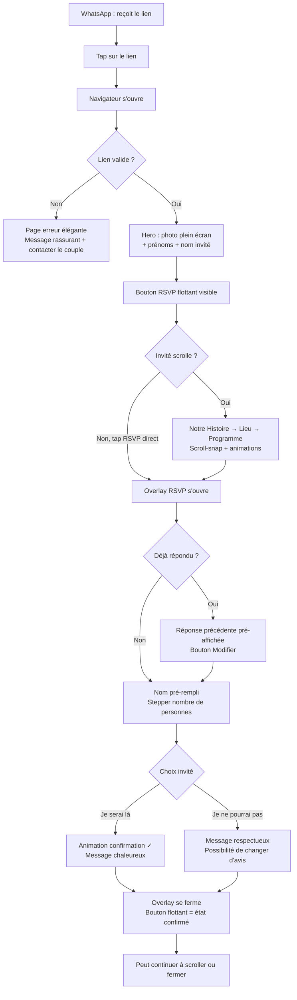
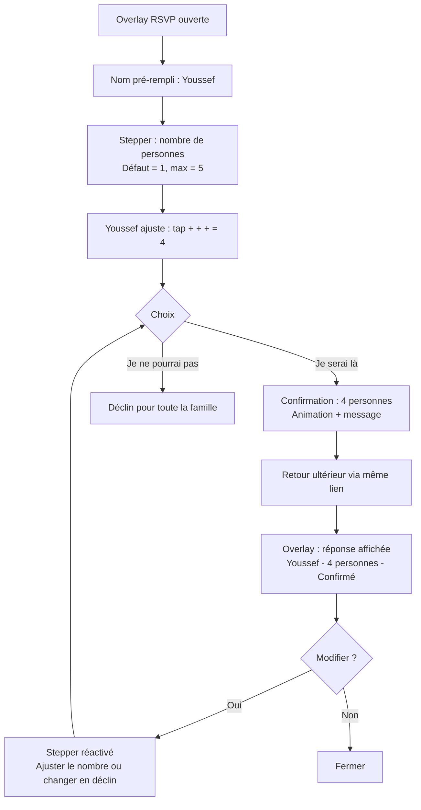
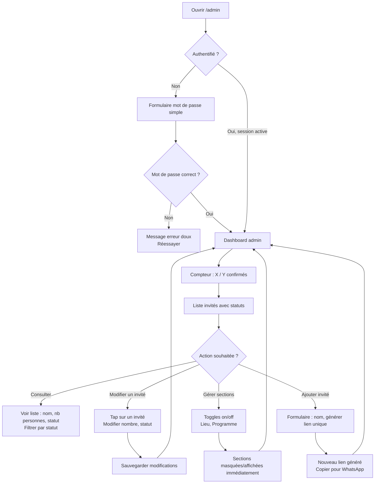
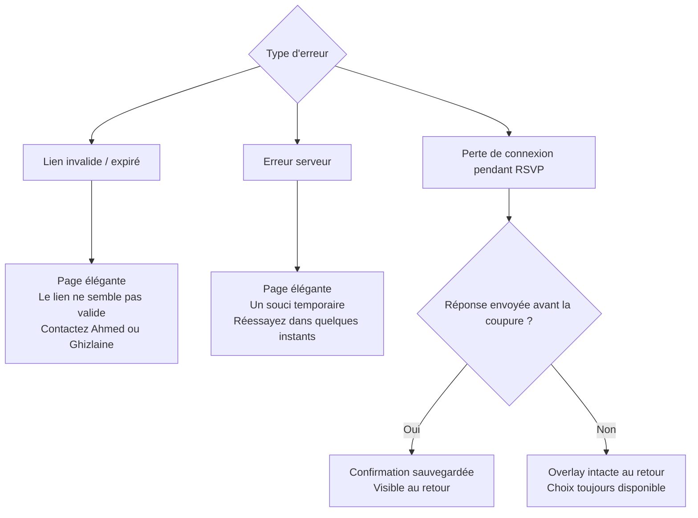

# UX Design Specification — Site de Mariage Ahmed & Ghizlaine

**Auteur :** Mister Azami
**Date :** 2026-02-13

---

## Executive Summary

### Vision Projet

Invitation digitale premium pour le mariage d'Ahmed & Ghizlaine. Site monopage émotionnel, accessible exclusivement via lien unique WhatsApp. L'expérience combine la fluidité interactive d'Apple, le raffinement visuel des maisons de luxe (LVMH, Chanel), et la douceur d'une palette florale aquarelle inspirée de fleurs sauvages. L'invité confirme sa présence en < 10 secondes dans un parcours sans friction.

### Utilisateurs Cibles

| Persona | Profil | Besoin UX principal |
|---------|--------|---------------------|
| Tante Fatima (58 ans) | Peu tech-savvy, mobile WhatsApp | Simplicité absolue, émotion immédiate, 0 friction |
| Karim (28 ans) | Hyper-connecté, exigeant design | Animations premium, "c'est pas un template", effet waouh |
| Ami Youssef (35 ans) | Pragmatique, famille de 4-5 | Accès rapide au RSVP, confirmation groupée en 1 action |
| Ahmed & Ghizlaine | Admin, mobile quotidien | Interface claire, contrôle rapide, mobile-first |

### Défis UX Clés

1. **Photos non professionnelles** — Le lot de photos disponibles n'est pas issu d'un shooting pro. Le design doit compenser : traitements visuels (voiles blancs, grains, recadrages), compositions soignées, et animations de révélation qui élèvent n'importe quelle photo.

2. **Fusionner deux esthétiques** — Le minimalisme froid du luxe européen (Chanel, LVMH) et la douceur florale aquarelle. Ces deux mondes doivent coexister sans dissonance : épuré MAIS chaleureux, élégant MAIS pas distant.

3. **RSVP élégant ET ultra-simple** — Le formulaire RSVP doit ressembler à une invitation, pas à un Google Forms. Il doit être suffisamment simple pour Fatima (58 ans) tout en étant visuellement cohérent avec le reste du site pour ne pas décevoir Karim (28 ans).

4. **Performance des animations sur mobile moyen** — Les scroll animations style Apple sont gourmandes. Elles doivent rester fluides à 60fps sur un iPhone 11 ou un Samsung Galaxy A52 sans sacrifier l'effet "waouh".

### Opportunités Design

1. **Identité unique** — La combinaison rose pétale floral + minimalisme luxe est rare dans les sites de mariage. C'est ce qui fera que Karim dira "c'est pas un template".

2. **Scroll narratif cinématique** — La page unique avec révélation progressive crée une expérience de storytelling immersive. Chaque scroll dévoile un chapitre de l'histoire du couple.

3. **Le RSVP comme moment émotionnel** — "Ahmed & Ghizlaine comptent sur vous" + "Je serai là" transforme un acte administratif en promesse personnelle. L'overlay peut être un moment design à part entière.

4. **Élévation photographique** — Les traitements visuels (zoom progressif au scroll, voile blanc pour lisibilité, grain subtil) peuvent transformer des photos classiques en éléments premium.

## Core User Experience

### Expérience Définissante

L'action fondamentale du produit est le **parcours RSVP** : WhatsApp → lien → émotion → confirmation. Tout le design sert ce funnel émotionnel. L'invité est d'abord touché au cœur (visuel immersif), puis informé (prénoms, date), puis guidé vers l'action (confirmer sa présence).

Le site n'est pas un site d'information — c'est une **expérience narrative** qui mène naturellement vers une promesse : "Je serai là."

### Stratégie Plateforme

| Aspect | Décision |
|--------|----------|
| Plateforme | Web SPA (Next.js), pas d'app native |
| Input principal | Touch mobile (90%+ des invités) |
| Entrée | Lien unique WhatsApp exclusivement |
| Offline | Non nécessaire |
| Orientation | Portrait mobile prioritaire, paysage desktop supporté |

**Deux expériences distinctes :**
- **Site invité** — Expérience premium immersive, scroll guidé, animations, overlay RSVP
- **Admin** — Interface utilitaire fonctionnelle, pas de design premium, efficacité avant tout

### Interactions Sans Friction

| Interaction | Principe |
|-------------|----------|
| Arrivée sur le site | Émotion immédiate en < 3 secondes — pas de loader, pas de splash screen, le visuel frappe dès le premier pixel |
| Navigation | Scroll guidé : chaque section occupe l'écran entier, la transition entre sections crée le rythme narratif. Fallback : scroll libre avec animations au passage |
| Découverte du RSVP | Bouton flottant assumé, visible dès l'arrivée — personne ne le rate |
| Confirmation RSVP | Nom pré-rempli, chiffre à ajuster, 1 bouton. Zéro champ à taper pour l'invité simple |
| Modification RSVP | Retour via le même lien → réponse précédente pré-affichée → modifier en 1 clic |
| Admin — check quotidien | Ouvrir `/admin` → voir la liste et les statuts → fermer. 5 secondes |

### Moments de Succès Critiques

1. **Les 3 premières secondes** — L'invité voit le visuel et pense "c'est beau". Si ce moment échoue (chargement lent, design fade), tout le reste est compromis. C'est LE moment make-or-break.

2. **Le scroll de découverte** — L'invité scrolle et chaque transition le surprend positivement. Il reste, il explore, il vit l'histoire. S'il scrolle et que c'est statique ou saccadé, l'effet "template" s'installe.

3. **L'ouverture de l'overlay RSVP** — L'overlay s'ouvre avec élégance, le nom est déjà là, c'est simple. Si ça ressemble à un formulaire, la magie se brise.

4. **Le tap sur "Je serai là"** — Le moment de confirmation est émotionnel. C'est une promesse, pas un clic administratif. L'animation post-confirmation célèbre ce moment.

### Principes d'Expérience

1. **Émotion avant information** — Le visuel frappe d'abord, le texte accompagne ensuite. Chaque section commence par l'impact visuel.

2. **Guidé, pas imposé** — Le scroll guidé crée un rythme, mais l'invité peut toujours accéder au RSVP quand il veut via le bouton flottant. Liberté dans la structure.

3. **Zéro friction, zéro réflexion** — L'invité ne doit jamais se demander "qu'est-ce que je dois faire ?". Chaque étape est évidente et ne demande qu'un seul geste.

4. **Deux mondes, deux UX** — Le site invité est une expérience émotionnelle premium. L'admin est un outil fonctionnel. Pas de compromis entre les deux.

## Desired Emotional Response

### Objectifs Émotionnels Primaires

**Émotion dominante :** Élégance émue — un mélange de "waouh c'est classe" et "c'est touchant/mignon". Le site doit provoquer de l'admiration visuelle teintée de tendresse.

**Émotion secondaire :** Fluidité — le sentiment que tout coule naturellement, sans effort, sans rigidité. L'invité se laisse porter.

**Émotions à éviter absolument :** Panique, frustration, confusion. Même dans les cas d'erreur, l'invité doit rester serein.

### Cartographie Émotionnelle du Parcours

| Étape | Émotion visée | Intensité |
|-------|---------------|-----------|
| Aperçu WhatsApp (Open Graph) | Curiosité + sentiment d'être privilégié | Douce — intrigue sans pression |
| Premières 3 secondes sur le site | "Waouh" + touchant + classe | Forte — pic émotionnel d'entrée |
| Scroll narratif (Notre Histoire) | Élégance + fluidité + smooth | Soutenue — l'invité se laisse porter |
| Sections Lieu / Programme | Information claire dans un écrin élégant | Calme — utile mais toujours beau |
| Overlay RSVP | Simplicité + évidence | Neutre — confirmation rapide et sereine |
| Post-confirmation | Satisfaction tranquille | Légère — c'est fait, c'est bien |
| Erreur / lien invalide | Sérénité — pas de panique | Rassurante — guidé vers la solution |

### Micro-Émotions Clés

| État positif visé | État négatif à éviter | Contexte |
|-------------------|----------------------|----------|
| Confiance | Confusion | Navigation et RSVP — tout est évident |
| Admiration | Indifférence | Design et animations — jamais "bof" |
| Sérénité | Panique | Erreurs — toujours une issue claire |
| Fluidité | Rigidité | Scroll et transitions — jamais de saccade |
| Privilège | Banalité | Lien unique — l'invité se sent attendu personnellement |

### Implications Design

| Émotion | Traduction UX |
|---------|---------------|
| "Waouh" + classe | Révélation visuelle au chargement : photo plein écran, animation d'entrée soignée, typographie display élégante |
| Touchant / mignon | Photos du couple mises en valeur, textes courts et personnels, intimité dans le ton |
| Fluidité / smooth | Transitions entre sections douces et continues, pas de coupures brusques, easing naturel sur toutes les animations |
| Curiosité (WhatsApp) | Open Graph avec image élégante et texte intrigant — pas tout révéler, donner envie d'ouvrir |
| Privilège | Nom de l'invité affiché dès l'arrivée sur le site — "c'est pour moi" |
| Sérénité (erreurs) | Pages d'erreur élégantes avec message rassurant, pas de jargon technique, redirection claire |
| Simplicité (RSVP) | Overlay épuré, minimum de champs, bouton unique proéminent, zéro distraction |

### Principes de Design Émotionnel

1. **Le pic émotionnel est à l'entrée** — Les 3 premières secondes portent 80% de la charge émotionnelle. Tout le budget "waouh" va là.

2. **Le scroll maintient, il n'intensifie pas** — Après le pic d'entrée, le scroll entretient l'élégance et la fluidité sans chercher à surprendre à chaque section. Le rythme est régulier et apaisant.

3. **Le RSVP est un non-événement émotionnel** — La confirmation doit être si simple qu'elle ne génère aucune émotion négative. Pas de stress, pas de doute, juste un geste naturel.

4. **Les erreurs sont élégantes** — Si quelque chose casse, le site reste beau et rassurant. Le message d'erreur a le même niveau de design que le reste du site.

## UX Pattern Analysis & Inspiration

### Analyse des Produits Inspirants

**Apple.com (pages produit iPhone/MacBook)**
- Scroll sections plein écran avec transitions fluides entre chaque "chapitre"
- Images qui se révèlent, tournent ou zooment au scroll — jamais statiques
- Rythme maîtrisé : chaque section a un seul message, un seul visuel
- Background sombre qui fait ressortir les visuels produit
- Texte minimal, énorme, centré — impact typographique fort

**Chanel.com / LVMH**
- Compositions photographiques ultra-travaillées — chaque image est un tableau
- Espace blanc généreux — le vide est un élément de design à part entière
- Palette restreinte : noir, blanc, doré — jamais plus de 3 couleurs
- Typographie serif élégante pour les titres, sans-serif clean pour le corps
- Pas de surcharge visuelle — chaque élément existe pour une raison

**Revolut (app mobile)**
- Ergonomie sans faille : chaque action en 1-2 taps maximum
- Hiérarchie visuelle très claire — l'œil sait immédiatement où aller
- Animations micro-interactions (transitions de pages, feedbacks de boutons)
- Design stylé sans sacrifier la fonctionnalité
- Information dense présentée de manière lisible et aérée

### Patterns UX Transférables

**Patterns de Navigation :**

| Pattern | Source | Application sur le site |
|---------|--------|------------------------|
| Scroll section plein écran | Apple | Chaque section du site (accueil, histoire, lieu, programme) occupe l'écran entier avec snap scrolling |
| Révélation progressive | Apple | Éléments qui apparaissent au scroll : textes, photos, timeline |
| Bouton action flottant | Revolut | Bouton RSVP toujours visible, fixé en bas d'écran |

**Patterns Visuels :**

| Pattern | Source | Application sur le site |
|---------|--------|------------------------|
| Photo plein écran comme héro | Chanel | Landing : photo du couple en full-bleed, texte par-dessus |
| Espace blanc généreux | Chanel/LVMH | Chaque section respire, pas de surcharge |
| Palette restreinte (3 couleurs max) | Chanel | Blanc/crème + rose pétale + texte foncé — c'est tout |
| Typographie display grand format | Apple | Prénoms "Ahmed & Ghizlaine" en très grand, centré, impact |

**Patterns d'Interaction :**

| Pattern | Source | Application sur le site |
|---------|--------|------------------------|
| Animation d'image au scroll (rotation, zoom) | Apple | Photos du couple qui se révèlent avec effets subtils au scroll |
| Micro-interactions feedback | Revolut | Bouton RSVP qui réagit au hover/tap, overlay qui s'ouvre avec spring animation |
| Action en 1-2 taps | Revolut | RSVP : ajuster le chiffre → taper "Je serai là" — 2 gestes max |

### Anti-Patterns à Éviter

| Anti-pattern | Pourquoi l'éviter | Risque si ignoré |
|--------------|-------------------|------------------|
| Template de mariage fleuri/chargé | Trop de décorations (fleurs, cœurs, confettis) tue l'élégance | Karim dit "c'est un template" |
| Musique qui se lance automatiquement | Intrusive, amateurish | Fatima panique, Karim ferme le site |
| Slider/carrousel de photos | Pattern daté, interaction confuse | Casse le rythme du scroll guidé |
| Formulaire long (nom, email, téléphone, message...) | Friction inutile, tue le RSVP en 10 secondes | Fatima abandonne |
| Compteur de jours animé clignotant | Effet "site de 2010" | Détruit l'élégance |
| Fond avec texture ou motif chargé | Conflit avec les photos et le texte | L'effet Chanel/luxe disparaît |
| Menu hamburger complexe | Inutile sur un site monopage | Ajoute une couche de navigation superflue |

### Stratégie d'Inspiration Design

**Adopter tel quel :**
- Scroll snap section plein écran (Apple) — c'est le cœur de la navigation
- Palette restreinte 3 couleurs (Chanel) — blanc/crème, rose pétale, texte foncé
- Espace blanc généreux (Chanel) — le vide est du luxe
- Action en 1-2 taps (Revolut) — pour tout le parcours RSVP

**Adapter au contexte mariage :**
- Animations d'image Apple → versions plus douces, plus émotionnelles (fade-in doux plutôt que rotation tech)
- Ergonomie Revolut → appliquer à l'admin (hiérarchie claire, dense mais lisible)
- Typo display Apple → adapter avec une police qui évoque l'élégance (serif display pour titres)

**Éviter absolument :**
- Tout ce qui dit "template de mariage" (fleurs, cœurs, polices cursives excessives)
- Tout ce qui est intrusif (musique auto, pop-ups, compteurs clignotants)
- Tout ce qui ajoute de la friction (champs inutiles, navigation complexe)

## Design System Foundation

### Choix du Système

**shadcn/ui + Tailwind CSS 4** — Composants non-stylés et personnalisables (Radix UI primitives), intégrés nativement avec Tailwind CSS et Next.js.

### Raisons du Choix

| Critère | shadcn/ui + Tailwind |
|---------|---------------------|
| Unicité visuelle | Composants non-stylés → personnalisation totale, aucune "signature" visuelle imposée |
| Vitesse de dev | Composants pré-construits pour l'admin (boutons, modales, tableaux) |
| Dev solo friendly | Code copié dans le projet, modifiable directement, zéro dépendance externe |
| Compatibilité | Conçu pour Next.js + Tailwind — zéro conflit avec le stack |
| Accessibilité | Radix UI primitives : ARIA, focus management, navigation clavier intégrés |

### Approche d'Implémentation

**Site invité — Custom sur base Tailwind :**
- Composants 100% custom sauf `dialog` (overlay RSVP) de shadcn/ui
- Scroll animations : **CSS Scroll-Driven Animations natives** (Safari 16+, Chrome — les navigateurs cibles)
- Micro-interactions (overlay, boutons) : **Framer Motion** si nécessaire, CSS animations sinon
- Styling luxe complet : palette florale, typographie élégante, espace blanc généreux

**Admin — shadcn/ui standard :**
- 7 composants shadcn/ui : `dialog`, `table`, `badge`, `switch`, `button`, `input`, `dropdown-menu`
- Styling fonctionnel et minimal
- Deux layouts Next.js distincts : layout invité (premium) / layout admin (utilitaire)

### Stratégie de Personnalisation

**Design Tokens (centralisés dans `@theme inline` de Tailwind CSS 4) :**
- Couleurs : blanc/crème, rose pétale floral, texte foncé
- Typographie : serif display (titres), sans-serif moderne (corps)
- Espacements : généreux côté invité, compact côté admin
- Border-radius : doux et arrondis
- Animations : easing custom (ease-out doux, spring subtil)

**Composants custom à créer :**
- Hero section plein écran avec animation d'entrée
- Section scroll-snap avec CSS Scroll-Driven Animations
- Timeline verticale animée
- Bouton flottant RSVP (`position: fixed` + styling Tailwind)
- Card de statut invité (admin)

### Stratégie d'Animations

| Type d'animation | Technologie | Justification |
|-----------------|-------------|---------------|
| Scroll animations (révélation, parallax, transitions sections) | CSS Scroll-Driven Animations natives | Performance maximale, zéro JS, zéro bundle, supporté par Safari + Chrome |
| Micro-interactions (overlay RSVP, feedback boutons) | CSS animations / Framer Motion si complexe | Léger, ciblé, pas de surcharge |
| Animation d'entrée (hero) | CSS animation keyframes | Chargement rapide, pas de dépendance JS |

## Expérience Définissante — Détail

### Interaction Fondamentale

**"Recevoir un lien personnel → vivre un scroll émotionnel → confirmer 'Je serai là'"**

L'invité décrirait cette expérience : *"J'ai reçu un truc magnifique, mon nom était dessus, j'ai appuyé un bouton et c'est fait."* C'est ce parcours sans friction, personnalisé et émotionnel qui distingue ce site de tout template de mariage existant.

### Modèle Mental des Utilisateurs

| Aspect | Attente de l'invité | Réalité du site |
|--------|---------------------|-----------------|
| Format | Un lien vers un site basique ou un Google Forms | Un site immersif premium avec son nom affiché |
| RSVP | Un formulaire avec des champs à remplir | Un overlay pré-rempli avec 1 bouton |
| Navigation | Chercher un menu, des onglets | Scroll naturel, contenu qui se dévoile |
| Personnalisation | Un site générique envoyé à tout le monde | Son prénom affiché, lien unique personnel |

**Risques de confusion identifiés :**
- Fatima (58 ans) pourrait ne pas comprendre le scroll-snap → fallback : scroll libre avec animations au passage
- Youssef pourrait chercher un champ texte pour le nombre → solution : stepper (+/-) avec chiffre bien visible

### Critères de Succès

| Indicateur | Cible | Mesure |
|-----------|-------|--------|
| Temps lien → RSVP confirmé | < 60s (Fatima), < 30s (Karim) | Analytics temps entre première visite et confirmation |
| Réaction émotionnelle | > 30% des invités envoient un message spontané au couple | Observation qualitative |
| Taux de complétion RSVP | > 95% de ceux qui ouvrent l'overlay | Analytics overlay ouvert vs confirmé |
| Scroll engagement | > 50% scrollent toutes les sections | Scroll depth analytics |
| Zéro support | 0 appels "je comprends pas comment faire" | Observation qualitative |

### Analyse Patterns : Établis vs Novateurs

**Patterns établis (zéro éducation nécessaire) :**
- Scroll vertical plein écran — connu via Apple, réseaux sociaux, stories
- Bouton flottant fixe — connu via toutes les apps mobiles modernes
- Overlay modale — connu via e-commerce, apps de réservation

**Innovations contextuelles (bonnes surprises, pas de confusion) :**
- **Personnalisation par lien unique** — le nom de l'invité affiché crée le sentiment "c'est pour moi"
- **RSVP émotionnel** — "Je serai là" au lieu de "Confirmer" transforme l'acte en promesse
- **Qualité visuelle inattendue** — "c'est pas un template" est la réaction visée

### Mécanique Détaillée du Parcours

**Phase 1 — Initiation (WhatsApp → Site)**
- Ahmed/Ghizlaine envoie le lien unique via WhatsApp en message privé
- Open Graph : image élégante + "Ahmed & Ghizlaine vous invitent" → curiosité + privilège
- Tap sur le lien → navigateur mobile s'ouvre

**Phase 2 — Impact (Premières 3 secondes)**
- Photo plein écran du couple, animation d'entrée douce (fade-in + légère translation)
- Prénoms "Ahmed & Ghizlaine" en typographie display élégante
- Nom de l'invité : "[Prénom], vous êtes attendu(e)"
- Bouton RSVP flottant visible en bas

**Phase 3 — Narration (Scroll)**
- Scroll-snap entre sections plein écran : Notre Histoire → Lieu → Programme
- Chaque section se révèle avec CSS Scroll-Driven Animations
- Le scroll mime le passage du temps — rencontre, fiançailles, jour J
- Le bouton RSVP reste fixe, toujours accessible

**Phase 4 — Action (RSVP)**
- Tap sur le bouton RSVP → overlay s'ouvre avec animation douce
- Nom pré-rempli (non modifiable par l'invité)
- Stepper (+/-) pour le nombre de personnes (1-5)
- Deux boutons : "Je serai là" (principal) / "Je ne pourrai pas" (secondaire discret)
- Tap sur "Je serai là" → animation de confirmation + message chaleureux

**Phase 5 — Complétion**
- Overlay se referme
- Bouton flottant change d'état visuel (check, couleur modifiée)
- L'invité peut continuer à explorer ou fermer
- Retour ultérieur via le même lien : réponse affichée, modifiable en 1 tap

## Visual Design Foundation

### Système de Couleurs

**Palette Principale (3 couleurs) :**

| Rôle | Nom | Hex | Usage |
|------|-----|-----|-------|
| Fond principal | Crème Chaud | `#FDF8F6` | Background des sections, base du site |
| Accent signature | Rose Pétale | `#C77B95` | Titres accentués, monogramme A&G, bordures, bouton RSVP |
| Texte principal | Prune Profond | `#3A2434` | Corps de texte, titres — pas un noir pur, un prune foncé chaud |

**Nuances Complémentaires :**

| Rôle | Nom | Hex | Usage |
|------|-----|-----|-------|
| Rose clair | Rose Doré | `#D4A0B0` | Hover, accents secondaires, icônes |
| Rose très clair | Voile Blush | `#F0D5DD` | Overlays sur photos, séparateurs, backgrounds subtils |
| Fond alternatif | Blanc Cassé | `#FFFBFC` | Sections alternées, overlay RSVP |
| Texte secondaire | Mauve Moyen | `#7A6070` | Sous-titres, texte d'accompagnement |
| Erreur | Rose Vif | `#D4708A` | Messages d'erreur (élégant, pas agressif) |
| Succès | Sauge | `#7A9B7A` | Confirmation RSVP, statut confirmé (admin) |

**Contrastes WCAG :**
- Prune Profond `#3A2434` sur Crème `#FDF8F6` → ratio ~12:1 (AAA)
- Rose Pétale `#C77B95` sur Crème `#FDF8F6` → ratio ~3.5:1 (AA large text — titres display uniquement)
- Mauve Moyen `#7A6070` sur Crème `#FDF8F6` → ratio ~4.6:1 (AA)

### Système Typographique

**Display — Cormorant Garamond :**
Serif à empattements fins, élégante et aérée. Évoque la haute couture sans être ornementale. Chargée via `next/font/google`.

| Niveau | Taille mobile | Taille desktop | Poids | Usage |
|--------|--------------|----------------|-------|-------|
| Display XL | 48px / 3rem | 80px / 5rem | 300 (Light) | Prénoms "Ahmed & Ghizlaine" |
| Display L | 36px / 2.25rem | 56px / 3.5rem | 400 (Regular) | Titres de section |
| Display M | 28px / 1.75rem | 40px / 2.5rem | 400 (Regular) | Sous-titres de section |

**Corps — Geist Sans** (déjà chargé dans le projet) :
Sans-serif moderne, neutre et lisible. Contraste parfait avec Cormorant.

| Niveau | Taille | Poids | Usage |
|--------|--------|-------|-------|
| Body L | 18px / 1.125rem | 400 | Texte principal invité |
| Body M | 16px / 1rem | 400 | Texte secondaire, admin |
| Body S | 14px / 0.875rem | 400 | Labels, légendes |
| Button | 16px / 1rem | 500 (Medium) | Boutons, CTA |
| Caption | 12px / 0.75rem | 400 | Micro-texte, copyright |

**Principe :** Cormorant en grand = élégance. Geist en petit = modernité. Jamais l'inverse.

### Système d'Espacement & Layout

**Unité de base : 8px**

| Token | Valeur | Usage |
|-------|--------|-------|
| `space-xs` | 4px | Espacement interne fin |
| `space-sm` | 8px | Éléments rapprochés |
| `space-md` | 16px | Espacement standard entre blocs |
| `space-lg` | 32px | Séparation entre groupes de contenu |
| `space-xl` | 64px | Espacement entre sections (mobile) |
| `space-2xl` | 128px | Espacement entre sections (desktop) |

**Layout — Site Invité :**
- Sections plein écran : `100vh` + `scroll-snap-type: y mandatory`
- Contenu centré : max-width `640px` mobile / `960px` desktop
- Marges latérales : `24px` mobile / `auto` desktop
- Espace blanc généreux — chaque section respire, Chanel-style

**Layout — Admin :**
- Container : max-width `1024px`, centré
- Padding : `16px` mobile / `32px` desktop
- Espacement compact, densité d'information plus élevée
- Scroll libre classique, pas de snap

### Considérations d'Accessibilité

| Aspect | Décision |
|--------|----------|
| Contraste texte | WCAG AA minimum partout, AAA pour le corps de texte |
| Doré sur fond clair | Réservé aux tailles display (≥ 24px) ou éléments décoratifs |
| Taille minimale | 14px minimum (12px uniquement pour captions non-essentielles) |
| Touch targets | 44x44px minimum pour tous les éléments interactifs |
| Focus visible | Outline rose au focus clavier sur tous les éléments interactifs |
| Réduction de mouvement | `prefers-reduced-motion` : désactive scroll animations, conserve transitions simples |

## Design Direction

### Directions Explorées

Trois variations de composition explorées dans l'esthétique établie (rose pétale + crème + Cormorant/Geist) :

| Direction | Concept | Hero | Intensité visuelle |
|-----------|---------|------|--------------------|
| A — Épure Absolue | Entrée minimaliste type invitation papier | Fond crème, prénoms seuls, photo révélée au 1er scroll | Basse — le texte porte l'émotion |
| B — Cinématique Immersive | Impact visuel immédiat, "waouh" dès le 1er pixel | Vidéo plein écran + voile blanc + prénoms par-dessus | Haute — l'image porte l'émotion |
| C — Élégance Équilibrée | Photo comme un tableau dans un cadre | Photo recadrée (70%), espace crème autour | Moyenne — texte et image en harmonie |

### Direction Retenue : B — Cinématique Immersive

La direction B est retenue car elle est la plus alignée avec les principes définis :
- **Pic émotionnel à l'entrée** (étape 4) — l'image frappe dès les 3 premières secondes
- **Émotion avant information** (étape 3) — le visuel plein écran prime
- **Inspiration Apple** (étape 5) — photo hero full-bleed comme les pages produit Apple
- **"C'est pas un template"** — aucun site de mariage ne commence par un cinéma immersif

### Principes de Composition

**Hero (Section 1) :**
- Vidéo en boucle du couple en full-bleed (`100vw × 100vh`), sources séparées mobile/desktop
- Voile blanc semi-transparent (bg-white/30) pour lisibilité du texte
- Prénoms "Ahmed & Ghizlaine" en Cormorant XL, brun profond #3A2434, centrés
- Nom de l'invité en Geist Sans, plus petit, en bas du hero
- Animation d'entrée : fade-in + légère translation vers le haut

**Sections Narratives :**
- Alternance rythme fort : section photo plein écran → section texte sur crème
- Chaque section = 1 message, 1 visuel, 1 émotion
- Les photos en plein écran utilisent le voile blanc pour la cohérence
- Les sections texte respirent avec espace blanc généreux

**Overlay RSVP :**
- Fond Blanc Cassé (`#FFFBFC`) semi-transparent avec backdrop-blur
- Bordure rose subtile
- Typographie mixte : Cormorant pour l'accroche émotionnelle, Geist pour les contrôles

## User Journey Flows

### Parcours Invité Standard (Fatima/Karim)

**Points clés :**
- Fatima : tap lien → tap RSVP → "Je serai là" → 3 taps, < 30 secondes
- Karim : tap lien → scroll toutes les sections → tap RSVP → confirme
- Aucun champ à saisir — tout est pré-rempli ou stepper

### RSVP Famille Nombreuse (Youssef)

**Points clés :**
- Un seul lien par famille — Youssef gère pour tout le monde
- Stepper de 1 à 5 (max défini dans les FRs)
- Modification possible à tout moment via le même lien

### Admin (Ahmed/Ghizlaine)

**Points clés :**
- Check quotidien : ouvrir → compteur → fermer = 5 secondes
- Mêmes droits pour Ahmed et Ghizlaine
- Toggles pour contrôler la révélation progressive des infos

### Cas d'Erreur & Edge Cases

### Patterns Transversaux

| Pattern | Application | Justification |
|---------|-------------|---------------|
| Pré-remplissage systématique | Nom invité partout, réponse RSVP au retour | Zéro saisie = zéro friction |
| Feedback immédiat | Animation après chaque action (RSVP, toggle admin) | L'utilisateur sait que ça a marché |
| État persistant visible | Bouton RSVP change d'état, statuts admin en temps réel | Pas de doute sur "est-ce que c'est fait ?" |
| Erreurs élégantes | Même design que le site, message humain, solution claire | Sérénité maintenue même en cas de problème |
| Réversibilité | RSVP modifiable, admin peut corriger | Pas de stress, pas d'action irréversible |

### Principes d'Optimisation des Flux

1. **Minimum de taps** — Chaque flux optimisé pour le moins de gestes possible (3 taps pour Fatima)
2. **Pas de cul-de-sac** — Chaque écran a une action claire, jamais de "et maintenant ?"
3. **Pré-remplissage maximal** — Tout ce qu'on sait déjà est affiché, l'invité ne fait que confirmer
4. **Modification sans punition** — Changer sa réponse est aussi simple que répondre la première fois
5. **Admin en lecture d'abord** — Le dashboard montre l'essentiel sans action requise

## Epic 6 — Animation des Alliances au Scroll

### Concept Narratif

Deux alliances accompagnent visuellement le parcours de l'invité tout au long du scroll. L'alliance en or (Ghizlaine) et l'alliance en argent/platine (Ahmed) symbolisent le chemin vers l'union. Le scroll devient littéralement la métaphore du rapprochement du couple.

### Spécifications Visuelles

**Style :** Rendu réaliste — reflets métalliques, ombres douces, aspect crédible. Pas de line-art, pas de minimalisme.

| Propriété | Alliance Or (Ghizlaine) | Alliance Argent (Ahmed) |
|-----------|------------------------|------------------------|
| Couleur | Or chaud, gradients dorés | Argent/platine, reflets froids |
| Position initiale | Bord gauche de l'écran | Bord droit de l'écran |
| Taille initiale (mobile) | ~30px diamètre | ~30px diamètre |
| Taille initiale (desktop) | ~50px diamètre | ~50px diamètre |
| Taille finale (entrelacement) | ~120px combiné mobile / ~200px desktop | Idem |

### Comportement au Scroll

**Apparition :** Les alliances n'apparaissent PAS sur le hero. Elles glissent en fondu depuis les bords après la première transition de scroll (post-hero). Cela préserve l'impact émotionnel du hero.

**Pendant les sections de contenu :**
- Opacité réduite : **30-40%** pour ne pas distraire de la lecture
- Zone de sécurité : **max 15% de la largeur** de chaque côté (desktop), **max 10%** (mobile)
- Les alliances tournent lentement sur elles-mêmes, se rapprochent progressivement du centre
- Animation fluide et continue liée au pourcentage de scroll (pas par étapes)

**Bidirectionnalité :** L'animation est entièrement réversible. Scroll up = les alliances se séparent et retournent vers les bords.

**Révélation finale (dernière section, scroll ~90-100%) :**
- Opacité passe à **100%**
- Les alliances arrivent au centre avec un **ralentissement** (easing cubic-bezier avec décélération)
- Un subtil **éclat doré** (glow) au moment de l'entrelacement
- La photo du couple apparaît en **fondu progressif (600-800ms)** à l'intérieur de l'espace formé par les deux anneaux unis
- La photo remplit l'intérieur des alliances (elles servent de cadre)

### Responsive Mobile (Option A retenue)

Sur mobile (375px-428px), les alliances sont :
- **Plus petites** qu'en desktop
- **Plus transparentes** (opacité de base ~20-30%)
- Positionnées davantage **haut/bas** plutôt que strictement gauche/droite, pour s'adapter à l'espace réduit
- La narration des deux alliances est maintenue (pas de fusion en un seul élément)

### Accessibilité

- `prefers-reduced-motion: reduce` → animations désactivées, alliances affichées statiquement ou masquées
- Les alliances sont décoratives → `aria-hidden="true"`
- `pointer-events: none` pour ne pas interférer avec la navigation
- La photo finale a un `alt` descriptif

### Easing et Timing

| Phase | Easing | Durée |
|-------|--------|-------|
| Apparition (fondu) | `ease-out` | 600ms |
| Rapprochement continu | Linéaire (lié au scroll %) | Continu |
| Rotation | Linéaire lent | Continu |
| Entrelacement final | `cubic-bezier(0.25, 0.1, 0.25, 1.0)` (décélération) | 800ms |
| Éclat doré | `ease-in-out` | 400ms |
| Fondu photo | `ease-out` | 600-800ms |

## Epic 7 — Landing Page Non-Invités

### Objectif

Accueillir avec chaleur les visiteurs non-invités qui accèdent au site par la racine `/` sans lien d'invitation.

### Ton de voix

Chaleureux et non-rejetant. Le visiteur est peut-être un ami qui n'a pas encore reçu son lien.

**Message :** *"Ce site est réservé aux invités d'Ahmed & Ghizlaine. Si vous souhaitez recevoir votre invitation, n'hésitez pas à les contacter."*

### Design

- Même design system que le site invité (fond crème `#FDF8F6`, Cormorant Garamond pour le titre, Geist pour le corps)
- Message centré verticalement et horizontalement
- Prénoms "Ahmed & Ghizlaine" en Cormorant Display L
- Séparateur rose décoratif (`w-12`, rose pétale `#C77B95`)
- Pas de photo, pas d'animation — page statique et sobre
- Pas de lien vers `/admin`
- Métadonnées `noindex, nofollow`

### Responsive

- Mobile : message centré, padding latéral `px-6`
- Desktop : message centré, même layout

## Component Strategy

### Composants shadcn/ui Utilisés

| Composant | Usage | Contexte |
|-----------|-------|----------|
| `Dialog` | Overlay RSVP + modales admin | Invité + Admin |
| `Button` | Actions partout | Invité + Admin |
| `Table` | Liste des invités | Admin |
| `Badge` | Statut RSVP (confirmé, en attente, décliné) | Admin |
| `Switch` | Toggles on/off sections | Admin |
| `Input` | Nom invité, mot de passe admin | Admin |
| `DropdownMenu` | Filtres, actions par invité | Admin |

### Composants Custom — Site Invité

**`HeroSection`**
- Vidéo en boucle plein écran + voile blanc + prénoms (Cormorant XL) + nom invité (Geist)
- États : skeleton rose → révélé (fade-in + translate-up)
- Technique : `<video>` autoPlay muted loop playsInline, overlay bg-white/30, separate mobile/desktop video sources, CSS keyframes
- Accessibilité : `alt` photo, `role="banner"`, prénoms en `h1`

**`ScrollSection`**
- Conteneur plein écran avec scroll-snap
- Variants : `photo` (fond photo + voile) | `content` (fond crème + texte centré)
- Technique : `100vh`, `scroll-snap-align: start`, CSS Scroll-Driven Animations
- Accessibilité : `role="region"`, `aria-label` par section

**`Timeline`**
- Frise "Notre Histoire" — rencontre → fiançailles → jour J
- Étapes révélées au scroll (CSS Scroll-Driven)
- Technique : flexbox vertical, ligne rose centrale, points roses, texte alterné (desktop) ou à droite (mobile)
- Accessibilité : `role="list"`, `aria-label="Notre histoire"`

**`FloatingRsvpButton`**
- Bouton RSVP fixe toujours visible
- États : `default` (doré, pulse doux) → `confirmed` (check vert) → `declined` (neutre)
- Technique : `position: fixed`, `bottom: 24px`, pulse CSS, transition d'état smooth
- Accessibilité : `aria-label`, `role="button"`, 44x44px minimum

**`RsvpOverlayContent`**
- Contenu de l'overlay RSVP dans le Dialog shadcn/ui
- États : `fresh` | `returning` (réponse pré-affichée) | `confirming` | `done`
- Technique : composition dans `Dialog`, transitions CSS/Framer Motion
- Accessibilité : focus trap (Radix Dialog), labels ARIA, annonce vocale confirmation

**`PersonStepper`**
- Sélecteur nombre de personnes (1–5) : bouton "−" + chiffre + bouton "+"
- États : min atteint (− désactivé) | max atteint (+ désactivé) | normal
- Accessibilité : `role="spinbutton"`, `aria-valuemin/max/now`, incrémentation clavier

**`PhotoSection`**
- Section photo plein écran avec voile doré et texte superposé optionnel
- Technique : `object-fit: cover` en 100vh, pseudo-élément gradient doré
- Accessibilité : `alt` descriptif

**`AllianceRings`**
- Conteneur des deux alliances animées au scroll — or (Ghizlaine, gauche) + argent (Ahmed, droite)
- États : `hidden` (hero visible) → `visible` (post-hero, opacité 30-40%) → `revealed` (dernière section, opacité 100%, entrelacées)
- Technique : `position: fixed`, `pointer-events: none`, CSS Scroll-Driven Animations (`animation-timeline: scroll()`), SVG avec gradients réalistes
- Révélation : éclat doré + fondu photo 600-800ms dans l'espace des anneaux
- Responsive : Option A mobile (plus petit, plus transparent, repositionné haut/bas)
- Accessibilité : `aria-hidden="true"`, `prefers-reduced-motion` → masqué ou statique

**`LandingPage`** (page.tsx racine)
- Page placeholder pour visiteurs non-invités
- Technique : Server Component pur, metadata `noindex, nofollow`
- Design : fond crème, Cormorant titre, message chaleureux centré, séparateur doré

### Composants Custom — Admin

**`AdminDashboard`**
- Vue principale : compteur "X / Y confirmés" + liste filtrable
- Technique : layout grid/flex, shadcn `Table` + `Badge`

**`GuestCard`**
- Ligne invité : nom, nombre personnes, statut (badge), lien, actions
- États : confirmé (vert) | en attente (jaune) | décliné (rouge)
- Technique : `Table` row avec `DropdownMenu` pour actions

**`SectionToggle`**
- Contrôle on/off sections optionnelles (Lieu, Programme)
- Technique : nom section + `Switch` shadcn/ui, état sauvegardé en base

### Stratégie d'Implémentation

| Priorité | Composants | Raison |
|----------|-----------|--------|
| P0 — MVP critique | `HeroSection`, `ScrollSection`, `FloatingRsvpButton`, `RsvpOverlayContent`, `PersonStepper` | Parcours RSVP complet |
| P0 — MVP critique | `AdminDashboard`, `GuestCard`, `SectionToggle` | Gestion invités fonctionnelle |
| P1 — MVP enrichi | `Timeline`, `PhotoSection` | Expérience émotionnelle narrative |
| P2 — Growth | Animations avancées (CSS Scroll-Driven) | Polish et "waouh" |
| P2 — Growth | `AllianceRings` | Animation narrative des alliances au scroll (Epic 6) |
| P3 — Quick Win | `LandingPage` (page.tsx racine) | Page placeholder non-invités (Epic 7) |

### Conventions de Développement

- Composants custom invité : `components/`
- Composants custom admin : `components/admin/`
- Composants shadcn/ui : `components/ui/` (convention standard)
- Design tokens via `@theme inline` — jamais de valeurs hardcodées
- Props typées TypeScript, nommage PascalCase
- Chaque composant custom est autonome

## UX Consistency Patterns

### Hiérarchie des Boutons

| Niveau | Style | Usage | Exemple |
|--------|-------|-------|---------|
| Primaire | Fond rose pétale (`#C77B95`), texte blanc, bords arrondis | Action principale unique par écran | "Je serai là", "Sauvegarder" |
| Secondaire | Fond transparent, bordure rose fine, texte brun | Action alternative | "Je ne pourrai pas", "Annuler" |
| Tertiaire / Ghost | Pas de fond ni bordure, texte brun moyen, underline hover | Action discrète | "Modifier", "Retour" |
| Destructif | Fond rose vif (`#D4708A`), texte blanc | Suppression (admin) | "Supprimer l'invité" |

**Règles :** Max 1 primaire par écran. Tous les boutons : 44x44px minimum, `border-radius: 8px`.

### Patterns de Feedback

| Situation | Invité | Admin |
|-----------|--------|-------|
| Succès | Animation check doré + message chaleureux, 3s | Badge mis à jour + toast discret, 2s |
| Erreur serveur | Message plein écran élégant, ton humain | Toast rouge doux avec message clair |
| Erreur validation | — | Texte rouge sous le champ, bordure rouge |
| Chargement | Skeleton doré sur crème (pas de spinner) | Spinner discret dans le composant |
| État vide | — | Message + CTA "Ajouter un invité" |

**Règles :** Côté invité : jamais de jargon technique. Animations : `ease-out`, 300ms transitions, 600ms apparitions.

### Patterns de Formulaire

| Pattern | Règle |
|---------|-------|
| Labels | Au-dessus du champ, Geist 14px, Brun Moyen |
| Champs | Bordure Brun Moyen, fond Blanc Cassé, focus = bordure dorée |
| Validation | Temps réel après premier blur |
| Champs requis | Pas d'astérisque — tous les champs affichés sont requis |

Note : côté invité, aucun formulaire textuel — uniquement stepper/bouton. Formulaires = admin uniquement.

### Patterns de Navigation

| Pattern | Contexte | Comportement |
|---------|----------|--------------|
| Scroll-snap vertical | Invité | Sections plein écran, snap doux |
| Bouton flottant fixe | Invité | Toujours visible, change d'état post-RSVP |
| Pas de menu/navbar | Invité | Le scroll EST la navigation |
| Scroll libre | Admin | Classique, pas de snap |

### Patterns d'Overlay/Modale

| Règle | Détail |
|-------|--------|
| Ouverture | Slide-up + fade-in, 400ms, `ease-out` |
| Fermeture | Tap extérieur, croix, ou swipe down (mobile) |
| Fond | Backdrop blur + Brun Profond 40% opacité |
| Contenu | Centré, max-width 480px, padding 24px |
| Focus | Focus trap (Radix Dialog), retour focus à la fermeture |
| Mobile | Bottom sheet (bas de l'écran) |

### Patterns d'Animation

| Catégorie | Easing | Durée | Usage |
|-----------|--------|-------|-------|
| Entrée d'élément | `ease-out` | 600ms | Fade-in au scroll |
| Transition d'état | `ease-in-out` | 300ms | Changement couleur/icône |
| Feedback bouton | `ease-out` | 150ms | Scale au tap (0.97 → 1.0) |
| Overlay ouverture | `cubic-bezier(0.32, 0.72, 0, 1)` | 400ms | Slide-up RSVP |
| Pulse RSVP | `ease-in-out` | 2000ms, infini | Attire l'attention |
| Smooth snap scroll desktop | `easeInOutCubic` (JS) | 1200ms | Transition entre sections desktop |
| `prefers-reduced-motion` | — | — | Animations ≥ 300ms désactivées |

### Intégration Design System

- Tokens shadcn remappés sur la palette (doré, crème, brun) via `@theme inline`
- `Dialog` : bottom-sheet mobile, centré desktop
- `Button` : étendu avec 4 variantes (primaire, secondaire, tertiaire, destructif)
- `Table` admin : style shadcn par défaut avec badges colorés

## Responsive Design & Accessibilité

### Stratégie Responsive

**Approche : Mobile-First absolue** — 90%+ des invités via WhatsApp mobile.

| Device | Priorité | Expérience |
|--------|----------|------------|
| Mobile portrait (375-428px) | Primaire | Expérience de référence |
| Mobile paysage | Secondaire | Scroll-snap désactivé, scroll libre |
| Tablette (768-1024px) | Tertiaire | Layout élargi, mêmes interactions |
| Desktop (1024px+) | Supporté | Contenu centré max-width, timeline alternée |

### Breakpoints

| Breakpoint | Valeur | Adaptation |
|-----------|--------|------------|
| `sm` | 640px | Textes plus grands, marges étendues |
| `md` | 768px | Timeline alternée, overlay centrée (pas bottom-sheet) |
| `lg` | 1024px | Max-width 960px, admin 2 colonnes |

Breakpoints Tailwind CSS 4 par défaut — pas de custom.

### Adaptations par Composant

| Composant | Mobile | Desktop |
|-----------|--------|---------|
| `HeroSection` | Photo 100vw×100vh, texte en bas | Idem, texte centré au milieu |
| `Timeline` | Ligne à gauche, texte à droite | Ligne au centre, texte alterné |
| `FloatingRsvpButton` | Centré en bas, full-width - 48px | Fixé bas droite, largeur auto |
| Overlay RSVP | Bottom-sheet | Modale centrée |
| `PersonStepper` | Boutons 48px, chiffre 32px | Boutons 44px, chiffre 28px |
| Admin `Table` | Cards empilées | Table avec colonnes |

### Stratégie d'Accessibilité — WCAG 2.1 AA

| Exigence | Implémentation |
|----------|----------------|
| Contrastes | AA partout, doré uniquement en display ≥ 24px |
| Touch targets | 44x44px minimum |
| Navigation clavier | Tab order logique, focus doré visible, skip-link vers RSVP |
| Screen reader | `role`, `aria-label`, `aria-live` pour confirmations |
| Focus trap | Actif dans overlay RSVP (Radix Dialog) |
| `prefers-reduced-motion` | Scroll animations désactivées, transitions instantanées |
| Sémantique HTML | `h1` prénoms, `h2` sections, `nav` admin, `main`, `footer` |
| Images | `alt` descriptif, décoratifs en `aria-hidden` |
| Formulaires admin | `label` + `aria-describedby` pour erreurs |

### Stratégie de Test

**Devices cibles :**
- iPhone SE (375px), iPhone 14/15 (393px), Galaxy A52 (412px), iPad (768px), Desktop 1440px

**Accessibilité :**
- Lighthouse Accessibility ≥ 90
- Navigation clavier complète (Tab, Enter, Escape, flèches stepper)
- VoiceOver iOS

**Performance :**
- Lighthouse Performance ≥ 90 (mobile 4G)
- FCP < 1.5s, LCP < 2.5s
- CSS Scroll-Driven Animations 60fps sur iPhone 11 / Galaxy A52

### Guidelines d'Implémentation

- Unités : `rem` typographie, `%`/`vw`/`vh` layout, `px` bordures uniquement
- Images : `next/image` + `priority` hero, WebP/AVIF, `sizes` responsive
- Media queries : mobile-first (`min-width`), classes Tailwind (`sm:`, `md:`, `lg:`)
- Scroll-snap : désactivé en paysage `@media (orientation: landscape)`
- Fonts : `next/font/google` Cormorant Garamond, `font-display: swap`

## Save the Date — Design UX (Epics 8-10)

### Direction Visuelle

**"Épure + Image d'Arrière-Plan"** — Cadre invisible, fond responsive (mobile: `arriere plan 4.jpeg`, desktop: `arriere plan 2.jpg`), contenu textuel centré sur fond crème `#FAF7F2`.

### Animation — Micro-narration en 3 Actes

**Timeline : 5000ms total**

| Phase | Durée | Action |
|-------|-------|--------|
| Acte 1 (0-1500ms) | 1500ms | Pigeon Lottie entre en vol depuis la gauche |
| Acte 2 (1500-2700ms) | 1200ms | Dépôt enveloppe (300ms) + envol pigeon (900ms) |
| Pause (2700-3000ms) | 300ms | Enveloppe seule, sceau visible |
| Acte 3 (3000-5000ms) | 2000ms | Sceau se brise, enveloppe s'ouvre, texte apparaît en séquence |

**Tokens d'animation :**
- `--easing-flight` : trajectoire vol pigeon
- `--easing-land` : rebond micro au dépôt
- `--easing-reveal` : apparition texte douce

### Éléments Visuels

**Pigeon :**
- Lottie frame-by-frame, recoloré palette aquarelle florale (mauves, blush, cream)
- Effet CSS watercolor
- 80-100px mobile / 150-180px desktop
- Deux fichiers : `oiseau.json` (mobile), `pigeon.json` (desktop ≥1024px)

**Enveloppe :**
- Blanc Cassé `#FFFDF9`, grain quasi-imperceptible, liseré doré `#D4A54A`
- 120px mobile / 200px desktop
- Coins arrondis (rx=8), ombre portée (drop shadow)
- État final : disparue (`opacity: 0`)

**Sceau A&G :**
- Monogramme latin "A&G" + entrelacs arabesques géométriques
- Cercle doré `#B8860B`, détails `#D4A54A`
- 30-40px mobile / 50-60px desktop

### Couleurs Texte (différenciées par rôle)

| Rôle | Couleur | Hex |
|------|---------|-----|
| Prénoms | Brun profond | `#2C2418` |
| Date | Mauve profond | `#6B3A4E` |
| Lieu | Olive profond | `#4A5E3A` |
| Message | Mauve doux | `#7A5A6A` |

### Backgrounds Responsives

- Mobile : `/images/rings/arriere plan 4.jpeg`
- Desktop (≥1024px) : `/images/rings/arriere plan 2.jpg`
- Appliqués via `.landing-bg` dans `globals.css`

### Accessibilité Save the Date

| État | Comportement |
|------|-------------|
| `prefers-reduced-motion` | Pas de pigeon, pas d'enveloppe — texte + cadre + séparateur uniquement |
| Lecteur d'écran | HTML sémantique (`h1`, `time`, `address`, `blockquote`), éléments décoratifs `aria-hidden` |
| Loading lent | Fond crème `#FAF7F2` = loading state élégant, timeout 3s → affichage direct |

### Open Graph WhatsApp

- Image : enveloppe fermée + sceau A&G sur fond crème (1200×630px, Satori)
- `og:title` : "Ahmed & Ghizlaine — 17 Octobre 2026"
- L'enveloppe fermée crée la curiosité — ne révèle pas tout le contenu
- Police locale TTF pour Satori (pas de fetch Google)

### Breakpoint Protection

Les classes `.pigeon-done` (3600ms) et `.envelope-done` (5100ms) empêchent le re-flash de l'animation lors des changements de breakpoint (ex: rotation appareil).
