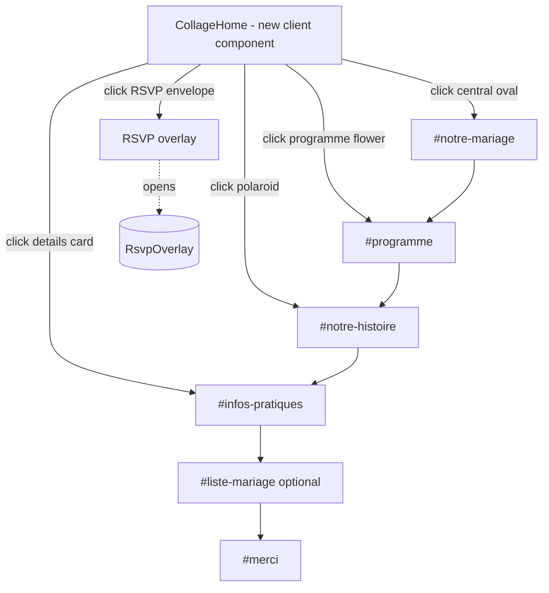
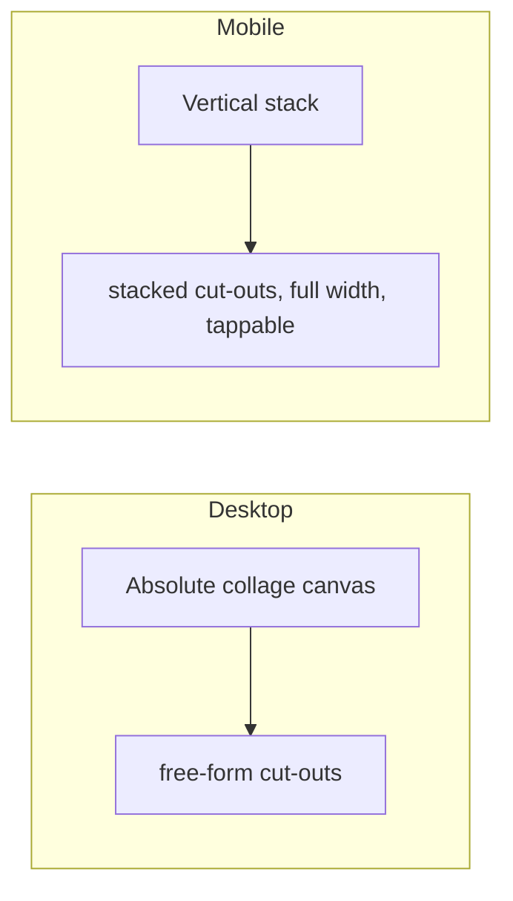
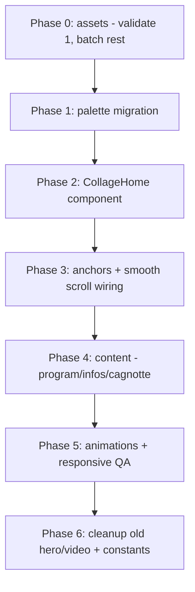

# Plan — Collage Moodboard Home (Guest Experience)

> Status: **Phases 0–6 DONE — awaiting visual feedback + real content**
>
> Phase 3: anchors + smooth scroll wired (ids on sections, scrollIntoView, open-rsvp event).
> Phase 4: program aligned to 16h→22h + "(Horaires à confirmer)"; venue gets a no-API Google Maps
> embed + itinerary link; details gets Hôtels + Météo cards; new `liste-mariage-v2` (cagnotte) section
> wired before merci (anchor liste-mariage, `.section-liste` added to desktop overlay CSS).
> Phase 5: florals recolored pink→bordeaux (HSV, originals in `_originals/`), blush card → cream,
> staggered `collage-enter` opacity entrance on desktop, floral sway, paper-lift hover.
> Phase 6: collage PNGs downscaled+optimized (~2.4MB→~1.2MB); dead `hero-v2.tsx` removed
> (invitation-bg*.mp4 now unused but kept). Build passes; invite page HTTP 200.
>
> OPEN: desktop composition needs a human visual pass (tuned blind). Placeholders to fill (TODO in code):
> venue name/address + maps query, hotel names/links, cagnotte URL, polaroid photo (uses hero.jpg).
> `_originals/` floral backups still in public/ — delete before commit.

> Status (historical): Phases 0–2 DONE
>
> Phase 2 delivered: `components/guest/v2/collage-home.tsx` (mobile vertical stack + desktop free-form),
> wired into `app/(guest)/invite/[slug]/page.tsx` (replaces HeroV2, anchor ids added: notre-mariage,
> notre-histoire, infos-pratiques, programme, merci). RSVP envelope opens overlay via `open-rsvp`
> CustomEvent (listener added in `rsvp-overlay.tsx`). Guest layout desktop bg → paper-texture.
> `collageSway` keyframe + `COLLAGE` constants added. Page renders HTTP 200, all elements present.
> Desktop element positions were tuned without a live preview → expect to refine in feedback.
>
> Phase 1 delivered: `app/globals.css` `@theme` + `:root` tokens migrated to ivoire/sable/bordeaux
> (new tokens `--color-ivory/cream/sand/sand-soft/bordeaux/bordeaux-deep/blush/ink/ink-soft/sage/sage-deep`;
> legacy names aliased via `var()` so existing components re-skin automatically). `rsvpPulse` recolored.
> `details-v2` palette swatches updated. Build passes; all routes HTTP 200.
>
> Phase 0 delivered (in `public/images/collage/`): `floral-sprig-1.png`, `floral-sprig-2.png`,
> `floral-sprig-3.png`, `flower-bloom.png` (anemone), `ribbon-bow.png`, `champagne.png` — all
> transparent watercolor cut-outs in bordeaux/blush — plus `paper-texture.webp` (ivory background).
> Envelope, oval card, polaroid and "Les détails" label will be built in HTML/SVG (Phase 2).
> Note: `flower-bloom.png` is ~800KB → optimize in Phase 5.
> Scope: Redesign the guest landing as an interactive watercolor collage ("moodboard")
> where each cut-out element is a clickable anchor scrolling to its dedicated section.
> Replaces the current video-hero vertical-scroll `v2` landing.

---

## 1. Goal

Recreate the composition of the reference moodboard (envelope + central oval card +
flower cards + polaroid + RSVP envelope + scattered watercolor florals) in the couple's
own palette (**off-white / ivory / sand beige + bordeaux accent**), as the new guest home.
Each element is a clickable anchor that smooth-scrolls to its section. Fully responsive:
the collage re-flows vertically on mobile while keeping the moodboard feel.

## 2. Confirmed decisions

| Decision | Choice |
|----------|--------|
| Collage assets | **AI-generated** watercolor PNGs (bordeaux/sand), transparent cut-outs |
| Palette | **Bordeaux / sand / ivory across the whole guest experience** |
| Scope | Collage **replaces** the video-hero landing; existing sections become anchor targets |
| Method | **Plan first** (this document) → build after approval |

## 3. Current state (facts)

- Fonts already loaded: **Great Vibes** (`font-script`), **Cormorant Garamond** (`font-display`), Geist (`font-sans`). No new fonts needed.
- Existing guest sections (reusable as anchor targets): `invitation-letter-v2`, `countdown-v2`, `story-v2`, `venue-v2`, `program-v2`, `details-v2`, `merci-v2`, plus `rsvp-overlay` and `alliance-rings`.
- Guest layout: `app/(guest)/layout.tsx` uses `snap-y snap-mandatory` full-viewport scroll + fixed desktop bg image + `SmoothSnapScroll`.
- Palette tokens in `app/globals.css` `@theme` are **mauve/pink** (`--color-gold-moroccan: #C77B95`, `--color-mauve-deep: #8B4A6E`, `--color-cream-warm: #FDF8F6`, `--color-brown-deep: #3A2434`, ...). These need to shift to bordeaux/sand.
- All French copy is centralized in `lib/constants.ts` (project rule FR29).
- No collage assets exist in `public/`. New dir created: `public/images/collage/`.

## 4. Gaps vs. brief

1. No collage assets (florals, envelope, polaroid frame, ribbon, organic flower cards).
2. Palette is mauve/pink, brief wants bordeaux/sand/ivory.
3. Program is icon-based; brief wants an **hourly timeline** (16h Cérémonie → 22h Soirée).
4. "Informations pratiques" needs **Google Maps embed, recommended hotels, météo** (dress code exists).
5. **Liste de mariage / cagnotte** section + link does not exist (optional in brief).

## 5. Target architecture

### Element → section mapping (from reference)

| Collage element | Visual | Anchor target |
|-----------------|--------|---------------|
| Central oval card | "Venez célébrer notre mariage / 02 oct 2026 / Casablanca" | `#notre-mariage` |
| Programme flower card | organic flower shape, "Programme" | `#programme` |
| Polaroid photo | couple photo in polaroid frame | `#notre-histoire` |
| "Les détails" card | small torn-paper label | `#infos-pratiques` |
| RSVP envelope | bordeaux/sand envelope, "Confirmez votre présence" | opens RSVP overlay |
| Monogram envelope (top) | open envelope w/ "G & A" flap | decorative (title) |
| Scattered florals, ribbon, champagne glass | watercolor accents | decorative (non-clickable) |

## 6. Asset plan (Phase 0)

Generate transparent-background watercolor PNGs into `public/images/collage/`.
Method: text-to-image (watercolor on plain bg) → background removal → trim. **Validate ONE
sprig first**, get visual approval, then batch the rest to keep a consistent style.

| File | Description |
|------|-------------|
| `floral-sprig-1.png` … `-4.png` | bordeaux/blush watercolor floral stems (hyacinth/lavender-like) |
| `flower-bloom.png` | single loose watercolor bloom (anemone) for the programme card |
| `envelope.png` *(or SVG)* | sand/kraft or bordeaux envelope (open + closed variants) |
| `ribbon-bow.png` | thin watercolor bow |
| `champagne.png` | small champagne glass accent |
| `paper-texture.webp` | subtle ivory paper grain for the collage background |

Polaroid, oval card, "Les détails" label, and the flower **card text containers** are
built in HTML/SVG (so text stays crisp/selectable/accessible); florals & ornaments are PNGs.

## 7. Palette migration (Phase 1)

Shift `@theme` token **values** in `app/globals.css` to the new palette, keeping semantic
intent so existing components re-skin automatically. Introduce clear bordeaux/sand tokens
and alias legacy names to them; clean up names progressively.

| New role | Token | Hex (proposed) |
|----------|-------|----------------|
| Off-white bg | `--color-ivory` | `#FBF8F2` |
| Ivory card | `--color-cream` | `#F5EFE4` |
| Sand beige | `--color-sand` | `#E4D6BE` |
| Bordeaux accent | `--color-bordeaux` | `#7B2D3A` |
| Deep bordeaux | `--color-bordeaux-deep` | `#5A1F2A` |
| Soft bordeaux/blush | `--color-blush` | `#C98B95` |
| Ink text | `--color-ink` | `#3A2A24` |
| Muted text | `--color-ink-soft` | `#7A6A5E` |
| Sage neutral (kept) | `--color-sage` | `#8A9A7B` |

Legacy aliases (so current sections don't break mid-migration):
`--color-cream-warm → ivory`, `--color-gold-moroccan → bordeaux`, `--color-brown-deep → ink`,
`--color-mauve-deep → bordeaux`, `--color-brown-medium → ink-soft`.
Update the `details-v2` palette swatches to the new colors and labels.

## 8. Component & layout work (Phase 2–3)

- **New** `components/guest/v2/collage-home.tsx` (`"use client"`): absolute-positioned
  cut-out elements over `paper-texture`. Desktop = free-form layout matching the reference;
  mobile = vertical stack (`flex-col`, generous spacing, each element full-width-ish, tappable).
  Each clickable element = `<button>`/anchor with `aria-label`, hover "paper-lift" transform,
  and `onClick` → `scrollInto{ behavior:'smooth' }` to target id (or open RSVP).
- **Replace** `HeroV2` usage in `app/(guest)/invite/[slug]/page.tsx` with `CollageHome`
  (keep `guestName` personalization). Retire `hero-v2` video landing for guests.
- **Add stable `id`s** to anchor sections (`notre-mariage`, `programme`, `notre-histoire`,
  `infos-pratiques`, `liste-mariage`, `merci`). Wire RSVP element to the existing overlay trigger.
- Reconcile collage with `snap-y snap-mandatory`: collage is the first `min-h-dvh snap-start`
  panel; verify anchor smooth-scroll cooperates with `SmoothSnapScroll` (adjust if it fights).

## 9. Content enrichment (Phase 4)

- **Programme**: convert to hourly timeline — 16h Cérémonie · 18h Cocktail · 20h Dîner ·
  22h Soirée dansante, with "(Horaires à confirmer)". Update `PROGRAM_EVENTS` / `program-v2`.
- **Infos pratiques**: add Google Maps `<iframe>` embed (lazy), recommended hotels list
  (3 placeholders), météo note (October Casablanca). Extend `venue-v2`/`details-v2` + `VENUE` constant.
- **Liste de mariage** (optional): small section with intro text + "Cagnotte" button (placeholder URL).
- All new copy → `lib/constants.ts` (collage labels, hotels, météo, cagnotte, program hours).
- Placeholders (venue name/address, maps URL, hotel names, cagnotte link) flagged with `TODO:`
  for the couple to fill in.

## 10. Animations (Phase 5)

- Paper-lift on hover (translateY + scale + shadow) on clickable cut-outs (`motion-safe`).
- Gentle floral sway (small infinite keyframe, `prefers-reduced-motion` safe).
- Soft fade/slide-in reveal of collage elements on load (staggered).
- Smooth anchor scrolling between sections.
- Keep `min-h-dvh` (iOS), `snap-start`, existing `scroll-reveal` patterns.

## 11. Phasing & order

## 12. Files touched (estimate)

- **New**: `components/guest/v2/collage-home.tsx`, optional `liste-mariage-v2.tsx`, `public/images/collage/*`.
- **Modified**: `app/globals.css` (palette + collage CSS), `app/(guest)/invite/[slug]/page.tsx`,
  `app/(guest)/layout.tsx` (bg/scroll), `lib/constants.ts`, `program-v2.tsx`, `venue-v2.tsx`,
  `details-v2.tsx`, `story-v2.tsx`/`merci-v2.tsx` (add ids).
- **Retired (guest path)**: `hero-v2.tsx` video landing.

## 13. Risks / open points

- **Transparent watercolor cut-outs**: text-to-image + background removal quality is the main
  risk. Mitigation: validate one sprig, iterate style, batch only after approval.
- **Snap-scroll vs. anchor scroll** may conflict; may need to relax `snap-mandatory` to `snap-proximity`.
- **Real content** (venue, maps, hotels, cagnotte) unknown → placeholders with `TODO:`.
- Memory rule "palette florale (mauve/rose)" is now **superseded** by this bordeaux/sand decision — memory will be updated.
- No automated tests in repo for guest UI → verification is manual (run dev, visual QA desktop + mobile).

## 14. Out of scope (this plan)

- Admin redesign, EN/AR i18n (future), email-of-confirmation backend changes, Save-the-Date page.
