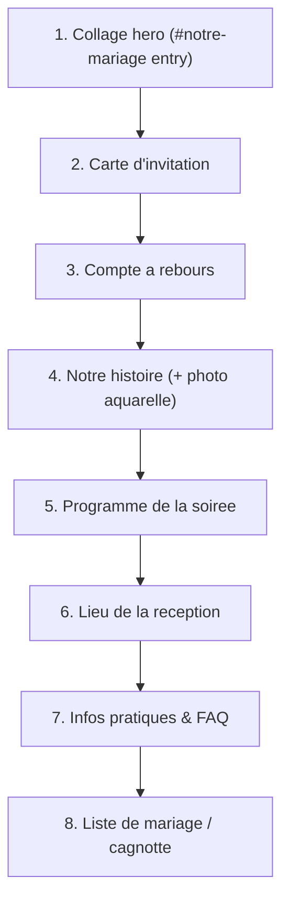

# Plan — Refonte contenus & sections (site invités)

> Status: **DRAFT — awaiting approval** · Read-only plan, no code changes yet.
> Scope: realign the collage hero default layout + rewrite the content of all guest
> sections (invitation, countdown, story, program, venue, infos+FAQ, registry).

---

## 1. Summary

Eight sections to update. Section 1 = layout (default arrangement of the draggable
collage, per the provided mobile/desktop screenshots, **drag stays enabled**).
Sections 2–8 = mostly **content** (copy in `lib/constants.ts`) + a few structural
changes (countdown without date/place, new program structure, a new FAQ block,
section reordering, one new watercolor photo asset).

## 2. Tech stack

| Item | Choice | Rationale |
|------|--------|-----------|
| Framework | Next.js 16 / React 19 / TS (existing) | No new deps |
| Styling | Tailwind v4 tokens (existing) | Consistency |
| Content | `lib/constants.ts` (FR strings, rule FR29) | All copy centralized |
| New asset | 1 watercolor couple photo (Story) | Provided by couple |

No new libraries. No backend changes.

## 3. Section order (reordered to match the brief)

Current `page.tsx` order is invitation → countdown → story → **venue → program** →
details → liste → merci. **Change:** move `program` **before** `venue` so the order
becomes invitation → countdown → story → program → venue → details(infos+FAQ) → liste → (merci).

## 4. Section-by-section changes

### Section 1 — Collage hero (layout only)
- Set the **default arrangement** to match the screenshots: mobile (#11) and desktop (#12).
- **Mobile:** remove the **champagne glass** and the **ribbon/bow** from the layout.
- **Desktop:** keep champagne + bouquet (top-right), per #12.
- ⚠️ **Keep drag enabled** — only the *default* positions change (PORTRAIT / WIDE arrays).
- File: `components/guest/v2/collage-home.tsx` (edit `PORTRAIT` and `WIDE` position arrays;
  drop champagne+ribbon items from `PORTRAIT`).

### Section 2 — Carte d'invitation
New copy (personalized greeting keeps the guest's first name):
> Cher/Chère **{prénom}**
> Nous avons la joie de vous convier à la célébration de notre mariage le vendredi
> 02 octobre 2026, à Casablanca. C'est avec une grande émotion que nous nous apprêtons
> à unir nos vies, entourés de ceux qui comptent le plus pour nous. Votre présence à nos
> côtés serait pour nous un immense bonheur et rendrait cette soirée encore plus belle et
> inoubliable.
> Avec toute notre affection, **Ghizlaine & Ahmed**
- Files: `lib/constants.ts` (`COUPLE.message` / new `INVITATION` block) + `components/guest/v2/invitation-letter-v2.tsx`.

### Section 3 — Compte à rebours
- New intro line: *"Chaque jour qui passe nous rapproche du plus beau «oui» de notre vie,
  et avec lui la joie de vous retrouver à nos côtés."*
- **Remove the date + place line** (`Vendredi 2 octobre 2026 · Casablanca`) at the bottom.
- Keep the live countdown timer (target date stays internal).
- File: `components/guest/v2/countdown-v2.tsx`.

### Section 4 — Notre histoire
- Replace the 3-chapter timeline copy with the new single narrative text (see brief).
- **Add a watercolor photo of the couple** (new asset).
- Decision: keep the engagement date **17 janvier 2026** mentioned in the text.
- Files: `lib/constants.ts` (`STORY` text), `components/guest/v2/story-v2.tsx`
  (render narrative + photo), new asset `public/images/story-photo.png` *(TODO: provide)*.

### Section 5 — Programme de la soirée
New 6-moment program (only the first has a fixed time):

| # | Moment | Heure |
|---|--------|-------|
| 1 | Accueil des invités | 18h00 |
| 2 | Première entrée & signature de l'acte | — |
| 3 | Entrée en tenue traditionnelle | — |
| 4 | Dîner & célébration | — |
| 5 | Robe blanche & pièce montée | — |
| 6 | Place à la fête | — |

- Restructure `PROGRAM_EVENTS` (add optional `time`, new titles + descriptions, icons).
- `program-v2.tsx`: render time only when present; keep timeline visual.
- Files: `lib/constants.ts`, `components/guest/v2/program-v2.tsx`.

### Section 6 — Lieu de la réception
- Keep `venue-v2` (name/address + Google Maps + itinerary). Real venue still `TODO`.
- File: `components/guest/v2/venue-v2.tsx` (+ `VENUE` constant). Reordered before details.

### Section 7 — Informations pratiques & FAQ
- Repurpose `details-v2` into **"Informations pratiques & FAQ"**: keep dress code /
  ambiance / hôtels / météo, **add a FAQ block** (accordion or Q/R list).
- FAQ content `TODO` — placeholder Q/R (horaires, parking, dress code, enfants, cadeaux…).
- Files: `lib/constants.ts` (`FAQ` array), `components/guest/v2/details-v2.tsx`
  (rename heading + add FAQ).

### Section 8 — Liste de mariage / cagnotte
- Keep `liste-mariage-v2` as-is. Real cagnotte link still `TODO`.

## 5. File changes

| File | Change |
|------|--------|
| `lib/constants.ts` | New/updated: `INVITATION`, `COUNTDOWN` intro, `STORY`, `PROGRAM_EVENTS` (6 items + time), `FAQ` |
| `components/guest/v2/collage-home.tsx` | New default `PORTRAIT`/`WIDE` positions; drop champagne+ribbon on mobile |
| `components/guest/v2/invitation-letter-v2.tsx` | New invitation copy |
| `components/guest/v2/countdown-v2.tsx` | New intro line; remove date/place line |
| `components/guest/v2/story-v2.tsx` | Narrative layout + watercolor photo |
| `components/guest/v2/program-v2.tsx` | Render 6 moments, optional time |
| `components/guest/v2/details-v2.tsx` | Heading → "Infos pratiques & FAQ" + FAQ block |
| `app/(guest)/invite/[slug]/page.tsx` | Reorder: program before venue |
| `public/images/story-photo.png` | New asset *(TODO: provide)* |

## 6. Dependencies / TODO (content to provide)

- ⚠️ **Watercolor couple photo** for Section 4.
- ⚠️ **FAQ questions/answers** for Section 7 (placeholders used meanwhile).
- ⚠️ Real **venue name/address** (Section 6) and **cagnotte link** (Section 8) — already `TODO`.

## 7. Risks / attention points

- ⚠️ Section 1: re-tuning default positions is **visual** — must match #11/#12; verify on
  mobile + desktop. Drag/parallax logic untouched.
- ⚠️ Story photo aspect ratio unknown until provided → reserve a flexible frame.
- ⚠️ FAQ accordion must stay accessible (button + aria-expanded) and not break snap scroll.
- Countdown still needs the internal target date even though it's hidden.

## 8. Verification

- Manual: run dev (`-p 3001`), check each section on mobile + desktop.
- All FR copy comes from `lib/constants.ts` (no hardcoded strings).
- `npm run lint` clean; guest page returns HTTP 200.

## 9. Out of scope

- RSVP backend, email confirmation, admin, i18n (FR/EN/AR), Save-the-Date page.
